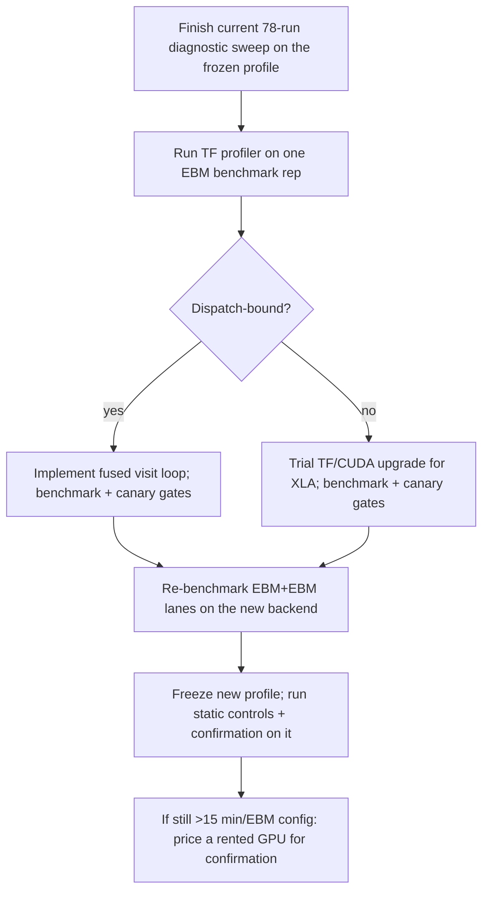

# Campaign 4 Runtime Reduction Research

**Date:** August 4, 2026
**Status:** research only - no code was changed; nothing here may be applied
mid-sweep (see [ADAPTIVE_STUDY_PLAN.md](ADAPTIVE_STUDY_PLAN.md) execution rules)
**Evidence base:** stage timers from the 5 completed Campaign 4 runs, the
validated `performance_profile.json`, the lane benchmark, the queue estimator,
and a read-only review of `basil_core/adaptive_experiment_engine.py`.

## Where the time actually goes

Per-stage totals from the completed 100-round runs (2-lane contention):

| Path | Wall | Training | Evaluation | SS | Transmit | Untracked |
|---|---:|---:|---:|---:|---:|---:|
| Clean pairwise | 25.1 m | 22.9 m (94%) | 1.3 m | 0.1 m | 0.0 m | 0.8 m |
| Hidden + SS | 26.5 m | 22.8 m (89%) | 1.3 m | 1.4 m | 0.0 m | 1.0 m |
| Noise, no mitigation | 26.8 m | 23.0 m (89%) | 1.6 m | 0.1 m | 1.2 m | 0.8 m |
| Noise + static EBM | 52.8 m | 49.4 m (95%) | 1.2 m | 0.1 m | 1.3 m | 0.9 m |

Conclusions that follow directly from the data:

1. **Training is the only stage worth optimizing.** Everything else combined
   is under 11% of wall time. Worker startup/save (untracked) is ~1 min per
   config - about 4% - so persistent-process reuse is low value.
2. **EBM costs 2.15x standard** (49.4 vs 23.0 min of training). The nested
   double-backprop is the entire difference.
3. **The queue's wall clock is the serial EBM chain.** Remaining queue:
   41 EBM configs (~25.9 h serial, max one EBM lane) vs 20 standard configs
   (~8.7 h, hidden inside the second lane). **Speeding up the standard path
   does not shorten the sweep at all; only EBM-path time matters.**

## Why a step costs what it costs

From the solo BF16 canaries: standard ≈ 25 ms/step, SS+EBM ≈ 59 ms/step
(25,000 steps per config, batch 512, small 4-conv CNN).

The engine executes each optimizer step as an individual Python-level
`tf.function` call (`adaptive_experiment_engine.py:590-596`): 25 dispatches per node
visit, 25,000 per run, each with a host-side `tf.cast` and a host-to-device
batch copy from the `tf.data` iterator. For a model this small, per-call
dispatch latency plausibly rivals the GPU compute itself on the standard
path. Two facts pull in opposite directions and only the profiler can settle
it:

- Dispatch-bound hypothesis: small CNN, 25k separate calls, casts on the
  Python side - suggests 1.5-2x headroom from fusing the loop.
- Compute-bound hypothesis: the EBM+EBM lane benchmark reached only 1.02x
  throughput, which suggests EBM already saturates the GPU.

**First action when the GPU is free: run the existing profiler mode on one
EBM benchmark representative** (`scripts/benchmark_adaptive_study.py` /
"Profile GPU + lanes"). The plan already requires the dominant stage to be
identified before accepting an optimization; the same applies inside the
training stage (dispatch vs compute vs H2D).

## Ranked options

### Tier 1 - no protocol impact, available now

| # | Option | Expected gain | Notes |
|---|---|---|---|
| 1 | Keep the GPU exclusive to the queue | protects the 1.75x contention factor from getting worse | The orphan-worker fixes (2026-08-04) removed the main violator. Do not run notebooks/benchmarks during the sweep. |
| 2 | Scheduling is already optimal | none left | `prioritizeEbm=true`, EBM chain is the critical path, standard work fills lane 2. No reordering can beat the serial EBM chain. |

### Tier 2 - new execution profile; only between sweeps, never mid-sweep

Each of these changes the execution profile, so it requires the benchmark +
paired 100-round precision canary gates again, and it would invalidate an
in-progress diagnostic sweep. Apply only after the current 78-run sweep
completes (or before confirmation starts), then freeze again.

| # | Option | Expected gain | Risk / gate |
|---|---|---|---|
| 3 | Profile one EBM rep with the TF profiler | none directly - decides 4-6 | none; do first |
| 4 | Fuse the 25-step visit loop into one `tf.function` (`tf.while_loop` over device-staged batches) | 1.3-2x standard; EBM gain depends on profiler verdict | Mathematically identical sequential SGD updates; must pass the existing fingerprint/canary gates. Removes 25k dispatches, casts, and H2D copies. |
| 5 | Retry XLA on an upgraded TF/CUDA stack | historically 1.5-2x on second-order paths via kernel fusion | XLA warm-up failed on the current stack; an upgrade is a full new profile validation. Biggest single EBM lever if it works. |
| 6 | Re-benchmark EBM+EBM lanes after 4/5 | up to ~2x on the EBM chain (the actual wall clock) | The 1.02x rejection was measured on the current backend; a leaner EBM step may clear the 1.05x gate. This is the highest-leverage re-test because it parallelizes the critical path. |

### Tier 3 - hardware, unlimited by the local GPU

| # | Option | Expected gain | Notes |
|---|---|---|---|
| 7 | Second machine / GPU running `scripts/run_adaptive_worker.py --config <json>` directly | ~2x sweep-level | Workers are standalone CLI processes; results are plain files that merge by copying into `experiments/results4/...`. Same profile rules apply per pooled comparison, so give the second GPU its own benchmarked profile and keep its runs profile-separated (the plotter already enforces this). |
| 8 | Rent a faster GPU for the 396-run confirmation (~99-114 GPU-h at target) | 1.6x (RTX 4090) to 3x+ (A100/H100) | Confirmation must then run entirely on that one profile. At current cloud prices this is roughly $50-150 for the whole matrix - worth weighing against ~2 weeks of local GPU time. |

### Explicitly rejected (protocol violations or already ruled out)

- Reducing rounds, nodes, local epochs, batch size, or evaluation frequency -
  changes the configured workload; forbidden by the plan.
- Microbatched EBM gradients - not mathematically the declared objective;
  already restricted to labeled performance diagnostics.
- `mixed_float16` - rejected pending a loss-scaling contract for the
  second-order path.
- Silently swapping profiles mid-sweep - makes completed diagnostics
  ineligible for the freeze.

## Suggested sequence

The plan's 10-15 minute EBM target is most plausibly reached by combining a
fused training loop (or working XLA) with a re-validated EBM+EBM lane pair;
either alone probably lands in the 18-22 minute range.
