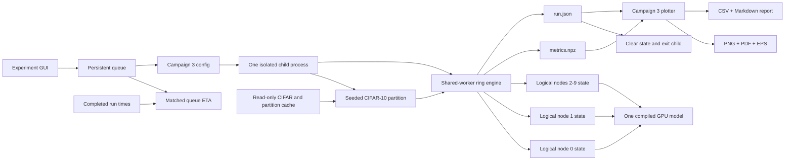
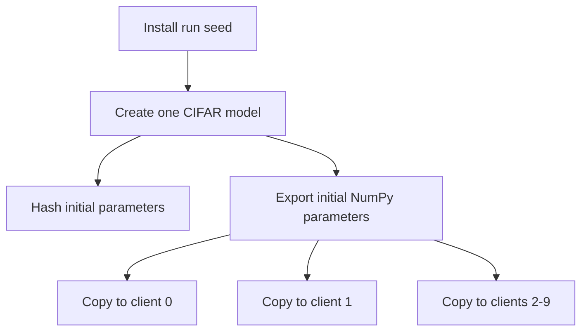
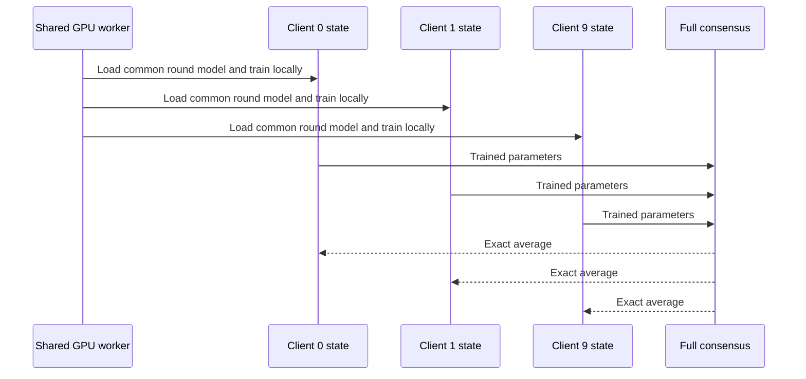
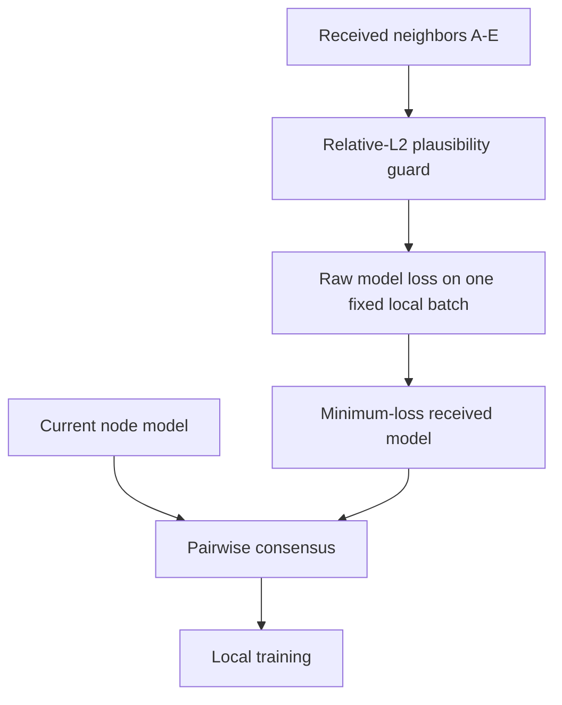
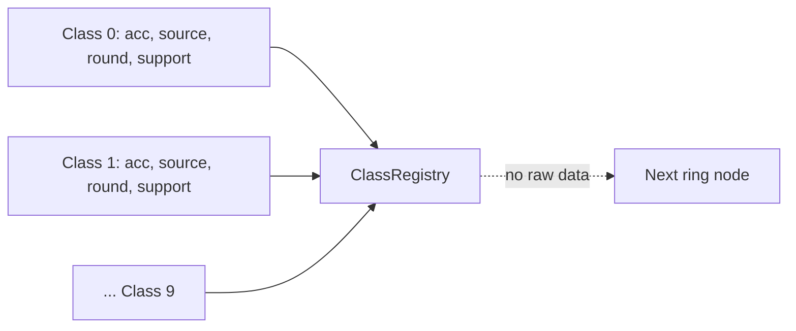
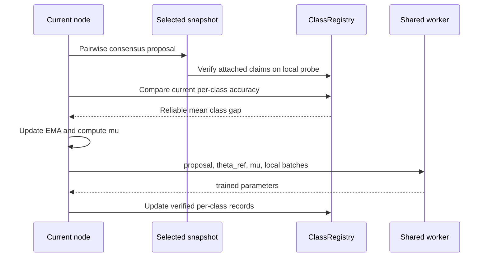
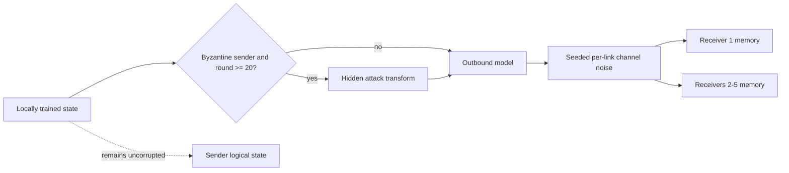
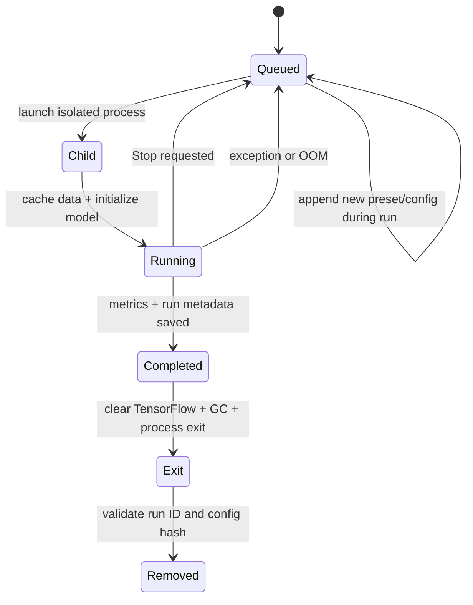
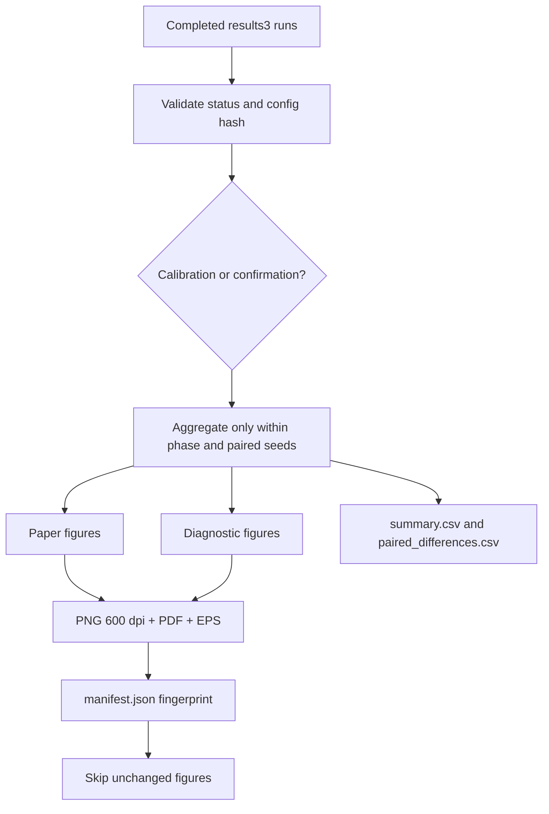

# PaperMerge Campaign 3 R2: System and Experiment Guide

## 1. Purpose

Campaign 3 is the isolated, reproducible experiment path for the conference
paper. It tests two failure modes and their matching defenses:

| Failure mode | Defense | Origin in this project |
|---|---|---|
| Hidden Byzantine model updates | Snapshot Selection (SS) | BASIL-derived |
| Gaussian channel noise | Expectation-Based Mitigation (EBM) | Noisy-communication-paper-derived |
| Non-IID client drift and class forgetting | CART registry and proximal control | Proposed CART contribution |
| Non-IID one-predecessor replacement | Pairwise/full consensus | Project integration layer |

Merged is the base integration study: ring communication, consensus, SS, and
EBM without CART. CART is an additional class-aware layer on that base.

The code does **not** force a requested accuracy ordering. It measures the
ordering, preserves negative effects in raw tables, and blocks CART
confirmation when the calibration conditions fail.

No web paper or external implementation was reviewed while implementing R2.
The two approved local PDFs were read with the user's permission: the BASIL
paper and *Robust Federated Learning with Noisy Communication*.

## 2. Source Boundaries

The components must be described accurately in the paper:

1. **BASIL-derived SS rule:** score the received counterclockwise-neighbor
   models themselves on one fixed local batch and choose minimum local loss.
   The current node is not an SS candidate once neighbor memory exists.
2. **R2 SS integration guard:** before BASIL loss ranking, reject received
   models outside the declared relative-L2 channel-plus-drift budget. This
   plausibility guard is a project addition, not a BASIL-paper contribution.
3. **Consensus integration:** after SS chooses a received model, average it
   with the node's current model before local training. This project mixing
   step is separate from SS.
4. **EBM objective:** differentiate
   `F + lambda * sigma^2 * ||grad F||^2`. The old `scale=2` gradient shortcut
   is not used by Campaign 3 R2.
5. **CART:** carry class-performance metadata and apply proximal control only
   when the exact consensus reference reproduces the registry advantage.

SS and EBM remain separate defenses. The low-noise repair does not change the
BASIL minimum-loss ranking or the noisy-paper objective. It changes only the
declared EBM coefficient at sigma 0.2 after a bounded coefficient screen.

## 3. High-Level Architecture



There are ten **logical** clients but only one active Keras model on the GPU.
Each logical client stores model parameters and its own SGD momentum slots as
NumPy arrays. The shared worker loads one logical model and optimizer state,
trains it, exports both states, and then moves to the next logical client.

This preserves sequential ring behavior while avoiding ten compiled CIFAR
models and their optimizer graphs on the GPU. The process boundary also
prevents TensorFlow state from accumulating across queue items.

## 4. Initialization

### 4.1 Seed installation

Before partitioning data or creating a model, the campaign installs the run
seed in NumPy and TensorFlow. Deterministic TensorFlow operations are enabled
where supported.

The same seed controls:

- model initialization;
- IID shuffle or non-IID Dirichlet partitioning;
- per-client dataset shuffle;
- stateless CIFAR augmentation;
- hidden-attack random perturbations;
- channel-noise samples.

Attack and channel random generators are keyed by values such as:

```text
(seed, "hidden", round, sender)
(seed, "channel", round, sender, receiver)
```

This gives matched configurations common random numbers without depending on
queue order or previous experiments.

### 4.2 One initialization copied to every logical node



All ten logical nodes start with byte-equivalent trainable parameters. The
initialization hash is stored in `run.json`.

The ClassRegistry is initialized independently at each CART node:

```text
best accuracy: [0, 0, ..., 0]
best source:   [-1, -1, ..., -1]
best round:    [-1, -1, ..., -1]
best support:  [0, 0, ..., 0]
```

The registry does **not** contain raw images, logits, gradients, class-specific
weights, or a model per class.

### 4.3 Data partition

The main non-IID campaign uses CIFAR-10 with a Dirichlet concentration of
`alpha=0.2`. The exact client indices are hashed and recorded in `run.json`.

Each node also receives a deterministic private class probe assembled from its
own training partition, up to 32 examples per locally present class. This
probe supplies CART telemetry and registry verification. It is not a global
public dataset and does not make absent classes available to a client.

## 5. Clean Environment

Clean has one precise meaning:

- zero Byzantine nodes;
- no channel noise;
- no SS;
- no EBM;
- correct sent and received values;
- full consensus after local training.

No other condition is labeled "Clean Environment".



The clean result is expected to be the upper reference because it contains no
corruption. The program does not overwrite its accuracy or artificially clamp
other configurations below it. If a noisy or attacked run exceeds clean due
to random variation, the raw result remains visible and must be investigated.

The simulator computes this clean all-node average in one engine operation.
Conceptually it represents a synchronous decentralized all-reduce/consensus
step with no parameter server, but the implementation uses the shared
simulation coordinator to calculate the exact average. The supplied draft's
statement that there is "no global averaging after each round" is therefore
not accurate for this clean reference. Non-clean Campaign 3 conditions use
pairwise ring consensus instead.

## 6. Hidden-Attack and Noisy Ring Round

The official hidden attack starts at round 20. This gives the ring an honest
warm-up, matching the paper text that says the hidden attack begins after
early training.

For 30-round calibration, rounds 0-19 are warm-up and rounds 20-29 are
attacked. For 100-round confirmation, rounds 20-99 are attacked.

### 6.1 State passed through the ring

Every received snapshot is atomic:

```text
RingSnapshot
  sender_id
  round_id
  model parameters
  matching ClassRegistry, for CART only
```

The model and registry cannot be selected from different senders or rounds.

### 6.2 Snapshot window

`S=5`, matching `b+1` for four Byzantine nodes. A node keeps the latest
snapshot from each of up to five predecessor senders.

For SS conditions, the candidate set contains only available received
predecessor snapshots. Node 0 may bootstrap from itself only before any message
exists. Each received model is scored directly on the same first local
mini-batch. Before scoring, R2 applies:

```text
relative_distance(current, received)
    <= sigma + 0.35
```

For attack-only conditions, `sigma=0`, so the bound is `0.35`. If every
received candidate is outside the bound, the nearest received neighbor is kept
as a fail-safe; self is still not inserted. The minimum-loss plausible
received model wins. Only after selection is pairwise consensus applied.



For no-SS controls, the immediate predecessor is used and pairwise consensus
is still applied. This keeps aggregation consistent while isolating the SS
contribution.

### 6.3 Why consensus is required

Replacing a non-IID node directly with one predecessor model caused the
observed CIFAR-10 flatline near 10%. Each local update learned the current
node's skewed classes and erased prior classes.

Pairwise consensus keeps a positive self-weight:

```text
theta_start = (theta_current + theta_selected) / 2
```

This is the ordinary decentralized mixing step. It is not SS and it is not
EBM. SS determines which received model is eligible for mixing.

## 7. CART Step by Step

### 7.1 Registry contents

For each CIFAR-10 class, the registry records:

| Field | Meaning |
|---|---|
| `class_best_acc[c]` | Best accepted class accuracy |
| `class_best_source[c]` | Node that produced it |
| `class_best_round[c]` | Round where it was recorded |
| `class_best_support[c]` | Probe support used for the claim |

Unknown classes have support zero and create no training signal.



### 7.2 Registry verification

The selected received model is evaluated on the receiver's private probe.
An improving claim is accepted only when:

```text
received_model_accuracy[c] >= claimed_accuracy[c] - verify_threshold
```

and both the stored claim and local probe have support for class `c`.

The default threshold is `0.05`.

Verification is a plausibility check, not a proof of Byzantine identity. A
claim measured on one client's class distribution is not perfectly comparable
to another client's probe. This remains a limitation.

### 7.3 Class gap

The current node and the exact pairwise-consensus reference are both evaluated
on the same private probe. Historical registry maxima are not assumed to still
exist in a later model. For every reliable class:

```text
verified_target[c] = min(registry_best[c], consensus_reference_accuracy[c])
gap[c] = max(0, verified_target[c] - node_current_accuracy[c])
```

This R2 correction prevents stale max-ever claims from anchoring training to a
reference that no longer reproduces the claimed class performance. The
reliable class gaps are averaged. The node keeps an EMA:

```text
ema_gap[t] = 0.85 * ema_gap[t-1] + 0.15 * mean_gap[t]
```

The campaign implementation uses:

```text
mu[t] = clip(gamma * ema_gap[t], 0, gamma)
```

If there is no reliable class gap, `mu=0`.

### 7.4 Local objective

The proposal selected by SS/consensus is frozen as `theta_ref`. The node
optimizes:

```text
cross_entropy(theta; batch)
    + (mu / 2) * ||theta - theta_ref||^2
```

The proximal term does not retrieve class-specific parameters from the
registry. It only limits drift away from the selected shared model when the
registry indicates that the node is behind on reliable classes.



### 7.5 Important paper-draft synchronization

The supplied draft currently states `mu = gamma * (1 + ema_gap)`. Campaign 3
uses `mu = clip(gamma * ema_gap, 0, gamma)` so that an empty registry does not
silently impose a constant proximal penalty.

The paper and code must use the same equation before submission. Do not report
the draft equation while using Campaign 3 results unless one side is changed
and the experiments are rerun.

## 8. EBM Step by Step

### 8.1 Channel-noise model

Campaign 3 preserves the repository's existing channel-noise implementation:
`sigma` is a relative whole-model L2 perturbation budget. For a transmitted
parameter vector with `d` coordinates, the implementation samples independent
Gaussian coordinates with:

```text
noise_coordinate_std = sigma * ||theta||_2 / sqrt(d)
```

This is a project modeling choice. It is **not** numerically the same as using
`xi ~ N(0, sigma^2 I)` with coordinate standard deviation `sigma`, as currently
written in the supplied paper draft. The draft, implementation, and experiment
description must be reconciled before submission. Campaign 3 records
`channelNoiseSemantics = relative_l2_per_link` in every config so the meaning
is not hidden.

### 8.2 EBM optimization

The noisy-communication paper's Equation 13 motivates:

```text
F_ebm(theta) = F(theta) + lambda * sigma^2 * ||grad F(theta)||^2
```

R2 differentiates this objective with nested gradient tapes. To retain the
configured batch size of 512 without the previous OOM, second-order work is
performed in slices of at most 128 and accumulated into one optimizer update.
For a batch larger than 128, this is a bounded microbatch approximation to the
full-batch gradient-norm term; it must not be described as algebraically exact
full-batch Hessian cross terms.

The current objective-coefficient schedule is:

| sigma | `lambda * sigma^2` | lambda |
|---:|---:|---:|
| 0.2 | 0.00100 | 0.025 |
| 0.3 | 0.00025 | 0.00277778 |
| 0.4 | 0.00025 | 0.0015625 |
| 0.5 | 0.00010 | 0.0004 |
| 0.6 | 0.00010 | 0.000277778 |

Only sigma 0.2 changed. The original coefficient, 0.00025, produced a
30-round Merged SS+EBM result 0.00876 below SS. A bounded screen tested
coefficients 0.00010, 0.00075, 0.00100, and 0.00200. Coefficient 0.00100 was
the only defensible candidate: it improved the old SS+EBM result while staying
within 0.01 absolute accuracy of SS. This is a calibration repair, not a change
to the EBM equation.

The repaired Merged coefficient did not transfer cleanly to CART: at sigma 0.2,
every tested nonzero CART gamma became worse than gamma zero under coefficient
0.00100. The separately versioned CART refinement therefore tests coefficient
0.00025 only for CART at sigma 0.2. This is an explicitly method-specific EBM
hyperparameter calibration. Once calibration freezes, CART confirmation and
IID-control configs at sigma 0.2 preserve coefficient 0.00025
(`lambda=0.00625`). It does not change the EBM equation or SS.

Gradients of the EBM objective are clipped to global norm 5. CART's proximal
gradient is then added as a separate term.

The configured batch remains 512. Micro-batching changes only activation
memory, not the effective batch or config.

EBM is active only when channel noise is active. It is never enabled in clean
or attack-only conditions.

## 9. Attack and Channel Order

After local training:

1. an honest logical state is retained locally;
2. a Byzantine sender transforms only its outbound parameters after round 20;
3. channel noise is added independently for each sender-receiver link;
4. the transmitted snapshot is stored by the next `S=5` clockwise nodes.



All mitigated and unmitigated arms use the same configured sigma and keyed
noise stream. EBM no longer receives an artificially reduced per-hop sigma.

## 10. Training Budget and GPU Memory

Official configuration:

| Setting | Value |
|---|---:|
| Nodes | 10 |
| Batch size | 512 |
| Local epochs per visit | 5 |
| Steps per epoch | 5 |
| Local updates per node visit | 25 |
| Confirmation rounds | 100 |
| Calibration rounds | 30 |
| Learning rate | 0.05 with BASIL schedule |
| Momentum | 0.9 |
| SS memory | 5 |
| Hidden attack nodes | 1, 4, 6, 8 |
| Hidden attack start | 20 |

`localEpochs=5` and `stepsPerEpoch=5` produce 25 mini-batch updates per node
visit. They do not mean five complete passes over each node's local dataset.
Since non-IID clients can have different sample counts, describing this as
"five local epochs" in the paper would be inaccurate unless the loader and
training budget are changed and all experiments are rerun.

Memory controls:

- one compiled model and optimizer on the GPU;
- NumPy parameter and per-node SGD momentum states for logical nodes;
- micro-batch gradient accumulation at 128;
- no list retaining all local batches;
- each queued Campaign 3 experiment runs in its own child process;
- explicit TensorFlow/Keras cleanup and three Python garbage-collection cycles
  run before the child exits;
- process exit guarantees release of CUDA allocator state before the next run;
- normalized CIFAR arrays are read-only memory maps and deterministic
  partition caches are bounded to 24 files;
- model parameters, optimizer state, iterators, registries, and snapshots are
  never cached across experiments;
- queue errors and stops retain the current queue item.

The acceleration changes do not alter Snapshot Selection, the EBM objective or
coefficient schedule, CART, batch size, rounds, local-update count, attack
timing, or channel-noise values.

The Queue window has a hardware gate for two isolated GPU lanes. It compares
two sequential EBM pilots with two concurrent EBM pilots under a 4,200 MB
per-process cap. Two lanes are enabled only when both concurrent runs finish,
their deterministic result fingerprints match, and measured throughput is at
least 1.4x. The July 26 RTX 4070 Ti benchmark passed memory and equivalence but
measured only 1.01x, so the current machine profile correctly selects one lane.

### 10.1 Submission Synchronization Checklist

The supplied paper draft and Campaign 3 currently disagree in these places:

| Topic | Campaign 3 implementation | Draft text that must be reconciled |
|---|---|---|
| CART coefficient | `mu = clip(gamma * ema_gap, 0, gamma)` | `gamma * (1 + ema_gap)` |
| CART gap target | registry target capped by exact consensus-reference accuracy | uncapped registry maximum |
| Channel noise | relative whole-model L2 budget per link | coordinate noise `N(0, sigma^2 I)` |
| SS candidates | received neighbors, project plausibility guard, BASIL loss ranking | BASIL selection without the project guard |
| EBM | differentiated gradient-norm objective with bounded microbatch approximation | text must not describe the old gradient-scale shortcut |
| CART SS+EBM LR | 0.05, same as other arms | condition-specific 0.025 |
| Local work | 25 mini-batch updates per node visit | five full local epochs |
| Clean aggregation | exact all-node consensus each round | no global averaging |

These are reporting issues, not cosmetic wording differences. The final paper
must describe the code that produced the submitted results, or the protocol
must be changed and every affected experiment rerun.

## 11. Campaign Presets

The Queue window has nine Campaign 3 presets plus a GPU-lane benchmark:

| Button | Runs | Purpose |
|---|---:|---|
| Core Confirmation | 105 | Replace the queue with the paper-focused non-IID matrix and skip completed runs |
| CART Low-Noise Refinement | 6 | Paired CART SS/SS+EBM tests at sigma 0.2 |
| Low-Noise Repair | 6 | Replace only affected sigma-0.2 EBM calibration runs |
| Calibration | 49 | Select or reject the CART gamma schedule |
| Merged Core | 99 | Three-seed non-IID Merged matrix |
| CART Add-on | 99 | Three-seed non-IID CART matrix |
| CART Non-IID Controls | 9 | Three-seed CART clean, hidden-only unprotected, and hidden-only SS controls |
| IID Controls | 48 | Selected IID controls |
| Full Campaign | 246 | Merged + CART + IID confirmation |

Every queue row displays its expected runtime and uncertainty range. The queue
summary displays total remaining wall-clock time, its range, and projected
finish time. If two validated lanes are enabled, it also distinguishes summed
config work from parallel wall-clock time. Completed-run log messages report
the measured duration.

### 11.1 Individual Current Config Library

**Add from File** defaults to `gui/configs/adaptive_study`; select **Campaign 3 R2**
to browse `gui/configs/current`. It supports selecting
multiple files from one split and approach. The checked-in matrix counts are:

| Split | BASIL | Noisy | Merged | CART |
|---|---:|---:|---:|---:|
| non-IID | 54 | 66 | 99 | 99 |
| IID | 54 | 66 | 99 | 99 |

The Merged and CART files are the exact seeded R2 confirmation matrices. The
BASIL and Noisy files are deterministic standalone controls with only valid
defense combinations: SS appears only with a hidden attack, EBM appears only
with channel noise, and clean has no mitigation. Their standalone EBM files
retain the paper-gradient-scaling implementation with target scale 2; the
official Merged/CART R2 files retain the differentiated second-order EBM
objective described above. Selecting files does not modify either algorithm.

The **Legacy / Custom** source exposes the older flat config archive
separately. It is not shown in Current counts and should not be mixed into an
R2 paper comparison.

The generator and synchronization command are:

```text
gui/config_library.py
python scripts/sync_gui_config_library.py
```

`Paper Core 101 · Add / Restore Missing` is non-destructive: it skips completed
results and run IDs already in the queue, then appends only missing paper runs.
Custom configs remain in place. Select custom rows and use
`Move Selected to Top` to run them before the remaining paper campaign. The
separate `Replace with Paper Core` action is available only when the queue is
stopped and requires confirmation.

### 11.2 Calibration matrix

Calibration uses seed 2025 and 30 rounds:

- representative sigma values 0.2, 0.4, and 0.6;
- base CART gamma candidates 0, 0.00025, 0.0005, and 0.001;
- sigma-0.2 refinement candidates 0.00030, 0.00035, and 0.00040;
- clean, component, SS, and SS+EBM controls.

The calibration state is written to:

```text
experiments/results3/r2/campaign_state.json
```

A per-noise nonzero gamma schedule is frozen only when all gates pass:

1. clean CART regression is no worse than 0.02 versus gamma 0;
2. at each representative sigma, CART SS+EBM is not below CART SS;
3. at each representative sigma, CART SS+EBM is not below Merged SS+EBM;
4. Merged SS improves hidden-only no mitigation;
5. Merged EBM improves noise-only at every representative sigma;
6. Merged SS+EBM is no more than 0.01 absolute accuracy below Merged SS at any
   representative sigma;
7. no tested corrupted Merged or same-gamma CART arm exceeds its matching
   clean upper reference.

For each representative sigma, calibration selects the passing gamma with the
highest CART SS+EBM final accuracy. Sigma 0.3 uses the selected 0.2 bucket;
sigma 0.5 uses the selected 0.6 bucket. Clean and no-noise runs use the 0.4
bucket as the default. If any bucket has no passing candidate, status is
`blocked` and CART confirmation presets remain locked.

### 11.3 Confirmation matrix

Confirmation uses seeds 2026, 2027, and 2028.

For each approach, the non-IID matrix includes:

- clean, no mitigation;
- hidden only: no mitigation and SS;
- noise only at sigma 0.2-0.6: no mitigation and EBM;
- hidden plus noise at sigma 0.2-0.6: no mitigation, SS, EBM, and SS+EBM.

No Gaussian, sign-flip, scaling, ALIE, IPM, model-poisoning, or
noise-amplification attacks are included in Campaign 3.

The 105-run Core Confirmation matrix retains the comparisons needed for the
paper while deferring supplementary arms:

- per seed: one Merged clean reference;
- Merged hidden-only no mitigation and SS;
- Merged noise-only no mitigation and EBM at sigma 0.2, 0.4, and 0.6;
- Merged SS and SS+EBM at every sigma from 0.2 through 0.6;
- CART SS and SS+EBM at every sigma from 0.2 through 0.6;
- Merged joint no mitigation and EBM at sigma 0.2, 0.4, and 0.6.

This is 35 runs per seed and 105 across seeds 2026-2028. The first four
confirmation runs are already complete, so the persisted queue currently has
101 pending items. Every Core run ID is a strict subset of the original
246-run Full Campaign; no result is relabeled or reused under a different
configuration.

## 12. Queue Behavior



Properties:

- the queue is persisted to JSON;
- reopening the GUI restores pending entries;
- new entries can be appended while a run is active;
- appended entries go to the bottom;
- while stopped, adding selected files automatically sorts the resulting queue
  by ascending estimated duration;
- while running, a newly selected batch is sorted and appended at the bottom;
- **Shortest First** sorts the full stopped queue by estimated duration;
- stopped queues support direct row drag-and-drop ordering;
- multiple selected entries can be deleted;
- stopped or failed runs remain in the queue;
- completed runs are removed only after atomic result completion;
- loading a preset skips matching completed run IDs and duplicate queued IDs.

Each isolated worker launch writes the complete configuration to the GUI Output
log, including split, environment, seed, local work, aggregation, attack,
channel, SS, EBM, CART, and worker-memory settings. Round events feed
lane-aware average and worst-node series into the live accuracy chart. These
are presentation changes only; the child-process training and saved metrics
remain unchanged.

The GUI queue ETA is not `item count * one average`. Each configuration is
matched against recorded runtimes using approach, EBM activity, SS activity,
noise/clean execution path, split, batch size, nodes, and local work. Same-round
records are preferred; otherwise runtime is scaled by declared work units. The
queue scheduler then computes a one- or two-lane makespan, subtracts elapsed
time for active runs, and displays:

- expected remaining time;
- a robust low/high range;
- active lane count;
- number of historical runtime samples;
- projected local completion date and time.

The estimate is recalculated after queue edits, every ten seconds while
running, and after each completed result.

## 13. Result Layout

Campaign 3 never writes to `experiments/results`, `experiments/results2`,
`plots`, or `plots2`.

Example:

```text
experiments/results3/r2/gui/
  nonIID/
    cifar10/
      hidden/
        cart/
          sigma_0_4/
            hidden_noise_sigma_0_4_ss_ebm/
              gamma_0_0005/
                seed_2026/
                  metrics.npz
                  run.json
```

`metrics.npz` contains:

- average, worst, and per-node trajectories;
- final full-test average and worst accuracy;
- final per-node accuracy;
- per-node, per-class accuracy;
- confusion matrices;
- client class counts;
- CART `mu`, registry acceptance/rejection, and coverage;
- selected snapshot sources;
- runtime, peak GPU memory, and learning-curve AUC.

`run.json` contains:

- full config;
- stable run ID, config hash, and explicit protocol revision;
- partition hash;
- code revision;
- initialization hash;
- deterministic metrics fingerprint;
- status and timestamps;
- engine runtime and full child-process wall runtime;
- final summary values.

Writes are atomic. A run is complete only when `run.json` says `completed` and
its run ID/config hash match the requested config.

The round-by-round `avg_history` and `worst_history` use the first five test
batches to keep live evaluation affordable. With batch size 512, this is 2,560
test examples. The saved `final_avg`, `final_worst`, final node accuracies,
per-class accuracies, and confusion matrices use the complete 10,000-example
CIFAR-10 test set. The final pass computes each confusion matrix once and
derives all accuracy summaries from it; it no longer performs a duplicate
full-test forward pass. Final bars and paired result tables use these full-test
values.

## 14. Plot Pipeline

The GUI Plot Results action offers:

- Campaign 3 Paper Figures;
- Campaign 3 Diagnostics;
- Campaign 3 Paper + Diagnostics;
- legacy `plots` / `plots2`.

Campaign 3 R2 reads only `experiments/results3/r2` and writes only
`plots3/r2`. The earlier campaign files remain preserved outside `r2`.
Automatic plotting runs once after a manual run or when a queue batch completes,
stops, or fails. The manifest still skips unchanged figures. This avoids
rescanning and rewriting the full plot set after every experiment.



Paper figures include:

1. component validation;
2. joint robustness profile;
3. defense composition;
4. CART lift over Merged;
5. fraction of damage recovered;
6. representative convergence;
7. average versus worst-node performance;
8. per-class retention.

Diagnostics include:

- mitigation heatmaps;
- seed spread;
- final-10-round stability;
- confusion matrices;
- CART registry telemetry;
- snapshot self/honest/attacker selection behavior;
- runtime and peak memory;
- client class distribution;
- learning-curve AUC;
- gamma calibration.

Colors are print-safe and mitigation-consistent:

| Method | Color |
|---|---|
| No mitigation | gray |
| SS | blue |
| EBM | orange |
| SS+EBM | green |
| Clean reference | black |

CART also uses hatching/dashed styling so plots remain interpretable in
grayscale.

Raw negative deltas remain in `paired_differences.csv` and the CART-lift plot.
The damage-recovery figure uses a separately defined bounded 0-100% metric:

```text
100 * (defended - degraded) / (clean - degraded)
```

It is clipped only because the plot is explicitly "fraction of damage
recovered." Its annotation states this, and it never replaces raw deltas.

## 15. Pilot Test Evidence

These are seed-2025 engineering diagnostics, not official paper results. CLI
pilots do not create result records.

| Paired diagnostic | No mitigation/control | R2 defense/CART | Outcome |
|---|---:|---:|---|
| Noise only, sigma 0.2, 10 rounds | 23.44% tracked | 24.16% EBM | EBM pass |
| Noise only, sigma 0.4, 10 rounds | 22.93% tracked | 23.49% EBM | EBM pass |
| Noise only, sigma 0.6, 10 rounds | 23.41% tracked | 23.83% EBM | EBM pass |
| Hidden+noise sigma 0.4, attack start 5, 10 rounds | 23.65% full SS | 24.97% full SS+EBM | composition pass |
| Hidden+noise sigma 0.4, official 30-round timing | 29.72% full Merged | 28.94% CART gamma 0.0025 | CART fail |
| Hidden+noise sigma 0.4, official 30-round timing | 29.72% full Merged | 29.47% CART gamma 0.0005 | CART fail |

The SS plausibility guard reduced post-activation selections of attacker
snapshots to 3% in the 30-round pair while still selecting received neighbors,
not self. The gamma-zero CART control matched Merged exactly at every round,
proving that the comparison uses equal initialization and execution semantics.

The completed initial calibration showed that different existing CART gamma
values passed the strict CART composition and CART-over-Merged gates at
different noise levels. It did not justify one global gamma. The current
calibration therefore selects a declared gamma per representative noise bucket;
the three-seed confirmation remains the test of whether that schedule
generalizes. If a bucket has no passing gamma after the six refinement runs, the
correct result remains `blocked`.

## 16. How to Run

1. Start the GUI:

   ```bash
   source environment/basil-noise-env/bin/activate
   python run_gui.py
   ```

2. Open **Queue**.
3. Confirm that the header says **101 items** and the first run is Merged,
   channel noise sigma 0.2, EBM, seed 2026. The queue was replaced with the
   missing Core Confirmation runs after the four completed files were checked.
4. Review the queue ETA and one-lane worker profile.
5. Click **Run Queue**.
6. During execution, new configs may still be appended at the bottom. A stop,
   failure, or OOM leaves every incomplete active item in the queue.
7. When the queue batch ends, inspect:

   ```text
   experiments/results3/r2/campaign_state.json
   plots3/r2/images/gui/nonIID/cifar10/hidden/comparison/diagnostics/
   plots3/r2/tables/nonIID/cifar10/
   ```

8. The calibration state is already `frozen`; do not rerun calibration unless
   the scientific protocol changes.
9. Use **Full Campaign R2 - 246** later only for supplementary IID and ablation
   arms. Completed Core run IDs will be skipped.

For a non-saving headless pilot:

```bash
python scripts/run_single_config.py \
  campaign3:cart:hidden_noise:ss_ebm:0.4 \
  --rounds 10 \
  --set attackHiddenStart=5 \
  --set distillStrength=0.0005
```

This pilot command does not create an official `results3/r2` record.

## 17. Claims That Are Safe Only After Confirmation

After calibration and three-seed confirmation, the paper may claim a result
only when the paired tables support it.

Required evidence for the intended claim:

1. clean is the strongest corruption-free reference within uncertainty;
2. EBM improves its matching noise-only baseline;
3. SS improves its matching hidden-only baseline;
4. Merged SS+EBM improves Merged SS under joint corruption;
5. CART SS+EBM improves Merged SS+EBM under the same seed and sigma;
6. CART SS+EBM improves CART SS under the same seed and sigma;
7. the improvement appears in average, worst-node, stability, and class-level
   diagnostics rather than only one final bar;
8. snapshot-selection telemetry shows meaningful collaboration rather than
   complete self-isolation.

If these conditions do not hold, the correct result is a limitation or
negative finding, not a reordered or clipped bar chart.
