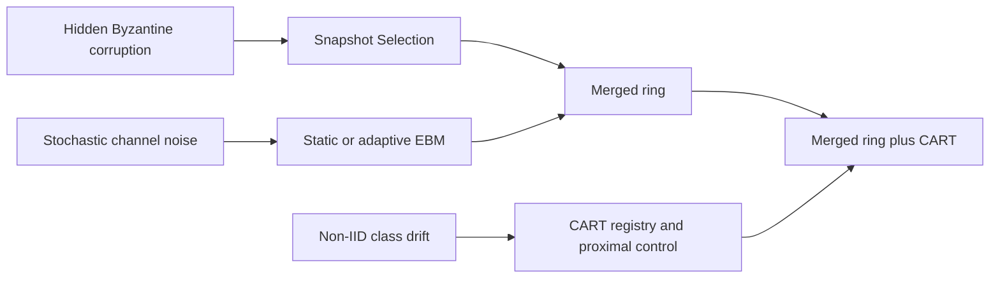
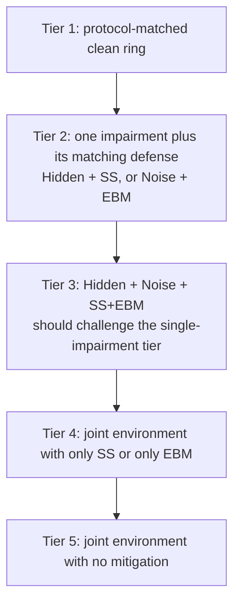
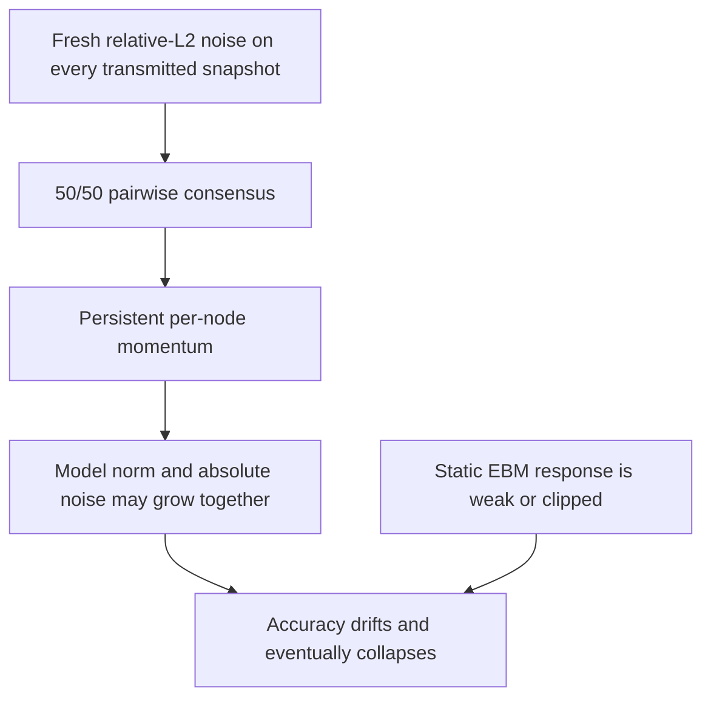
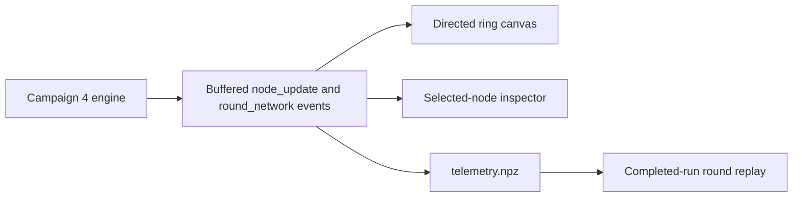
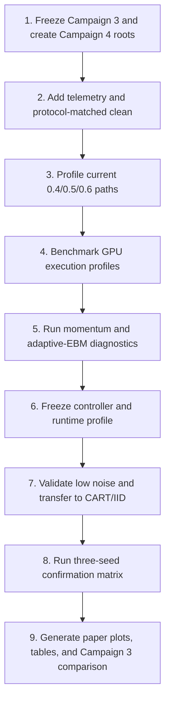

<a id="top"></a>

# Campaign 4 Engineering And Evaluation Plan

**Status:** implementation plan, not completed experimental evidence  
**Date:** August 3, 2026  
**Scope:** CIFAR-10, IID and non-IID, Merged and CART, clean conditions,
Gaussian channel noise, and hidden Byzantine attacks

Campaign 4 is intended to determine why channel-noise mitigation starts losing
effectiveness at `sigma=0.4`, deteriorates at `sigma=0.5`, and collapses at
`sigma=0.6`. It will test a separately identified adaptive EBM extension while
preserving the original static EBM and Snapshot Selection paths as controls.

All Campaign 4 configurations, results, telemetry, and plots will be isolated
from previous campaigns. The implementation must also reduce warm-cache
100-round execution time toward 10-15 minutes per configuration by improving
GPU utilization without reducing the configured batch size, node count,
rounds, local epochs, or optimizer updates.

## Index

| Section | Purpose |
|---|---|
| [Research Question](#research-question) | Defines the comparison that the paper is trying to make |
| [Expected Evidence Hierarchy](#expected-hierarchy) | Shows the expected accuracy tiers without forcing results |
| [Current Failure Evidence](#current-failure) | Summarizes what starts at sigma 0.4 and worsens at 0.5-0.6 |
| [Likely Causes](#likely-causes) | Maps observed failures to the active code paths |
| [Method Boundaries](#method-boundaries) | States exactly what changes SS, EBM, Merged, and CART |
| [Campaign 4 Isolation](#campaign-isolation) | Defines new config, result, plot, and telemetry roots |
| [Adaptive EBM Design](#adaptive-ebm) | Describes the proposed dynamic noise-response extension |
| [Diagnostic Experiments](#diagnostic-experiments) | Isolates noise, momentum, clipping, SS, EBM, and CART effects |
| [Confirmation Matrix](#confirmation-matrix) | Defines the final IID/non-IID and Merged/CART experiment matrix |
| [Acceptance Criteria](#acceptance-criteria) | Defines success before viewing Campaign 4 results |
| [GPU Runtime Plan](#gpu-runtime) | Targets 10-15 minutes without weakening the experiment |
| [Live Network GUI](#live-network-gui) | Defines the node-ring visualization and inspector |
| [Plots And Tables](#plots-and-tables) | Lists paper and diagnostic outputs under `plots4` |
| [Implementation Map](#implementation-map) | Identifies files to add or update |
| [Verification](#verification) | Defines unit, integration, numerical, runtime, and OOM tests |
| [Execution Order](#execution-order) | Provides the staged implementation and run sequence |
| [Decision Rules](#decision-rules) | Prevents endless tuning and result-driven method changes |

<a id="research-question"></a>

## Research Question [Back to top](#top)

The central paper question is:

> Can two defenses derived for different impairments be composed in one
> decentralized ring so that hidden Byzantine attacks and stochastic channel
> noise are handled at the same time, and can CART improve non-IID retention on
> top of that combined defense?

The components have separate responsibilities:



Campaign 4 must measure these responsibilities independently before measuring
their composition. It must not alter saved accuracy values or tune a method
until a desired bar ordering appears.

<a id="expected-hierarchy"></a>

## Expected Evidence Hierarchy [Back to top](#top)

The expected hierarchy is a hypothesis, not an assertion enforced by code.



For a fixed split, approach, seed, and noise level, the intended comparisons
are:

```text
Protocol-matched clean
    > Hidden + SS
    > or approximately Noise(sigma) + EBM

Hidden + Noise(sigma) + SS+EBM
    should approach the harder single-impairment reference
    and should outperform the matching joint ablations:

    Hidden + Noise(sigma) + SS
    Hidden + Noise(sigma) + EBM
    Hidden + Noise(sigma) + no mitigation
```

The hidden-only and noise-only controls form one broad tier. They are not
required to have a strict ordering because the relative difficulty changes
with `sigma`.

### Fair clean references

Campaign 3 uses full all-node consensus for clean runs and pairwise ring
consensus for impaired runs. Campaign 4 will separate two clean references:

| Clean reference | Purpose |
|---|---|
| Protocol-matched clean ring | Primary fair baseline using the same ring aggregation as impaired arms |
| Ideal full-consensus ceiling | Optional upper reference, labeled as a different aggregation protocol |

Only the protocol-matched clean ring is used in paired defense comparisons.
The ideal ceiling must never be presented as if it used the same protocol.

<a id="current-failure"></a>

## Current Failure Evidence [Back to top](#top)

The current three-seed non-IID CART confirmation means show a progressive
failure rather than a problem isolated to `sigma=0.6`:

| Condition | Sigma | Peak accuracy | Final accuracy | Peak-to-final drop |
|---|---:|---:|---:|---:|
| Noise + EBM | 0.4 | 41.64% | 40.87% | 0.77 pp |
| Noise + EBM | 0.5 | 34.53% | 30.15% | 4.38 pp |
| Noise + EBM | 0.6 | 29.99% | 10.73% | 19.26 pp |
| Hidden + Noise + SS+EBM | 0.4 | 34.63% | 28.90% | 5.73 pp |
| Hidden + Noise + SS+EBM | 0.5 | 30.54% | 10.01% | 20.53 pp |
| Hidden + Noise + SS+EBM | 0.6 | 27.69% | 10.03% | 17.66 pp |

Interpretation:

- At `0.4`, noise-only training remains stable, but EBM adds almost no gain
  and the joint SS+EBM condition already declines.
- At `0.5`, late-round accumulation is visible in noise-only and joint runs.
- At `0.6`, the same accumulation begins earlier and usually reaches random
  CIFAR-10 accuracy.
- SS and SS+EBM curves are nearly identical at all three levels, indicating
  that the active EBM term is not materially mitigating the noisy joint path.
- At `0.4` and `0.5`, SS selected external attackers in less than 0.4% of
  post-attack node visits, so attacker selection alone does not explain the
  decline.

<a id="likely-causes"></a>

## Likely Causes [Back to top](#top)

The current evidence supports a multi-part cause chain. Campaign 4 telemetry
must determine the contribution of each part.



| Suspected mechanism | Current source | Current implementation evidence | Required measurement |
|---|---|---|---|
| Relative noise growth | [`trainer.py`](../basil_core/trainer.py) | Noise norm is proportional to current model norm | Model norm and actual noise norm for every link |
| Repeated injection | [`campaign_engine.py`](../basil_core/campaign_engine.py) | A selected noisy snapshot is mixed 50/50 before each node update | Consensus innovation before local training |
| Momentum accumulation | [`campaign_engine.py`](../basil_core/campaign_engine.py), [`basil.py`](../basil_core/basil.py), [`cart.py`](../basil_core/cart.py) | Campaign 3 persists logical-node optimizer slots; legacy paths reset them | Momentum norm and reset-versus-persistent ablation |
| Weak EBM schedule | [`campaign3.py`](../gui/campaign3.py) | Objective coefficient is `0.00025` at 0.4 and `0.00010` at 0.5/0.6 | Base gradient, regularizer gradient, and their ratio |
| Gradient clipping | [`campaign_engine.py`](../basil_core/campaign_engine.py) | The combined EBM gradient is clipped to global norm 5 | Pre-clip norm, post-clip norm, and clip frequency |
| SS guard behavior | [`campaign_engine.py`](../basil_core/campaign_engine.py) | Allowed distance rises with sigma; fallback is not saved | Candidate distance, plausibility, loss, and fallback telemetry |
| Non-IID selection ambiguity | [`campaign_engine.py`](../basil_core/campaign_engine.py) | SS scores models on local data that may have strong class skew | Selected-source class support and per-node loss distribution |
| CART response | [`class_registry.py`](../basil_core/class_registry.py), [`campaign_engine.py`](../basil_core/campaign_engine.py) | CART `mu` is small and many registry claims are rejected | Per-node gap, EMA gap, `mu`, registry coverage, accepted/rejected claims |
| Incomplete high-noise diagnostics | [`plotCampaign3.py`](../plots/plotCampaign3.py) | Detailed selection behavior currently uses only representative sigma 0.4 | Per-sigma diagnostics for 0.4, 0.5, and 0.6 |

<a id="method-boundaries"></a>

## Method Boundaries [Back to top](#top)

### Snapshot Selection

The first Campaign 4 implementation will not change BASIL's core selection
rule, memory size, hidden-attack start, or attacker behavior. It will add
telemetry around the existing project plausibility guard and fallback.

Changing the guard, fallback, candidate scoring, or memory policy would be a
Snapshot Selection pipeline change. Such a change requires a separate config
identifier, ablation, and explicit approval before implementation.

### Static EBM

Static EBM remains a required control and continues optimizing the declared
gradient-norm-regularized objective. Its coefficient and noise semantics are
stored in every run. Campaign 4 will not silently replace static EBM results
with adaptive results.

### Adaptive EBM

Adaptive EBM changes the coefficient over time while preserving the same core
objective. It is a project extension inspired by the EBM objective, not the
unchanged algorithm from the noisy-communication paper. Configs, logs, plots,
and paper text must identify it as `adaptive_ebm`.

### Merged and CART

- Merged is the primary integration study: SS for Byzantine corruption and
  EBM for channel noise in one ring.
- CART is an additional class-aware non-IID layer.
- CART is expected to matter most under non-IID data. IID is a neutral control,
  not a condition where CART must be forced to outperform Merged.

<a id="campaign-isolation"></a>

## Campaign 4 Isolation [Back to top](#top)

Campaign 4 will use new top-level output roots:

```text
gui/configs/campaign4/
  manifest.json
  IID/{merged,cart}/
  nonIID/{merged,cart}/

experiments/results4/campaign4/
  campaign_state.json
  performance_profile.json
  gui/{IID,nonIID}/cifar10/...
    run.json
    metrics.npz
    telemetry.npz

plots4/campaign4/
  images/...
  paper/...
  diagnostics/...
  tables/...
  comparison_with_campaign3/...
```

Isolation rules:

1. Campaign 4 plot discovery reads `experiments/results4/campaign4` only.
2. Campaign 3 and legacy records are never pooled into Campaign 4 aggregates.
3. A separate comparison command may read both versions, but writes clearly
   labeled figures only under `plots4/campaign4/comparison_with_campaign3`.
4. Every run stores campaign ID, protocol revision, config hash, Git revision,
   dirty-worktree state, engine source hash, TensorFlow/CUDA versions, GPU
   execution profile, and deterministic partition hash.
5. Stopped or failed runs remain incomplete and stay in the GUI queue.

<a id="adaptive-ebm"></a>

## Adaptive EBM Design [Back to top](#top)

The static objective is:

```text
J(w) = F(w) + c * ||grad F(w)||^2
```

Adaptive EBM uses the same objective with a bounded per-node coefficient
`c_t`. It must use only information available to the receiving node. Test
accuracy, future rounds, and known attacker identities are forbidden inputs.

Candidate observable signals are:

```text
incoming stress r_t = ||w_selected - w_local|| / (||w_local|| + epsilon)
smoothed stress s_t = beta*s_(t-1) + (1-beta)*clip(r_t)

base gradient       g_t = grad F(w)
regularizer vector  h_t = grad ||grad F(w)||^2
active EBM ratio        = ||c_t*h_t|| / (||g_t|| + epsilon)
```

The controller will choose a bounded and smoothed `c_t` so the EBM component
has a measurable but limited ratio to the supervised gradient. It will include:

- `c_min` and `c_max` safety bounds.
- EMA smoothing to prevent coefficient oscillation.
- A maximum per-step coefficient change.
- Finite-value checks and a static fallback.
- Separate telemetry for requested and applied coefficients.
- No response based on whether the simulator knows a sender is Byzantine.

The controller constants must be selected on diagnostic seeds and frozen
before confirmation seeds are run.

<a id="diagnostic-experiments"></a>

## Diagnostic Experiments [Back to top](#top)

### Stage A: instrumentation replay

Run one non-IID Merged seed at `sigma=0.4`, `0.5`, and `0.6` using the current
static behavior, but with Campaign 4 telemetry. This establishes where model
norm, noise norm, momentum, clipping, and EBM ratios begin diverging.

### Stage B: optimizer-state ablation

For each of `0.4`, `0.5`, and `0.6`, compare:

| Arm | Momentum behavior | EBM behavior |
|---|---|---|
| Current protocol | Persistent by logical node | Static |
| Visit reset | Reset before every local visit | Static |
| Adaptive only | Persistent by logical node | Adaptive |
| Reset plus adaptive | Reset before every local visit | Adaptive |

This isolates whether temporal accumulation is primarily optimizer state,
insufficient EBM response, or their interaction.

### Stage C: environment decomposition

Use one diagnostic seed and full 100-round histories:

| Environment | Required arms |
|---|---|
| Protocol-matched clean | No mitigation |
| Hidden only | No mitigation, SS |
| Noise only at 0.4/0.5/0.6 | No mitigation, static EBM, adaptive EBM |
| Hidden plus noise at 0.4/0.5/0.6 | None, SS, EBM, static SS+EBM, adaptive SS+EBM |

The 30-round Campaign 3 calibration horizon is not sufficient because the
observed `0.5/0.6` failures begin later. A successful candidate must finish all
100 rounds.

### Stage D: approach and split transfer

After the Merged non-IID controller is frozen:

1. Run CART non-IID at `0.4`, `0.5`, and `0.6`.
2. Run Merged IID at the same levels.
3. Run CART IID as a control.
4. Validate `0.2` and `0.3`; high-noise success does not guarantee that an
   adaptive controller will avoid overcorrection at low noise.

<a id="confirmation-matrix"></a>

## Confirmation Matrix [Back to top](#top)

For each approach, split, and confirmation seed:

| Family | Conditions per seed |
|---|---:|
| Protocol-matched clean | 1 |
| Hidden only: none and SS | 2 |
| Noise only: 5 sigma values x none/adaptive EBM | 10 |
| Joint: 5 sigma values x none/SS/adaptive EBM/adaptive SS+EBM | 20 |
| Total | 33 |

With two approaches, two splits, and three seeds, the complete main
confirmation matrix contains `33 x 2 x 2 x 3 = 396` configurations. In this
matrix, `EBM` means the frozen adaptive Campaign 4 method and is labeled that
way in every config and plot.

The original static EBM remains a required paired method-control subset. For
each non-IID approach, all five sigma values and all three seeds compare:

```text
Noise only: static EBM versus adaptive EBM
Joint:      SS + static EBM versus SS + adaptive EBM
```

That subset adds `2 approaches x 2 families x 5 sigma values x 3 seeds = 60`
configurations. Static controls can be extended to IID if the non-IID results
show that the adaptive effect depends on the data split.

At the 15-minute target, the 396-run main matrix requires approximately 99 GPU
hours. Including the 60 static-method controls raises the planned confirmation
work to 456 runs, or approximately 114 GPU hours. The staged gates avoid
committing to that full matrix before the method passes the high-noise and
low-noise transfer checks.

<a id="acceptance-criteria"></a>

## Acceptance Criteria [Back to top](#top)

All criteria are evaluated with paired seeds and raw, unclamped values.

### Scientific gates

1. Protocol-matched clean remains the upper reference in mean final accuracy
   and learning-curve AUC.
2. Hidden + SS improves over matching hidden + no mitigation.
3. Noise + adaptive EBM improves over matching noise + no mitigation at every
   sigma in the confirmation mean.
4. Joint adaptive SS+EBM improves over matching joint none, SS-only, and
   EBM-only arms.
5. Joint adaptive SS+EBM challenges the harder single-impairment reference.
   The non-inferiority margin must be selected with the advisor before the
   confirmation results are viewed. A candidate starting point is five
   absolute accuracy points or 90% accuracy retention.
6. Worst-node accuracy, class retention, and late-round stability do not hide
   an average-only improvement.
7. Key paired effects are reported with seed spread and confidence intervals.
8. Negative effects remain negative in raw tables and plots.

### Failure gates

- Random-accuracy collapse after previously useful learning is a failure.
- Repeated non-finite gradients or coefficient saturation is a failure.
- Adaptive EBM selecting more attacker snapshots is a diagnostic failure even
  if final average accuracy rises.
- A speed optimization that changes the configured training workload is a
  protocol change and cannot be accepted as an implementation optimization.

<a id="gpu-runtime"></a>

## GPU Runtime Plan [Back to top](#top)

### Target and constraints

Current Campaign 3 EBM configurations take approximately 53-56 minutes. The
Campaign 4 stretch target is:

| Path | Warm-cache 100-round wall-time target |
|---|---:|
| Standard Merged/CART | 10 minutes or less |
| EBM or SS+EBM Merged/CART | 15 minutes or less |

The target includes training, round evaluation, result saving, and normal
worker startup. First-time profiler and autotuning runs are reported
separately.

The following remain unchanged:

- Batch size `512`.
- 100 confirmation rounds.
- 10 logical nodes.
- 5 local epochs x 5 batches per node visit.
- 25,000 optimizer updates per configuration.
- Model architecture and data partition for the compared protocol.
- Attack and channel-noise timing.
- Full final evaluation and confusion matrices.

If 10-15 minutes cannot be achieved without changing these semantics, the
software must report the measured runtime instead of silently reducing work.

### Performance measurement

Add stage timers and one TensorFlow profiler mode for:

```text
data wait
parameter/state transfer
SS candidate scoring
consensus and channel noise
standard local training
EBM nested-gradient training
CART probes and registry work
round evaluation
final evaluation
serialization and plot notification
```

The GUI and `run.json` will show the measured breakdown. Optimizations are
accepted only after the dominant stage is identified.

### Optimization order

1. **Autotune the internal microbatch, not the configured batch.** Benchmark
   internal sizes 128, 256, and 512 under one isolated worker. Select the
   largest OOM-safe value separately for standard and second-order EBM paths.
   Gradient accumulation must continue to represent one batch of 512.

2. **Use the available GPU memory safely.** Replace the fixed 4200 MB campaign
   cap with a benchmarked single-worker profile that reserves operating-system
   and GUI headroom. Cache the selected profile by GPU, model, precision, and
   training path. Never guess based only on installed system RAM.

3. **Benchmark XLA per path.** Compile the stable training kernels with
   `jit_compile=True` only when warm-run throughput improves and numerical
   validation passes. Keep an automatic non-XLA fallback.

4. **Benchmark mixed precision conservatively.** Use float16 Tensor Core
   computation while retaining float32 master weights, noise generation,
   gradient accumulation, EBM norms, CART state, and reported metrics. Dynamic
   loss scaling and finite checks are mandatory. Reject mixed precision if
   second-order EBM becomes unstable or changes SS decisions materially.

5. **Keep ring state on the GPU where memory permits.** Replace repeated
   NumPy CPU-to-GPU model transfers with device tensors for logical-node state,
   optimizer slots, and snapshots. The design still uses one shared CNN, not
   ten simultaneously executing models.

6. **Move channel arithmetic to compiled TensorFlow kernels.** Pairwise
   consensus, norm calculation, and stateless Gaussian link noise can run on
   the GPU. The Campaign 4 protocol must record the stateless RNG algorithm and
   keyed seed because this changes the exact sample stream from Campaign 3.

7. **Remove provably duplicate CART probes.** Reuse a cached class metric only
   when its parameter hash and probe batch are unchanged. Never reuse a metric
   across a model update or a different node's private probe.

8. **Reduce host synchronization.** Buffer scalar telemetry on-device and
   transfer it at node or round boundaries. Never transmit model arrays to the
   GUI event loop.

9. **Preserve isolated-process cleanup.** A completed worker explicitly clears
   TensorFlow/Keras state, invokes garbage collection, and exits so CUDA memory
   is returned before the next configuration. Process reuse will be considered
   only if profiling shows compilation is a major fraction of the new runtime.

10. **Use one GPU lane unless a new benchmark proves otherwise.** The current
    two-lane benchmark achieved only about 1.01x throughput. Parallel workers
    remain disabled unless they fit, remain deterministic, and exceed the
    predeclared throughput gate.

### Runtime benchmark gate

For each optimization profile:

1. Run a short warm-up that is excluded from official results.
2. Run standard, SS, EBM, and CART+SS+EBM benchmark representatives.
3. Record wall time, GPU peak memory, OOM status, numerical comparison, and
   final fingerprint.
4. Accept the profile only when it is faster on at least three repeats and does
   not change the experiment contract.
5. On OOM, terminate the isolated worker, keep the queue item, lower only the
   internal microbatch/profile, and retry from the beginning.

The required speedup from the current EBM runtime is approximately 3.6x to
reach 15 minutes. That is a stretch target and must be demonstrated by the
benchmark rather than assumed from the GPU model.

<a id="live-network-gui"></a>

## Live Network GUI [Back to top](#top)

Campaign 4 adds a dedicated **Network** tab while retaining the existing Output
log and live average/worst-accuracy chart.



### Ring canvas

- Ten directed nodes arranged in a logical ring.
- Click a node or use a node dropdown to select it.
- Highlight the active node, selected sender, communication edges, and rejected
  candidates.
- Distinguish honest, hidden warm-up, active Byzantine, and currently selected
  states.
- Show edge intensity from measured relative link noise, not only configured
  `sigma`.
- Provide a lane selector when multiple workers are active.

### Node inspector

The sidebar shows actual runtime state:

| Group | Fields |
|---|---|
| Identity | Node ID, round, split, local class distribution, current role |
| Attack | Honest/Byzantine, warm-up/active, attack transform norm |
| Incoming | Sender, source round, parameter hash, actual noise norm, relative distance |
| SS | Every candidate's sender, loss, distance, plausibility, selected flag, fallback flag |
| Consensus | Local/selected hashes, mixing weights, innovation norm |
| Training | Learning rate, step count, momentum mode and norm, clipping rate |
| EBM | Static/adaptive mode, stress EMA, requested/applied coefficient, gradient ratio |
| CART | Gap, EMA gap, active `mu`, registry coverage, accepted/rejected claims |
| Outgoing | Honest hash, attacked hash, next receivers, measured per-link noise |
| Evaluation | Current node accuracy, worst/average ring accuracy, per-class values |

Full model parameters are never sent through worker stdout. Events contain
bounded scalar values, IDs, short hashes, and small per-class vectors.

### Responsiveness and replay

- The engine emits one detailed event after each node visit and one summary
  event after each round.
- The GUI reducer stores state by lane, run ID, round, and node ID.
- Canvas redraw is throttled to at most 5-10 updates per second.
- Telemetry is buffered and saved independently of GUI rendering.
- A round slider replays a completed run from `telemetry.npz`.
- Legacy runs without node telemetry display a static configuration preview.

<a id="plots-and-tables"></a>

## Plots And Tables [Back to top](#top)

Campaign 4 plotting is incremental after each completed run and fingerprints
its source records so unchanged figures are not regenerated.

### Paper-facing plots

| Plot | Purpose |
|---|---|
| Evidence hierarchy | Clean, single-impairment defenses, joint SS+EBM, partial defenses, and no mitigation |
| Joint challenge profile | Joint SS+EBM versus hidden+SS and noise+EBM at every sigma |
| Defense composition | Joint none, SS, EBM, and SS+EBM with paired uncertainty |
| Static versus adaptive EBM | Direct paired effect of the Campaign 4 extension |
| CART lift over Merged | Paired CART minus Merged under identical conditions |
| Noise robustness curve | Accuracy and AUC across sigma 0.2-0.6 |
| Average versus worst node | Detects weak-node failures hidden by the mean |
| Class retention | Shows whether CART preserves non-IID classes |
| Seed profiles | Keeps seed identities visible instead of pooling favorable runs |

### Diagnostic plots

- Model norm and measured noise norm over time.
- Consensus innovation by sigma and node.
- Base-gradient, EBM-gradient, and applied-ratio histories.
- Adaptive coefficient and stress EMA histories.
- Gradient clipping frequency.
- Momentum norm for persistent and reset protocols.
- SS candidate distance/loss/plausibility and fallback rates.
- Honest versus attacker snapshot selection for every sigma and seed.
- CART gap, `mu`, registry coverage, and verification activity.
- Per-stage runtime, GPU utilization, and peak-memory plots.
- Result completeness matrix before any combined paper figure is produced.

Absolute-accuracy plots always identify their baseline. Raw signed differences
are never floored at zero. A bounded recovery percentage may be provided as a
separate named metric, with its raw paired values available in CSV.

<a id="implementation-map"></a>

## Implementation Map [Back to top](#top)

Campaign 3 code remains available for reproduction. Campaign 4 behavior is
versioned rather than silently changing old contracts.

| File | Planned responsibility |
|---|---|
| `gui/campaign4.py` | Campaign 4 config contracts, paths, presets, matrices, and completion checks |
| `basil_core/campaign4_engine.py` | Versioned ring engine, telemetry, static/adaptive EBM, GPU state, and timing |
| `scripts/run_campaign4_worker.py` | Isolated GPU setup, execution, saving, cleanup, and live events |
| `plots/plotCampaign4.py` | Campaign 4 discovery, incremental plotting, tables, and completeness gates |
| `gui/network_view.py` | Ring canvas, node inspector, event-state reducer, and replay controls |
| `gui/experimentGui.py` | Campaign 4 queue buttons, Network tab, lane binding, and plot actions |
| `gui/campaign_workers.py` | Transport arbitrary bounded Campaign 4 telemetry events |
| `gui/runtime_estimator.py` | Version-aware per-stage history and Campaign 4 ETA estimates |
| `basil_core/data/cifar.py` | Profiled input-pipeline changes that preserve partition and batch contracts |
| `scripts/benchmark_campaign4.py` | Microbatch, precision, XLA, memory, equivalence, and throughput benchmark |
| `scripts/sync_campaign4_configs.py` | Generate the checked-in Campaign 4 config library and manifest |

<a id="verification"></a>

## Verification [Back to top](#top)

### Mathematical and numerical tests

- Static EBM reproduces the declared objective and coefficient.
- Adaptive mode with adaptation disabled equals static mode.
- The EBM gradient is compared with finite differences on a tiny model.
- Microbatch sizes 128/256/512 produce equivalent full-batch gradients within
  a declared float32 tolerance.
- Mixed precision is rejected if gradients become non-finite or deviate beyond
  the approved tolerance.
- GPU stateless noise has the declared covariance and deterministic keyed seed.
- Consensus weights sum to one and channel noise is applied exactly once per
  sender-receiver transmission.

### Protocol tests

- Clean configs cannot enable SS or EBM.
- SS requires a hidden attack; EBM requires channel noise.
- Hidden attacks begin at round 20; channel noise begins at round 0.
- Static and adaptive EBM have different explicit method identifiers.
- Protocol-matched clean uses the same ring aggregation as impaired arms.
- Campaign 4 never writes under `experiments/results3`, `plots2`, or `plots3`.
- Plot discovery rejects Campaign 3 records unless explicit comparison mode is
  requested.

### GUI and worker tests

- Node events update only the matching lane/run/node.
- Stale or out-of-order events do not overwrite newer state.
- Clicking a node and using the dropdown produce the same inspector state.
- Event payloads remain bounded and contain no model arrays.
- Stop, failure, and OOM leave the current queue item intact.
- Saved telemetry can replay the same node state after the run.
- Incremental plotting regenerates only affected Campaign 4 figures.

### Runtime and OOM tests

- Benchmark standard, SS, EBM, and CART+SS+EBM paths independently.
- Confirm GPU execution for convolution, standard gradients, and EBM nested
  gradients.
- Record peak GPU memory with at least the configured safety reserve.
- Force one controlled OOM and verify process cleanup plus safe-profile retry.
- Verify no growth in GPU allocation across sequential isolated workers.

<a id="execution-order"></a>

## Execution Order [Back to top](#top)



Implementation checkpoints:

1. Storage and config contracts pass before any new result is accepted.
2. Telemetry-only replays run before changing optimizer or EBM behavior.
3. GPU optimizations pass equivalence and OOM gates before scientific pilots.
4. One diagnostic seed is used to identify causes at 0.4, 0.5, and 0.6.
5. Adaptive constants and non-inferiority margin are frozen before confirmation.
6. Full confirmation starts only after high-noise and low-noise transfer gates
   pass for Merged.
7. CART and IID runs use the same frozen controller; they are not retuned to
   produce a preferred ordering.

<a id="decision-rules"></a>

## Decision Rules [Back to top](#top)

1. Do not infer the cause from `sigma=0.6` alone. Diagnosis requires all of
   `0.4`, `0.5`, and `0.6` because they show onset, progression, and collapse.
2. Do not modify SS while testing an EBM hypothesis.
3. Do not modify channel-noise magnitude only in mitigated arms.
4. Do not use attacker identity or test accuracy inside an adaptive controller.
5. Do not tune on confirmation seeds.
6. Do not claim that success at `0.6` guarantees success at lower noise.
7. Do not require joint SS+EBM to exceed easier single-impairment controls.
   Require it to challenge them and outperform matching joint ablations.
8. Stop tuning a controller after the predeclared diagnostic budget. If it
   fails, report the failure and evaluate a separately named alternative such
   as noise-aware consensus rather than silently changing EBM.
9. Do not claim the 10-15 minute runtime until a full 100-round benchmark
   demonstrates it on the target GPU.
10. Preserve all unsuccessful Campaign 4 results. They are part of the research
    record and must not disappear from raw tables.

This plan keeps the research question, method provenance, performance work,
GUI observability, and evidence-generation process separate enough to audit.
