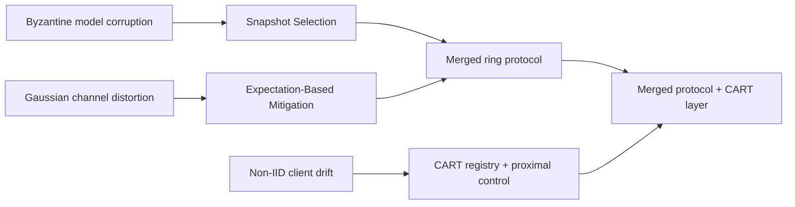
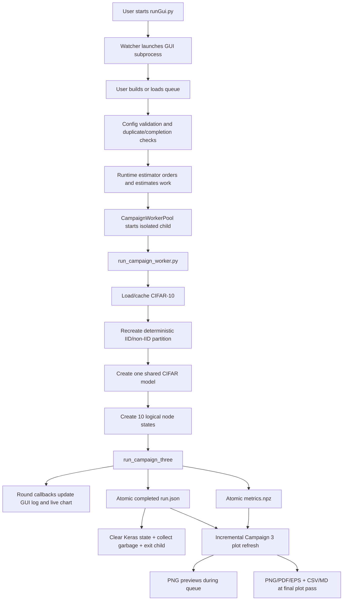
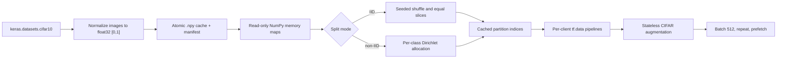
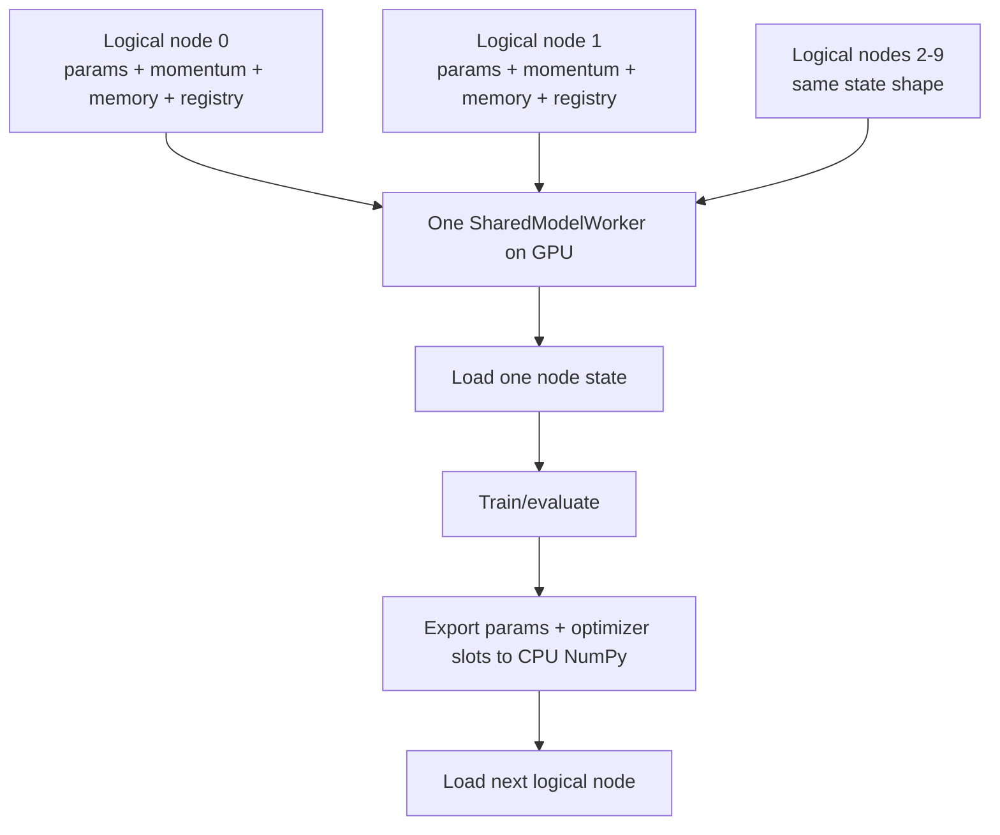
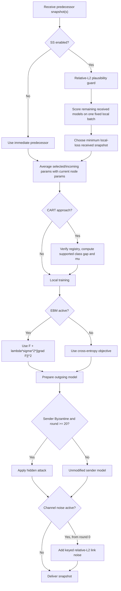
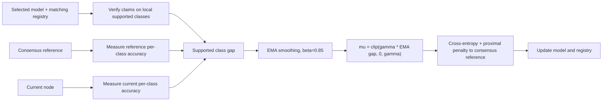
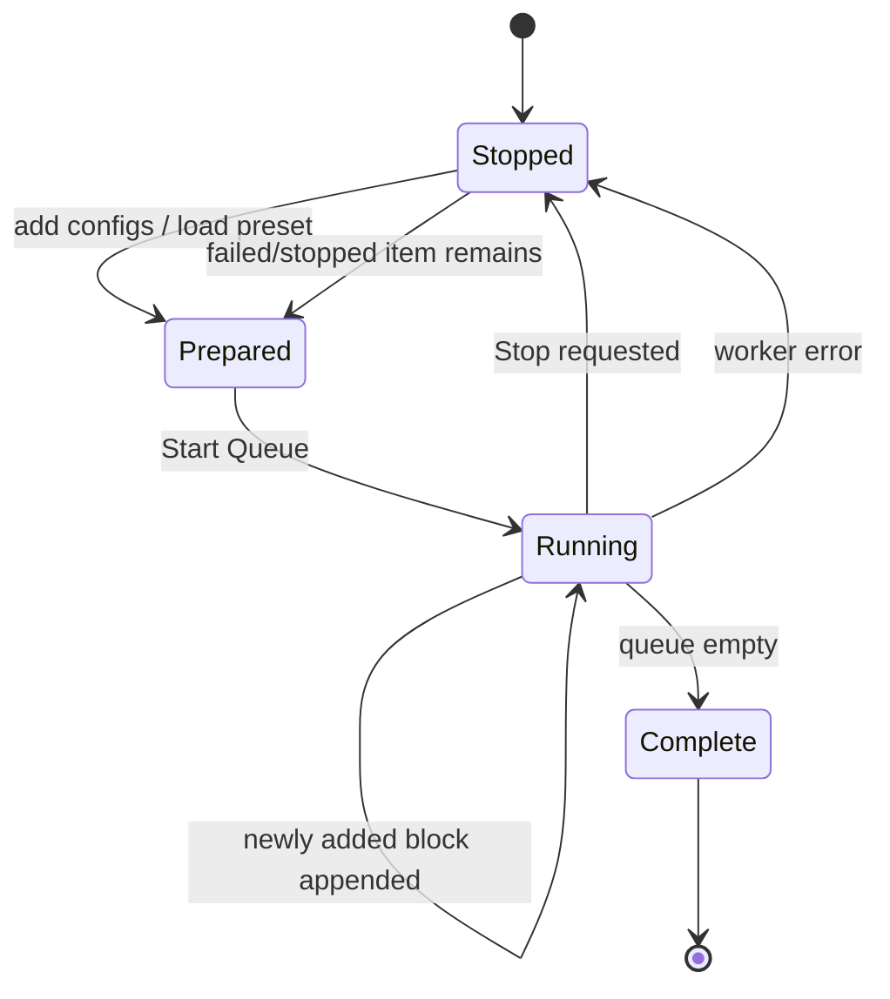

<a id="document-top"></a>

# Get To Know PaperMerge

This is the advisor-facing technical map of the repository. It explains what
has been run, what the stored results mean, how an experiment travels from a
JSON configuration to CIFAR-10 training and publication plots, and what every
project code file and callable is responsible for.

The description reflects the repository state on **July 29, 2026**. It
documents the code as implemented. It does not turn expected accuracy ordering
into a guarantee, and it does not treat incomplete experiment arms as evidence.

<a id="section-index"></a>

## Section Index

Use this index to jump directly to a major section. The `↑` icon beside every
major section heading returns here.

| Section | Brief explanation |
|---|---|
| [What Has Been Tested So Far](#tested-so-far) | Current Campaign 3 R2 coverage, completed records, missing runs, and result-reading links |
| [What A Result Means](#result-meaning) | Definitions of stored metrics, baselines, paired comparisons, and valid interpretation |
| [Component Boundaries](#component-boundaries) | Exact responsibilities of consensus, Snapshot Selection, EBM, Merged, and CART |
| [End-To-End System](#end-to-end-system) | Full flow from a selected JSON config to training, saved artifacts, and plots |
| [Data Path](#data-path) | CIFAR-10 loading, IID/non-IID partitioning, model construction, and node state |
| [One R2 Training Round](#r2-training-round) | Round-level behavior for clean, noisy, Byzantine, Merged, and CART runs |
| [GUI And Queue Behavior](#gui-queue) | GUI layout, config selection, queue persistence, workers, stopping, failures, and ETA |
| [Saving And Plotting](#saving-plotting) | Result schemas, directory structure, incremental plotting, tables, and figure types |
| [Why Experiments Take So Long](#runtime) | Optimizer workload, evaluation cost, EBM overhead, process isolation, and safe speed controls |
| [Repository Map](#repository-map) | Purpose of each top-level project directory |
| [Entry Points And GUI Function Reference](#gui-function-reference) | Every entry-point and GUI callable, grouped by responsibility |
| [Core Learning Function Reference](#core-function-reference) | Active model, node, consensus, Snapshot Selection, CART, and Campaign 3 functions |
| [Legacy And Experimental Core Modules](#legacy-core-reference) | Older training paths and isolated research prototypes |
| [Noise-Mitigation Function Reference](#noise-reference) | Channel model, EBM helpers, schedulers, and validation functions |
| [Runner And Maintenance Script Reference](#runner-reference) | Worker, single-config, migration, validation, and maintenance scripts |
| [Plot Function Reference](#plot-reference) | Plot discovery, filtering, aggregation, comparisons, and report generation |
| [Automated Test Function Reference](#test-reference) | What each automated test module verifies |
| [Non-Code Files And Generated Families](#non-code-files) | Config families, result artifacts, plots, papers, and documentation |
| [Reproducing And Reviewing The Project](#reproduction-review) | Commands and review order for reproducing or auditing the work |
| [Known Boundaries](#known-boundaries) | Current evidence gaps, legacy limitations, and claims the repository cannot yet support |
| [Git Hygiene](#git-hygiene) | Tracked research artifacts versus ignored machine-local and generated state |

<a id="tested-so-far"></a>

## What Has Been Tested So Far [↑](#section-index)

### Official Campaign 3 R2 records

The current paper experiment is Campaign 3 R2:

| Property | Implemented setting |
|---|---|
| Dataset | CIFAR-10 |
| Main split | non-IID Dirichlet, alpha `0.2` |
| Topology | 10 logical clients in a sequential ring |
| Model | Shared VGG-style CIFAR CNN, with separate logical node states |
| Confirmation rounds | 100 |
| Local work per visit | 5 local epochs x 5 batches |
| Effective batch size | 512, internally microbatched at 128 |
| Confirmation seeds | 2026, 2027, 2028 |
| Hidden attackers | Nodes 1, 4, 6, and 8 |
| Hidden attack timing | Active from round 20 through the end |
| Channel-noise timing | Active from round 0 through the end |
| Noise sweep | sigma `0.2`, `0.3`, `0.4`, `0.5`, `0.6` |
| Base approaches | Merged and CART |
| Defenses | SS for Byzantine updates; EBM for channel noise |

The complete per-approach confirmation matrix has 99 configurations:

```text
Per seed:
  1 clean reference
  2 hidden-only arms: no mitigation, SS
  10 noise-only arms: 5 sigma values x (none, EBM)
  20 joint arms: 5 sigma values x (none, SS, EBM, SS+EBM)
  ---------------------------------------------------------
  33 configurations per seed x 3 seeds = 99
```

At the time this guide was written, the R2 result tree contains:

| Stored state | Count | Meaning |
|---|---:|---|
| `run.json` records | 159 | Every prepared run, including failures |
| Completed `metrics.npz` archives | 158 | Successful archives physically present on disk |
| Records accepted by current plot protocol | 149 | 103 confirmation plus 46 current calibration; superseded calibration patches are excluded |
| Failed records without metrics | 1 | A Merged sigma-0.2 EBM run ended on a broken output pipe |
| CART confirmation records completed | 99 of 99 | The full non-IID CART confirmation matrix is present |
| Merged confirmation records completed | 4 of 99 | Clean, hidden/no-defense, hidden/SS, and noise sigma-0.2/no-defense |
| Calibration archives completed | 55 | 38 CART and 17 Merged stored; 46 match the current plot protocol |
| Official IID R2 records completed | 0 | IID configs exist, but this R2 result tree is currently non-IID only |

This distinction matters: the CART matrix is complete, but a complete
three-seed CART-versus-Merged confirmation comparison is **not yet present**.
Plots can render partial Merged evidence, but they cannot substitute for the
missing Merged arms.

### Where to interpret the results

- [Campaign 3 R2 protocol and interpretation](Campaign3Guide.md) explains the
  experiment environments, equations, calibration gates, and paper-facing
  claims.
- [Generated non-IID result report](../plots3/r2/tables/nonIID/cifar10/results_report.md)
  summarizes records currently accepted by the plotter.
- [Raw per-run summary](../plots3/r2/tables/nonIID/cifar10/summary.csv) contains
  final average/worst accuracy, last-10-round stability, AUC, runtime, and peak
  GPU memory.
- [Raw paired differences](../plots3/r2/tables/nonIID/cifar10/paired_differences.csv)
  preserves negative as well as positive paired effects.
- [Gamma in CART](gammaExplained.md) explains `gamma`, class gaps, and the
  per-node/round proximal coefficient `mu`.
- [WCM pilot](WCM_PILOT.md) describes the isolated Worst-Case Model code and
  why it is not part of Campaign 3 or the current plots.

### Older and exploratory results

`experiments/results/`, `experiments/results2/`, `plots/`, and `plots2/`
contain legacy GUI and standalone experiments. They use older execution paths,
schemas, aggregation behavior, and sometimes single seeds. They are preserved
for provenance but must not be pooled with R2.

The WCM implementation currently has equation and tiny-ring tests, but no
official result archive under `experiments/wcm_pilot/`. WCM is an isolated
candidate mitigation, not a result claimed by the current paper campaign.

<a id="result-meaning"></a>

## What A Result Means [↑](#section-index)

The primary R2 values are:

| Field | Meaning |
|---|---|
| `avg_history` | Mean test accuracy across the 10 logical node models after each round |
| `worst_history` | Lowest test accuracy among those node models after each round |
| `final_avg` | Full-test mean node accuracy after the final round |
| `final_worst` | Full-test minimum node accuracy after the final round |
| `final_node_accuracy` | One full-test accuracy for each logical node |
| `final_class_accuracy` | Per-class accuracy derived from the aggregate confusion tensor |
| `confusion` | Full-test confusion matrices used for class diagnostics |
| `mu_history` | Mean active CART proximal strength over nodes in each round |
| `accepted_claims` / `rejected_claims` | CART registry-verification telemetry |
| `registry_coverage` | Fraction of registry classes with verified support |
| `selected_sources` | Sender selected by each node in each round |
| `learning_curve_auc` | Normalized area under the average-accuracy history |
| `runtime_seconds` | Time inside the training engine |
| `wallRuntimeSeconds` | Worker startup, data setup, training, saving, and cleanup time |
| `peak_gpu_bytes` | TensorFlow-reported peak allocator use |

Expected behavior is a research hypothesis, not a plotting rule:

- Clean is expected to be the upper reference because it has no corruption.
- SS should be evaluated against a matching Byzantine no-mitigation arm.
- EBM should be evaluated against a matching noisy no-mitigation arm.
- SS+EBM should be evaluated against matching joint no-defense, SS-only, and
  EBM-only arms.
- CART should be evaluated against Merged using the same split, environment,
  sigma, mitigation, seed, and protocol revision.

The software does not rewrite accuracy to force these relationships. Raw
paired differences remain negative when a defense or CART performs worse.
Only the named damage-recovery visualization is bounded to 0-100%; the raw CSV
still contains the signed effect.

<a id="component-boundaries"></a>

## Component Boundaries [↑](#section-index)

PaperMerge combines separate mechanisms with different responsibilities:



| Mechanism | Responsibility | Source status |
|---|---|---|
| Snapshot Selection | Select a lower-local-loss received snapshot under Byzantine corruption | BASIL-derived |
| EBM | Optimize a gradient-norm-regularized objective under channel noise | Noisy-communication-paper-derived |
| Pairwise/full consensus | Preserve and combine decentralized model state | Project integration mechanism |
| SS relative-L2 plausibility guard | Reject implausibly distant candidates before loss ranking | Project integration mechanism |
| Merged | Test SS and EBM together in one realistic ring environment | Project contribution/integration study |
| CART | Carry verified class metadata and adapt proximal regularization | Proposed project contribution |

The current R2 implementation does not silently modify SS or EBM based on a
desired result. Their code paths and coefficients are declared in each config
and stored in `run.json`.

<a id="end-to-end-system"></a>

## End-To-End System [↑](#section-index)



The process boundary is important. TensorFlow's GPU allocator may retain memory
inside a process even after Python objects are deleted. One R2 child owns one
experiment, explicitly clears Keras state, runs garbage collection three
times, and exits. The operating system then releases the process and CUDA
allocator state before the next experiment.

<a id="data-path"></a>

## Data Path [↑](#section-index)

### CIFAR-10 loading and cache



`basil_core/data/cifar.py` stores normalized arrays and deterministic
partition-index files under `experiments/cache/cifar10/`. File locks and atomic
replacement prevent two workers from partially writing the same cache.
Partition keys include IID/non-IID mode, client count, alpha, seed, and data
size. Old partition entries are pruned to a bounded count.

Each client receives only its partition. A deterministic private probe contains
up to 32 locally available examples per class for CART registry measurements.
The probe does not add absent classes and is not shared raw data.

MNIST and N-MNIST loaders remain for legacy scripts. N-MNIST uses `tonic` when
available and otherwise constructs an event-like fallback from MNIST.

### Model path

The R2 CIFAR model is a Keras sequential CNN:

```text
Input 32x32x3
  -> Conv block, 64 channels
  -> MaxPool + Dropout
  -> Conv block, 128 channels
  -> MaxPool + Dropout
  -> Conv block, 256 channels
  -> MaxPool + Dropout
  -> Flatten
  -> Dense 512 + Dropout
  -> Dense 10 logits
```

Batch normalization is intentionally absent, which keeps parameter averaging
straightforward. `CIFARModel` wraps the Keras model with a common
get/set/call interface shared by the MNIST and N-MNIST wrappers.

### Logical nodes and the shared GPU worker

R2 does not keep ten compiled CNNs resident on the GPU:



Every logical node has independent model parameters, momentum slots, incoming
snapshot memory, probe data, and CART state. The shared worker serializes their
use of one compiled TensorFlow model.

<a id="r2-training-round"></a>

## One R2 Training Round [↑](#section-index)

### Clean environment

Clean means exactly:

```text
0 Byzantine nodes + no channel noise + no SS + no EBM
```

All nodes begin a round from the same consensus model, train locally, and are
recombined with an exact all-node average:

```mermaid
sequenceDiagram
    participant R as Common round model
    participant N0 as Node 0
    participant N1 as Node 1
    participant N9 as Node 9
    participant C as Exact consensus

    R->>N0: Copy parameters; local train
    R->>N1: Copy parameters; local train
    R->>N9: Copy parameters; local train
    N0->>C: Updated parameters
    N1->>C: Updated parameters
    N9->>C: Updated parameters
    C-->>N0: Average of all 10
    C-->>N1: Average of all 10
    C-->>N9: Average of all 10
```

This is the only condition labeled clean. The code expects it to be an upper
reference but does not clamp other outcomes below it.

### Hidden/noisy environments

For every node, in ring order:



Pairwise consensus is ordinary aggregation, not SS mitigation:

```text
reference = 0.5 * current_node + 0.5 * selected_received
```

Without SS, the selected received model is the immediate predecessor. With SS,
the candidate set contains received neighbor snapshots, not an automatically
inserted copy of self. The R2 plausibility guard runs before the BASIL-derived
minimum-loss ranking.

### EBM in R2

The legacy path can scale gradients by `1 + lambda*sigma^2`. Campaign 3 R2
does not use that shortcut. It differentiates:

```text
J(w) = F(w) + lambda * sigma^2 * ||grad F(w)||^2
```

Nested gradient tapes produce the second-order gradient. Microbatch
accumulation bounds activation memory while preserving configured batch size
512. The effective coefficient `lambda*sigma^2`, implementation identifier,
and coefficient schedule are saved in every config.

### CART in R2

The `ClassRegistry` stores metadata, not class-specific models:

```text
class -> best verified accuracy, source node, source round, support count
```



Historical registry accuracy is capped by what the exact current consensus
reference can reproduce. Unknown or unsupported classes do not generate a
training signal. `gamma` is a maximum multiplier; `mu` is the smaller
node-and-round-specific active strength. See
[gammaExplained.md](gammaExplained.md) for worked examples.

<a id="gui-queue"></a>

## GUI And Queue Behavior [↑](#section-index)

### Startup and layout

`runGui.py` is a lightweight watcher. It launches `gui/experimentGui.py` in a
child process and watches project Python modification times. A GUI-requested
reload exits with code 42, causing a clean relaunch with current source.

The Tkinter GUI provides:

- Basic, Advanced, Attack, and Output tabs.
- A dark ttk theme and a live Matplotlib chart.
- Manual config execution and persistent queue execution.
- Multi-select config loading, presets, multi-delete, move controls, drag
  reordering, and shortest-first sorting.
- Per-row empirical duration estimates and a total queue completion estimate.
- Full configuration logging and lane-prefixed worker output.

### Queue lifecycle



The queue is persisted in `gui/queue_state.json`. A queue item is removed only
after its matching result is completed and saved. If the user stops a run or a
worker fails, the current config remains available for resumption. Completed
R2 configs are skipped only when `run.json`, `metrics.npz`, run ID, and config
hash all agree.

When stopped, selected configs are sorted by estimated duration. During a run,
new configs are sorted as a block and appended after existing work. Manual drag
ordering remains available while stopped.

### ETA calculation

`RuntimeEstimator` reads completed `run.json` records and matches costly
properties such as approach, EBM path, SS path, split, batch size, nodes, local
epochs, and steps. It prefers exact signatures and same-round histories,
scales weaker matches by total work units, and reports a median with a robust
uncertainty range.

For multiple validated lanes, queue ETA uses greedy lane scheduling rather than
dividing total time blindly. Active elapsed time is subtracted from matching
running jobs. The worker benchmark allows two lanes only if both fit, remain
deterministic, and achieve at least the configured 1.4x throughput.

### Live output and plotting

Workers emit JSON events prefixed by `@@CAMPAIGN_EVENT@@`. The GUI parses round,
start, completion, stop, and failure events while forwarding ordinary
TensorFlow output to the log. Round events update lane progress and the live
average/worst chart.

After each completed R2 config, the GUI schedules a background incremental PNG
refresh. `PlotWriter` fingerprints source metadata and skips unchanged plots.
At the queue boundary or a manual full plot request, the plotter writes all
requested PNG, PDF, and EPS files plus CSV and Markdown tables.

<a id="saving-plotting"></a>

## Saving And Plotting [↑](#section-index)

### Current config library

`gui/configs/current/` is generated from Python source contracts, not edited as
the primary source:

```text
gui/configs/current/
  manifest.json
  IID/{basil,noisy,merged,cart}/*.json
  nonIID/{basil,noisy,merged,cart}/*.json
```

Merged and CART entries are exact R2 confirmation configs. BASIL and Noisy
entries are deterministic standalone baselines. `scripts/sync_gui_config_library.py`
regenerates the current library and removes stale generated config files.

The older `gui/configs/IID/`, `gui/configs/nonIID/`, and
`gui/presets/preset1_queue.json` paths are legacy/custom libraries. They are
selectable only through the explicit legacy route and are not silently mixed
with the current library.

### R2 result paths

```text
experiments/results3/r2/gui/
  {IID|nonIID}/cifar10/{none|hidden}/{merged|cart}/
    {no_channel_noise|sigma_0_2|...}/
      {conditionId}/
        [patch_{protocolPatch}/]
        [gamma_{value}/]
        seed_{seed}/
          run.json
          metrics.npz
```

`run.json` records config identity, status, Git revision, partition hash,
initialization hash, metric fingerprint, final metrics, runtime, GPU peak, and
failure traceback when applicable. It is written first as `preparing`, then
`running`, and finally `completed`, `stopped`, or `failed`.

`metrics.npz` is written only for a successful complete experiment. Both JSON
and NPZ writers use a temporary file in the target directory, flush it, and
atomically replace the destination. The completed metadata is written after
the metrics archive, so a crash cannot masquerade as a completed result.

### R2 plot paths

```text
plots3/r2/
  manifest.json
  images/gui/{split}/cifar10/hidden/
    {merged|cart}/paper/
    comparison/paper/
    comparison/diagnostics/
  tables/{split}/cifar10/
    summary.csv
    paired_differences.csv
    results_report.md
```

Paper plots include:

| Plot | Question answered |
|---|---|
| `component_validation_avg` | Does Merged SS help hidden-only and EBM help noise-only? |
| `joint_robustness_profile_avg` | How does SS+EBM accuracy change with sigma? |
| `defense_composition_avg` | How do none, SS, EBM, and SS+EBM compare? |
| `cart_lift_over_merged_avg` | What is the paired CART minus Merged effect? |
| `damage_recovery_avg` | What fraction of measured corruption damage is recovered? |
| `convergence_representative_avg` | How do representative runs evolve over rounds? |
| `average_vs_worst` | Does mean performance hide a weak node? |
| `class_retention_avg` | Which CIFAR-10 classes are retained under joint stress? |
| `experiments_avg` / `_zoom` | Familiar per-approach learning curves |
| `grid_avg` | One panel per experiment condition |
| `final_accuracy_avg` | Final absolute accuracy with uncertainty |
| `improvement_over_no_mitigation_avg` | Paired mitigation gain over a matching baseline |
| `seed_profiles_final_accuracy` | Seed-specific profiles without pooling identities |
| `ablation_groups_avg` | Grouped mitigation ablation by environment and sigma |

Diagnostics include mitigation heatmaps, seed spread, last-10-round stability,
confusion matrices, CART registry telemetry, snapshot-selection behavior,
runtime/memory, client class distribution, learning-curve AUC, and calibration
gamma profiles.

Legacy plotting uses `plots/plotGui.py` and writes only PNG files under
`plots/` or `plots2/`. R2 publication plotting uses
`plots/plotCampaign3.py` and never reads legacy roots.

<a id="runtime"></a>

## Why Experiments Take So Long [↑](#section-index)

One 100-round R2 config performs:

```text
100 rounds
  x 10 logical nodes
  x 5 local epochs
  x 5 effective batches
= 25,000 optimizer updates
```

Every effective batch has 512 images but is split into four activation
microbatches of 128. A standard config therefore executes roughly 100,000
microbatch gradient passes before adding evaluation work.

EBM is more expensive because differentiating
`F + lambda*sigma^2*||grad F||^2` requires nested gradient tapes and
second-order derivatives. CART adds private per-class probes, registry
verification, reference probes, and proximal gradients. SS adds candidate
model loads and loss scoring. Every round also evaluates ten logical models on
test batches, and the final pass builds full confusion matrices.

Additional fixed costs include:

- A new Python/TensorFlow process and CUDA context per config.
- TensorFlow graph tracing on the first standard or EBM step.
- Deterministic data-pipeline construction and iterator setup.
- Atomic result serialization.
- Plot refresh work, mostly off the training critical path.

The CIFAR and partition caches remove repeated download, normalization, and
partition-generation costs. They cannot remove CNN training, second-order EBM,
SS scoring, CART probes, or evaluation.

Running two GPU workers is not automatically faster. Both contend for the same
GPU compute and memory bandwidth. The repository benchmark measured only about
1.01x throughput on the current RTX 4070 Ti, below the 1.4x gate, so one lane
is the safe measured setting.

<a id="repository-map"></a>

## Repository Map [↑](#section-index)

```text
PaperMerge/
  README.md                    Public entry point
  docs/                        Public technical guides
  Papers/                      Local source papers
  environment/requirements.txt
  runGui.py                    GUI watcher/launcher
  basil_core/                  Models, data, attacks, ring engines, CART
  noise_comm/                  EBM/WCM mathematical helpers
  gui/                         Tk GUI, campaign contracts, workers, configs
  plots/                       Legacy and R2 plot generators
  scripts/                     Runners, workers, calibration, maintenance
  tests/                       Contract, engine, worker, cache, and WCM tests
  experiments/                 Configs, caches, legacy results, R2 results
  plots3/r2/                   Current R2 plots and tables
```

The next sections are a file-by-file and function-by-function reference.

<a id="gui-function-reference"></a>

## Entry Points And GUI Function Reference [↑](#section-index)

### `runGui.py`

| Callable | Responsibility |
|---|---|
| `_run_gui()` | Imports and invokes `gui.experimentGui.main()` inside the launched GUI process. |
| `_collect_mtimes()` | Scans project Python files and returns modification times used by hot reload. |
| `_launch_subprocess()` | Starts a fresh Python child running this file in GUI-child mode. |
| `_run_watcher()` | Supervises the child, watches source changes, handles reload code 42, and relaunches when requested. |

### `gui/experimentGui.py`

`ExperimentGUI` is the main Tkinter controller. It owns widgets, Tk variables,
the queue, worker pool state, runtime estimates, log routing, live chart data,
legacy in-process runs, R2 isolated runs, and plot refresh scheduling.

#### Construction and display

| Method | Responsibility |
|---|---|
| `__init__()` | Initializes all GUI/run/queue/plot state, applies style, builds widgets, restores the queue, starts ETA/live timers, and installs close handling. |
| `_setupStyle()` | Defines the dark ttk theme, colors, typography, tab/button/tree styles, and disabled/active states. |
| `setupVariables()` | Creates Tk variables for dataset, split, model, topology, optimization, noise, attacks, CART, and experiment name fields. |
| `createUI()` | Builds the main header, notebook tabs, progress strip, output area, and command bar. |
| `_createProgressFrame()` | Creates status, current progress, elapsed time, per-run ETA, and queue ETA labels. |
| `createBasicTab()` | Builds common dataset, approach, topology, node, round, learning-rate, and batch controls. |
| `createAdvancedTab()` | Builds non-IID, schedule, local-work, EBM, CART, memory, and verification controls. |
| `createAttackTab()` | Builds scrollable Byzantine and channel-noise controls; nested `_resize()` keeps the embedded frame width synchronized. |
| `createOutputTab()` | Embeds the structured text log and Matplotlib average/worst live chart. |
| `_styleChartAxes()` | Applies dark chart colors, labels, grid, bounds, and spine styles. |
| `createButtons()` | Builds the compact icon/text command bar for run, queue, stop, config, plot, clear, and reload actions. |
| `_setupKeyboardShortcuts()` | Binds run, queue, save/load, stop, and reload keyboard actions. |

#### Status, logging, and live chart

| Method | Responsibility |
|---|---|
| `_setStatus()` | Updates the status text safely from Tk callbacks. |
| `_onRoundComplete()` | Receives a training-round callback and schedules UI work on the Tk thread. |
| `_updateUIAfterRound()` | Updates progress values, latest metrics, elapsed/rate estimates, and chart history. |
| `_etaTicker()` | Periodically refreshes elapsed time and per-run/queue ETA while work is active. |
| `_refreshLiveChart()` | Redraws one or more lane-aware average/worst histories without replacing the canvas widget. |
| `_clearLiveChart()` | Clears histories, lane data, and chart artists before a new run/batch. |
| `logMessage()` | Appends tagged text to the Output widget from GUI or worker threads. |
| `_appendToErrorFile()` | Mirrors error/traceback-like log lines to the local `error.txt` session log. |
| `_pickLogTag()` | Chooses log colors for errors, warnings, rounds, headings, success, and ordinary text. |
| `clearOutput()` | Clears the visible log and local error-log contents. |
| `_showLogMenu()` | Opens the Output context menu. |
| `_copySelection()`, `_selectAllLog()`, `_copyAllLog()` | Implement text-selection and clipboard actions. |
| `_saveErrorsFromLog()` | Extracts error-tagged text and lets the user save an explicit diagnostic file. |

#### Form semantics and config assembly

| Method | Responsibility |
|---|---|
| `_onNonIIDChange()` | Enables or disables the Dirichlet-alpha control when split mode changes. |
| `_applyPreset()` | Applies a named form preset and synchronizes dependent widgets. |
| `_autoGenerateName()` | Builds a readable legacy experiment name from active environment and mitigation controls. |
| `onApproachChange()` | Enables only controls relevant to BASIL, Noisy, Merged, or CART. |
| `validateConfig()` | Validates current form values before manual execution. |
| `_hasByzantineAttack()` | Requires both attacker IDs and an enabled attack flag to classify a run as Byzantine. |
| `_validateMitigationSemantics()` | Rejects SS without attack, EBM without noise, and active noise with nonpositive sigma. |
| `_isCartTwoAttackTwoMitigation()` | Recognizes the CART + Byzantine + noise + SS + EBM legacy target condition. |
| `_isNamedCleanReference()` | Recognizes the legacy canonical clean experiment name. |
| `_applyCleanReferenceSemantics()` | Forces that legacy named clean run to zero attack/noise/mitigation and consensus aggregation. |
| `_applyCartTargetTuning()` | Retained compatibility hook that intentionally returns without hidden tuning. |
| `getConfig()` | Serializes all form variables to a legacy-compatible config dictionary and applies semantic defaults. |
| `defaultAggregationMode()` | Chooses handoff for BASIL-style SS, consensus for unmitigated Merged/CART, and handoff otherwise. |

#### Manual and legacy execution

| Method | Responsibility |
|---|---|
| `runExperiment()` | Validates the form, disables conflicting controls, resets output, and starts one background run thread. |
| `runExperimentThread()` | Executes the selected config, reports exceptions, and schedules final UI restoration. |
| `_onRunFinished()` | Restores controls and status after a manual worker thread ends. |
| `runAll()` | Discovers a legacy config directory, skips saved configs, and starts a batch thread. |
| `runAllThread()` | Runs legacy config files sequentially, preserving stop/error state and plotting at batch boundaries. |
| `_executeExperiment()` | Enforces mitigation rules, clears TensorFlow state, delegates execution, and always releases references. |
| `_executeExperimentImpl()` | Logs a full config, loads data, creates nodes, dispatches BASIL/FedAvg/CART/R2, evaluates, and saves. |
| `_cleanupTensorflow()` | Calls shared explicit Keras cleanup and garbage collection at experiment boundaries. |
| `_releaseExperimentObjects()` | Drops node, loader, data, and model references before cleanup. |
| `stopExperiment()` | Sets the stop event and terminates active isolated workers without deleting their queue configs. |
| `onClosing()` | Confirms active-work shutdown, stops workers/timers, saves queue state, and destroys the root. |
| `reloadGui()` | Saves queue state, stops active work, and exits with watcher reload code 42. |
| `loadDataset()` | Dispatches CIFAR-10, MNIST, or N-MNIST loading. |
| `makeLoaders()` | Dispatches the matching IID/non-IID loader and requests R2 metadata where required. |
| `createNodes()` | Creates synchronized `BasilNode` or `CARTNode` objects for legacy execution. |
| `getModelClass()` | Maps dataset name to the model wrapper class. |
| `getNoiseModel()` | Maps form flags to `none`, `noisy`, or legacy `ebm`. |
| `prepareAttacks()` | Parses attacker IDs and enabled attack types. |

#### Result identity and R2 in-process bridge

| Method | Responsibility |
|---|---|
| `_getResultPaths()` | Returns R2 atomic paths for Campaign 3 or legacy `.npy`/config paths otherwise. |
| `_resultDir()` | Constructs split/dataset/attack/approach and optional sigma-bucket legacy directories. |
| `_isAlreadyRun()` | Uses strict R2 metadata validation or legacy file existence to detect completion. |
| `_partitionHash()` | Hashes exact client index arrays for provenance. |
| `_codeRevision()` | Reads the current Git commit directly from `.git/HEAD` and its reference. |
| `_executeCampaignThree()` | Runs the shared-worker engine in the manual process, writes metrics/metadata, logs full results, and schedules plots. |
| `saveResults()` | Atomically avoids duplicate legacy writes, saves accuracy/config files, then requests missing plots. |

#### Queue estimates, persistence, and presets

| Method | Responsibility |
|---|---|
| `_workerSettings()` | Loads the benchmark profile and returns validated lane count, GPU cap, and slowdown. |
| `_queueEstimateText()` | Formats item count, ETA range, finish clock time, lanes, and summed work. |
| `_refreshQueueEstimate()` | Reloads runtime history and refreshes queue/active estimates. |
| `_scheduleQueueEstimateRefresh()` | Debounces ETA recalculation on the Tk event loop. |
| `_configsByEstimatedDuration()` | Stable-sorts configs by empirical estimated seconds. |
| `_saveQueueState()` | Writes the current queue JSON to local persistent state. |
| `_loadQueueState()` | Restores a valid saved queue at startup. |
| `_updateQueueButton()` | Updates the Queue button badge and schedules ETA refresh. |
| `_appendCampaign3Preset()` | Builds a named R2 preset and appends only missing/not-queued configs. |
| `_replaceWithCampaign3Preset()` | Replaces the stopped queue with a confirmed preset after warning the user. |
| `_benchmarkCampaignWorkers()` | Starts the one-vs-two-lane benchmark flow from the queue window. |
| `_runWorkerBenchmarkThread()` | Runs the benchmark subprocess, logs output, reloads the worker profile, and refreshes ETA. |

#### Queue manager and isolated execution

`openQueueManager()` builds the queue window. Its nested callbacks are:

| Nested callable | Responsibility |
|---|---|
| `_attackSummary()` | Produces a short environment/attack description for a tree row. |
| `refreshTree()` | Rebuilds queue rows with order, approach, split, estimated duration, and name. |
| `addCurrent()` | Captures the current form as one queued config. |
| `loadPreset1()` | Loads the archived 36-entry local preset. |
| `addFromFile()` | Opens the multi-select Current/Legacy config picker. |
| `refreshPicker()` | Rebuilds picker rows and counts after filters/library selection change. |
| `onPickAdd()` | Adds selected picker configs, sorted within their added block. |
| `addAllDialog()` | Opens campaign preset choices and missing-run actions. |
| `doAddAll()` | Dispatches the selected preset append/replace operation. |
| `_selectedIdx()`, `_selectedIdxs()` | Convert selected tree rows to queue indexes. |
| `moveUp()`, `moveDown()`, `moveSelectedToTop()` | Reorder selected stopped queue items. |
| `sortShortestFirst()` | Globally sorts a stopped queue by estimated duration. |
| `removeSelected()` | Deletes all selected stopped items, not just one row. |
| `clearAll()` | Clears a stopped queue after confirmation. |
| `runQueueAndClose()` | Closes the manager and starts queue execution. |
| `beginDrag()`, `dragRow()`, `endDrag()` | Implement mouse drag-and-drop queue ordering. |

The remaining queue methods are:

| Method | Responsibility |
|---|---|
| `_removeQueuedConfig()` | Removes the exact successful config object and persists the queue. |
| `_nextCampaignConfig()` | Finds the next non-active, non-duplicate Campaign 3 item. |
| `_startCampaignLiveRun()` | Allocates lane-specific chart/progress state. |
| `_recordCampaignRound()` | Stores one worker round event and schedules chart refresh. |
| `_logCampaignConfiguration()` | Prints the complete R2 config and worker settings before launch. |
| `_updateCampaignPoolProgress()` | Combines lane progress into the main progress strip. |
| `_drainCampaignWorkerEvents()` | Parses structured events, updates charts/status, and forwards ordinary child lines. |
| `_runIsolatedCampaignBlock()` | Schedules R2 workers across validated lanes until the campaign block completes/stops/fails. |
| `runQueue()` | Validates queue state, resets UI/live data, and starts the queue thread. |
| `runQueueThread()` | Runs mixed legacy/R2 queue items, removes only successful items, preserves failed/stopped items, and finalizes plots. |

#### Config dialogs and plots

| Method/callback | Responsibility |
|---|---|
| `saveConfig()` | Saves current form config through a file dialog. |
| `loadConfig()` | Opens the config browser and populates form variables. |
| `refreshList()` | Nested loader callback that filters and lists available JSON configs. |
| `onLoad()` | Nested loader callback that reads the selected JSON into the form. |
| `_scheduleCampaign3PlotRefresh()` | Marks a split dirty and starts/debounces the live plot thread. |
| `_campaign3PlotRefreshLoop()` | Generates changed PNG previews until no dirty split remains. |
| `_waitForCampaign3PlotRefresh()` | Waits for in-flight live refreshes before a final format pass. |
| `plotResults()` | Opens paper/diagnostic/both plot controls. |
| `runCampaign()` | Nested callback that starts the requested R2 plotting mode. |
| `_attackKeyFromConfig()` | Converts active attack flags to a stable legacy folder key. |
| `generateCampaign3Plots()` | Calls the R2 plotter, reports generated/skipped/errors, and handles UI state. |
| `generatePlots()` | Calls legacy plotting for one config or the discovered result tree, optionally only when stale/missing. |
| `main()` | Creates the Tk root and starts the GUI event loop. |

### `gui/campaign_workers.py`

| Callable | Responsibility |
|---|---|
| `ActiveWorker` | Dataclass holding lane, config, subprocess, temp config path, start time, and reader thread. |
| `WorkerCompletion` | Immutable completion record with lane, config, return code, and elapsed wall time. |
| `CampaignWorkerPool.__init__()` | Configures lane count, GPU cap, worker script/interpreter, work directory, locks, and event queue. |
| `available_lanes`, `active_count`, `has_active` | Thread-safe properties describing pool capacity. |
| `active_configs()` | Returns configs currently owned by child processes. |
| `launch()` | Atomically writes a lane temp config, starts one worker subprocess, records it, and starts output reading. |
| `_read_output()` | Converts prefixed JSON lines to structured events and all other lines to log events. |
| `drain_events()` | Nonblockingly drains accumulated worker output for the GUI. |
| `poll_finished()` | Reaps exited workers, closes output, removes temp configs, and returns completions. |
| `active_elapsed_by_run_id()` | Reports elapsed wall time used by queue ETA subtraction. |
| `request_stop()` | Sends terminate to each active worker for cooperative stop handling. |
| `kill_remaining()` | Force-kills children that did not terminate. |
| `wait()` | Polls until all workers exit or a timeout expires. |

### `gui/runtime_estimator.py`

| Callable | Responsibility |
|---|---|
| `RuntimeEstimate`, `QueueEstimate`, `_RuntimeRecord` | Immutable records for one-config estimates, whole-queue estimates, and historical samples. |
| `_active_ebm()` | Identifies the costly active second-order EBM path. |
| `_signature()` | Builds a runtime-relevant config signature. |
| `_work_units()` | Computes `rounds * nodes * localEpochs * stepsPerEpoch`. |
| `_load_records()` | Loads successful wall/engine runtimes from R2 metadata. |
| `_matching_tier()` | Ranks historical records from exact signature to EBM-only fallback. |
| `_scaled_seconds()` | Scales a historical runtime by work units and adds missing process overhead. |
| `RuntimeEstimator.__init__()`, `reload()` | Initialize or refresh historical samples. |
| `RuntimeEstimator.estimate()` | Uses same-round robust medians when possible and conservative defaults otherwise. |
| `RuntimeEstimator.estimate_queue()` | Computes lane-aware makespan and total work with active elapsed-time subtraction. Its nested `makespan()` greedily schedules durations across lanes; `remaining_work()` sums config work after elapsed-time subtraction. |
| `load_worker_profile()` | Loads benchmark recommendations or safe single-lane defaults. |
| `format_duration()` | Formats seconds as seconds, minutes, hours, or days. |

### `gui/config_library.py`

| Callable | Responsibility |
|---|---|
| `_condition_id()` | Produces a stable standalone condition key from environment, mitigation, and sigma. |
| `_standalone_config()` | Builds validated BASIL/Noisy baseline JSON with the fixed current workload. |
| `_standalone_matrix()` | Builds the allowed standalone environment/defense/seed matrix for one split/approach. |
| `build_current_configs()` | Returns standalone BASIL/Noisy configs or exact R2 Merged/CART confirmation configs. |
| `config_filename()` | Produces a deterministic human-readable filename from seed and condition ID. |

### `gui/campaign3.py`

This file is the source of truth for Campaign 3/R2 configuration identity and
matrix construction. It deliberately imports no TensorFlow or Tkinter code.

| Callable | Responsibility |
|---|---|
| `_canonical_payload()` | Removes derived/transient fields before hashing a config. |
| `config_hash()` | SHA-256 hashes canonical JSON config content. |
| `make_run_id()` | Creates the short `v3r2-...` ID from the config hash. |
| `_sigma_label()` | Converts sigma to a stable path token. |
| `ebm_objective_coefficient()` | Returns the predeclared piecewise `lambda*sigma^2` coefficient. |
| `_condition_id()` | Names clean, hidden, noise, and joint mitigation conditions. |
| `_experiment_name()` | Builds the full GUI/log display name. |
| `make_config()` | Validates environment/mitigation semantics and creates a complete schema-v3 R2 config. |
| `_gamma_for_sigma()` | Resolves scalar or bucketed CART gamma schedules. |
| `_full_approach_matrix()` | Builds the 33-condition-per-seed full matrix for Merged or CART. |
| `build_cart_low_noise_refinement()` | Builds the six paired CART sigma-0.2 gamma/SS-vs-SS+EBM calibration runs. |
| `build_calibration()` | Builds the complete 49-run seed-2025 calibration matrix. |
| `build_repair()` | Selects calibration runs superseded by the low-noise EBM patch. |
| `build_merged_core()` | Returns the 99 non-IID Merged confirmation configs. |
| `build_cart_addon()` | Returns the 99 non-IID CART confirmation configs for a frozen schedule. |
| `build_approach_confirmation()` | General three-seed full-matrix constructor for a split/approach. |
| `build_cart_controls()` | Selects clean and hidden-only CART controls from the full matrix. |
| `build_iid_controls()` | Builds the 48 representative IID control configs. |
| `build_core_confirmation()` | Builds the 105-run paper-focused non-IID claim matrix. |
| `load_calibration_state()` | Reads `campaign_state.json` when valid. |
| `frozen_cart_gamma()` | Returns a single frozen gamma when the state contains one. |
| `frozen_cart_schedule()` | Returns the frozen sigma-bucketed schedule used by confirmations. |
| `freeze_calibration_if_ready()` | Loads required metrics, computes declared gates/deltas, and atomically writes blocked/frozen state. Its nested `final_for()` reads final accuracy for one exact config. |
| `build_preset()` | Dispatches named GUI presets and enforces calibration before CART confirmation. |
| `result_run_dir()` | Builds isolated split/attack/approach/sigma/condition/patch/gamma/seed paths. |
| `result_paths()` | Returns `metrics.npz` and `run.json` for a config. |
| `is_completed()` | Requires both files plus matching completed status, run ID, and config hash. |
| `write_json_atomic()` | Flushes a temporary JSON file and atomically replaces the destination. |
| `write_npz_atomic()` | Writes compressed arrays to a temporary archive and atomically replaces the destination. |

`gui/__init__.py` is an empty package marker.

<a id="core-function-reference"></a>

## Core Learning Function Reference [↑](#section-index)

### `basil_core/models.py`

`MNISTModel`, `CIFARModel`, and `NMNISTModel` each construct the architecture
described in their class docstring. Their common methods work identically:

| Callable | Responsibility |
|---|---|
| `__init__()` | Builds the wrapped Keras sequential network and logits output. |
| `get_params()` | Returns trainable variables as NumPy arrays for ring communication. |
| `set_params()` | Assigns a matching parameter list into trainable variables. |
| `trainable_weights`, `trainable_variables` | Expose the wrapped Keras trainable variables to optimizers/tapes. |
| `get_weights()`, `set_weights()` | Forward Keras's full weight-list API. |
| `__call__()` | Runs the wrapped model with the requested training/inference mode. |

### `basil_core/trainer.py`

`lossFn` is sparse categorical cross-entropy over logits.

| Callable | Responsibility |
|---|---|
| `addChannelNoiseToParams()` | Adds isotropic Gaussian noise whose expected full-model L2 norm is `sigma * ||w||`, optionally from a keyed RNG. |
| `getParams()` | Copies model trainable weights to float32 NumPy arrays. |
| `setParams()` | Assigns NumPy parameters to model variables with correct dtype. |
| `averageParams()` | Computes normalized weighted or uniform parameter-wise averages. |
| `_iterLimited()` | Iterates a dataset fully or stops after `maxBatches`. |
| `evaluate()` | Computes classification accuracy over a limited or full loader. |
| `evaluateBatchLoss()` | Computes one-batch loss for legacy Snapshot Selection. |
| `evaluatePerClass()` | Computes supported per-class accuracy for CART. |
| `evaluateAll()` | Returns average, worst, and per-node accuracy for a node list. |
| `makeLrScheduler()` | Returns nested `lr()` functions for fixed, BASIL reciprocal, or power-law schedules. |
| `_computeGrads()` | Compiled cross-entropy gradient/loss pass. |
| `_forwardPass()` | Compiled inference forward pass. |
| `localUpdate()` | Legacy local SGD dispatcher for standard, gradient-scaled EBM, or backward-compatible WCM steps. |

The EBM branch in `localUpdate()` is legacy. Official R2 EBM is implemented in
`campaign_engine.py`.

### `basil_core/attacks.py`

| Callable | Responsibility |
|---|---|
| `gaussianAttack()` | Blends each outgoing tensor with calibrated Gaussian replacement noise. |
| `signFlipAttack()` | Randomly flips a calibrated fraction of parameter signs. |
| `hiddenAttack()` | Produces a delayed malicious model by blending a malicious direction or a negative-scaled model plus noise. |
| `modelPoisonAttack()` | Performs local gradient ascent on a Byzantine node and adds small obscuring noise. |
| `scalingAttack()` | Negates and amplifies model parameters. |
| `alieAttack()` | Applies an ALIE-style per-layer standard-deviation shift. |
| `innerProductAttack()` | Applies an inner-product manipulation negative scaling. |
| `noiseAmplificationAttack()` | Amplifies parameter deviation/noise. |
| `applyAttack()` | Normalizes the attack name and dispatches all parameter-list attacks; model poisoning remains handled by loops that own a model/data loader. |

### `basil_core/basil.py`

This is the legacy/general BASIL and FedAvg implementation. R2 reuses its
attack and conceptual behavior but executes through `campaign_engine.py`.

| Callable | Responsibility |
|---|---|
| `_batchGradients()` | Computes weighted microbatch gradients (max 128 images) equivalent to one effective batch and lowers peak activation memory. |
| `_MutableLR.__init__()` | Stores learning rate in an assignable TensorFlow variable. |
| `_MutableLR.__call__()` | Returns the current variable to Keras without retracing. |
| `_MutableLR.assign()` | Changes learning rate between rounds. |
| `_MutableLR.get_config()` | Serializes the initial schedule value. |
| `BasilNode.__init__()` | Stores node/model/data, bounded snapshot memory, noise/EBM/WCM settings, optimizer schedule, and lazy compiled state. |
| `BasilNode.receiveModel()` | Keeps the latest model by sender and evicts oldest senders beyond memory `S`. |
| `BasilNode.selectBestModel()` | Scores received snapshots on the same first local batch and loads the minimum-loss model. |
| `BasilNode._ensureCompiled()` | Lazily creates SGD and nested compiled `_step_fn()` for standard or legacy EBM training. |
| `BasilNode._resetOptimizerSlots()` | Zeros momentum-like optimizer slots while preserving learning-rate/iteration scalars. |
| `BasilNode.localTrain()` | Executes configured local epochs/steps through compiled SGD or legacy WCM. |
| `basilRingTrainingWithAttack()` | Runs sequential/parallel ring training, handoff/consensus, SS, attacks, link noise, clean exact consensus, LR control, evaluation, and callbacks. |
| `simpleRingTraining()` | Convenience wrapper for a basic attack-free ring call. |
| `fedAvgTrainingWithNoise()` | Runs centralized simulation-style FedAvg: synchronize, local train, attack submissions, optional selection, average, channel perturbation, evaluate. |

### `basil_core/class_registry.py`

| Callable | Responsibility |
|---|---|
| `ClassRegistry.__init__()` | Initializes per-class best accuracy, source, round, and support arrays. |
| `update()` | Atomically replaces class metadata only for finite, supported, better observations. |
| `merge()` | Takes better supported entries from another registry. |
| `verifyAndMerge()` | Accepts received claims only where the selected model reproduces them within threshold and local support exists. |
| `trustWeights()` | Converts positive verified class gaps into normalized class trust weights. |
| `reliableMask()` | Marks classes with both registry and local support. |
| `toDict()` | Serializes registry arrays to JSON-compatible lists. |
| `fromDict()` | Validates and reconstructs a registry from serialized data. |
| `clone()` | Deep-copies all metadata arrays. |
| `__repr__()` | Returns a compact diagnostic representation. |

### `basil_core/cart.py`

This is the legacy multi-model CART loop. The official R2 CART behavior is in
`campaign_engine.py`, but both use the same registry/proximal intent.

| Callable | Responsibility |
|---|---|
| `CARTNode.__init__()` | Extends `BasilNode` with class accuracy, registry, EMA gap, proximal references, gamma, and verification settings. |
| `selectBestModelClassAware()` | Performs legacy BASIL loss selection, then measures the selected model per class. |
| `_buildRefParams()` | Creates nontrainable TensorFlow reference variables matching model parameters. |
| `_ensureCartCompiled()` | Creates the CART optimizer and nested `_cart_step()` for supervised plus proximal gradients and optional legacy EBM scaling. |
| `cartLocalTrain()` | Sets class-gap/EMA-derived proximal strength and performs local CART updates. |
| `cartRingTraining()` | Runs legacy model+registry ring transmission, SS/consensus, verification, local CART, attacks/noise, clean consensus, and evaluation. |

### `basil_core/campaign_engine.py`

This is the deterministic official R2 training engine.

| Callable | Responsibility |
|---|---|
| `_copy_params()` | Deep-copies a parameter list as float32 NumPy arrays. |
| `_keyed_rng()` | Derives a deterministic NumPy RNG from base seed and semantic keys. |
| `params_hash()` | Hashes dtype, shape, and bytes of a complete parameter list. |
| `_relative_parameter_distance()` | Computes `||left-right|| / max(||left||, epsilon)` over the full model. |
| `_gradient_norm_regularized_gradients()` | Uses nested tapes and microbatch accumulation to differentiate R2's EBM objective. |
| `RingSnapshot` | Immutable sender/round/model/optional-registry communication object. |
| `LogicalNode` | Dataclass for CPU parameter state, optimizer slots, data/probe, memory, registry, class state, and EMA gap. |
| `LogicalNode.receive()` | Stores the latest snapshot by sender and enforces bounded predecessor memory. |
| `SharedModelWorker.__init__()` | Builds one model, SGD optimizer, reference variables, and compiled standard/EBM functions. Nested `apply_step()`, `standard_step()`, and `ebm_step()` implement optimizer application and the two objectives. |
| `SharedModelWorker.load()` | Assigns one logical node's parameters to the shared model. |
| `SharedModelWorker.export()` | Copies the shared model back to CPU arrays. |
| `SharedModelWorker.zero_optimizer_state()` | Clears per-node optimizer state. |
| `_load_optimizer_state()` | Loads a logical node's momentum/optimizer arrays. |
| `_export_optimizer_state()` | Copies optimizer slots back to the logical node. |
| `batch_loss()` | Scores arbitrary parameters on a fixed batch while restoring worker state through caller-controlled loads. |
| `train()` | Loads node and optimizer state, sets reference/mu/LR, executes bounded standard or EBM local steps, and exports updated state. |
| `probe_metrics()` | Returns per-class accuracy/support on one private probe batch. |
| `confusion()` | Computes a full confusion matrix for the loaded model. |
| `_gpu_peak_bytes()` | Reads TensorFlow peak allocator bytes when supported. |
| `_class_accuracy_from_confusion()` | Converts confusion matrices to per-class accuracy with empty-class handling. |
| `_accuracy_from_confusion()` | Converts a confusion matrix to scalar accuracy. |
| `_mean_reference_supported_gap()` | Computes CART's mean reliable gap after capping registry targets by exact reference reproduction. |
| `_selected_snapshot()` | Applies SS relative-distance filtering and fixed-batch minimum-loss ranking, or immediate-predecessor selection without SS. |
| `_evaluate_states()` | Loads every logical node and returns limited-test average, worst, and per-node accuracy. |
| `run_campaign_three()` | Seeds deterministically, initializes shared/logical state, runs clean or sequential ring rounds, applies CART/SS/EBM/attacks/noise, emits callbacks, computes final diagnostics, and returns all metrics. |

### `basil_core/data/cifar.py`

| Callable | Responsibility |
|---|---|
| `CifarArrayDataset` | Read-only image/label array wrapper with sequence behavior. |
| `__len__()`, `__getitem__()`, `__iter__()` | Expose cached arrays like the legacy list-of-pairs dataset. |
| `_writeNpyAtomic()` | Atomically writes a non-pickled NumPy array. |
| `_writeJsonAtomic()` | Flushes and atomically writes cache metadata. |
| `_cacheLock()` | Acquires a Linux/WSL advisory file lock for cache creation. |
| `_cachedCifarArrays()` | Validates or creates normalized array files and reopens them read-only with memory mapping. |
| `loadCifar10()` | Loads memory-mapped cached CIFAR when a cache path is supplied, otherwise returns normalized legacy lists. |
| `_augment()` | Applies random horizontal flip and padded random crop. |
| `_augmentStateless()` | Applies the same augmentation deterministically from client seed and sample visit. |
| `_datasetArrays()` | Converts either cached wrapper or legacy pairs to image/label arrays. |
| `_dirichletPartition()` | Allocates each class across clients from a Dirichlet draw. |
| `_partitionCachePath()` | Hashes split-defining fields into a stable partition filename. |
| `_prunePartitionCache()` | Retains a bounded recent set of partition archives. |
| `_loadOrCreatePartition()` | Validates cached indices or deterministically creates and atomically stores a new split. |
| `makeLoaders()` | Builds repeated shuffled augmented client pipelines, test pipeline, class counts, exact indices, and private probes. Nested `toDataset()` creates one client's pipeline. |

### `basil_core/data/mnist.py`

| Callable | Responsibility |
|---|---|
| `loadMnist()` | Loads MNIST, normalizes images, flattens labels, and returns sample pairs. |
| `_dirichletPartition()` | Builds a legacy class-wise non-IID index allocation. |
| `makeLoaders()` | Creates IID or Dirichlet client `tf.data` pipelines and test batches. Nested `toDataset()` converts one index set. |

### `basil_core/data/nMnist.py`

| Callable | Responsibility |
|---|---|
| `loadNMnist()` | Loads real N-MNIST frames through optional `tonic`, or falls back to padded MNIST with event-like Poisson noise. Nested `addEventNoise()` creates that fallback. |
| `_dirichletPartition()` | Builds class-wise non-IID client subsets. |
| `makeLoaders()` | Builds IID/non-IID repeated client pipelines and test batches. Nested `toDataset()` converts one subset. |

`basil_core/__init__.py` and `basil_core/data/__init__.py` are package markers
and define no runtime callables.

<a id="legacy-core-reference"></a>

## Legacy And Experimental Core Modules [↑](#section-index)

### `basil_core/acds.py`

| Callable | Responsibility |
|---|---|
| `split_sensitive_non_sensitive()` | Randomly marks an alpha fraction of dataset indices sensitive and leaves the rest shareable. |
| `partition_batches()` | Splits non-sensitive indices into `H` sharing batches. |
| `acds_share()` | Builds anonymous global or group-local shared-index sets. |
| `apply_acds()` | Returns the dataset subset selected for sharing. |

ACDS is not wired into the current GUI or R2.

### `basil_core/basil_plus.py`

| Callable | Responsibility |
|---|---|
| `_split_into_groups()` | Divides nodes into approximately equal contiguous groups. |
| `basil_plus_training()` | Runs group-local BASIL, picks representatives by local loss, performs a circular representative merge, and multicasts back. |

This file uses older snake_case imports that current modules do not export. It
is archival and should not be treated as a working R2 entry point without
compatibility repair.

### `basil_core/main_basil.py`

| Callable | Responsibility |
|---|---|
| `_build_nodes()` | Builds legacy nodes from a config-like dictionary. |
| `plot_curve()` | Plots a single accuracy curve to screen or PNG. |
| `run_experiment()` | Loads a legacy dataset/config, runs old ring training, and plots results. |

This file also expects obsolete snake_case APIs and constructor arguments. Use
the GUI, worker, or `run_single_config.py` instead.

### `basil_core/wcm_pilot.py`

| Callable | Responsibility |
|---|---|
| `WcmPilotWorker.__init__()` | Builds one shared model/optimizer for the isolated WCM ring. |
| `load()`, `export()` | Move logical parameters into/out of the shared worker. |
| `zero_optimizer_state()` | Clears optimizer slots for the pilot's non-momentum update. |
| `batch_loss()` | Evaluates arbitrary parameters on a candidate-selection batch. |
| `probe_metrics()` | Computes private-probe class accuracy and support. |
| `confusion()` | Computes full-test confusion for a loaded state. |
| `train_wcm()` | Calls the WCM local optimizer while preserving effective batch and per-node WCM state. |
| `_validate_pilot_config()` | Enforces isolated pilot semantics and safe parameter ranges. |
| `run_wcm_pilot()` | Runs matched consensus/SS/hidden/noise/CART mechanics with WCM replacing only channel mitigation. |

<a id="noise-reference"></a>

## Noise-Mitigation Function Reference [↑](#section-index)

### `noise_comm/ebm.py`

This is a small PyTorch reference utility, not the TensorFlow R2 path.

| Callable | Responsibility |
|---|---|
| `add_gaussian_noise_state_dict()` | Adds independent Gaussian noise to tensors in a PyTorch state dictionary. |
| `ebm_grad_norm_sq()` | Computes the sum of squared PyTorch loss-gradient norms, optionally retaining a higher-order graph. |

### `noise_comm/ebm_tf.py`

This is an older TensorFlow helper and is not called by the official engine.

| Callable | Responsibility |
|---|---|
| `add_gaussian_noise_weights()` | Adds absolute coordinate-wise Gaussian noise directly to model variables. |
| `add_gaussian_noise_numpy()` | Adds the same older absolute noise to NumPy parameter arrays. |
| `ebm_regularized_loss()` | Returns loss plus `sigma^2` times the TensorFlow gradient-norm square. |

### `noise_comm/wcm.py`

This is the isolated Worst-Case Model implementation based on the approved
local noisy-communication paper. It is not connected to R2.

| Callable | Responsibility |
|---|---|
| `WcmState` | Stores recursive gradient estimate, previous parameters, and iteration. |
| `WcmState.clone()` | Deep-copies all WCM state arrays. |
| `_as_float32_params()` | Normalizes arbitrary parameter iterables to float32 array lists. |
| `fullModelL2Norm()` | Computes one L2 norm over the flattened complete model. |
| `sampleBoundaryPayload()` | Samples seeded isotropic directions on one full-model uncertainty sphere. |
| `applyDelta()` | Adds a scaled delta list to a parameter list. |
| `paperSequence()` | Computes a paper-style decaying sequence `(t+1)^(-exponent)`. |
| `validatePaperExponents()` | Enforces the Lemma-7 ordering/range for rho and gamma exponents. |
| `updateGradientEstimate()` | Implements the recursive gradient estimate from the paper equations. |
| `_batch_slices()` | Yields bounded microbatch slices. |
| `lossAndGradientsAtDelta()` | Evaluates loss/gradients at a perturbed full-model point using weighted microbatches. |
| `scaSurrogateGradients()` | Builds the sampled SCA surrogate gradient corresponding to the pilot's Eq. 31 mapping. |
| `_clip_gradients()` | Clips a list by global norm without changing list structure. |
| `wcmLocalUpdate()` | Executes sampled SCA inner steps, recursive gradient update, and conditional reference-to-candidate blend. |
| `scaSurrogateLoss()` | Backward-compatible scalar surrogate helper. |
| `_optimizer_learning_rate()` | Reads a concrete numeric LR from a Keras optimizer. |
| `wcmStep()` | Legacy one-batch adapter that initializes/restores recursive state and calls the WCM update. |

`noise_comm/__init__.py` is an empty package marker.

<a id="runner-reference"></a>

## Runner And Maintenance Script Reference [↑](#section-index)

### `scripts/common.py`

| Callable | Responsibility |
|---|---|
| `setExperimentSeed()` | Seeds Python/NumPy/TensorFlow and requests deterministic TensorFlow operations where supported. |
| `sendNotification()` | Sends a best-effort `ntfy.sh` completion/error notification; failures do not fail experiments. |
| `setupGpu()` | Configures TensorFlow memory growth and reports the selected CUDA/CPU device. |
| `cleanupTensorflowMemory()` | Clears Keras backend state, releases references, and runs configurable explicit garbage-collection cycles. |
| `ensureDirs()` | Creates expected experiment/result/plot directories for legacy scripts. |
| `saveCurve()` | Creates a parent directory and stores a NumPy curve. |
| `handleGpuMemoryError()` | Detects resource-exhaustion errors and prints practical cleanup guidance. |

### `scripts/run_campaign_worker.py`

| Callable | Responsibility |
|---|---|
| `_parse_args()` | Parses config path, GPU cap, CIFAR cache, no-save, and summary-output options. |
| `_emit()` | Writes one machine-readable prefixed worker event. |
| `_configure_gpu()` | Imports TensorFlow after applying a logical GPU cap or memory growth. |
| `_partition_hash()` | Hashes exact client index arrays. |
| `_code_revision()` | Reads current Git revision without spawning Git. |
| `_metrics_fingerprint()` | Hashes core metric arrays for sequential/concurrent determinism checks. |
| `main()` | Owns one R2 config: validates, writes preparing/running state, loads cached data, runs engine, writes metrics/completed state, emits events, handles stop/failure, and always clears/collects. |
| `request_stop()` | Nested signal handler that asks the engine to stop at a safe callback boundary. |

### `scripts/benchmark_campaign_workers.py`

| Callable | Responsibility |
|---|---|
| `_parse_args()` | Parses benchmark rounds, per-worker GPU cap, speedup gate, and profile path. |
| `_command()` | Builds a no-save worker command for one temporary config. |
| `_run_one()` | Runs one benchmark worker synchronously and captures merged output. |
| `_load_summary()` | Reads a worker's deterministic JSON summary. |
| `main()` | Warms cache, times two sequential and two concurrent runs, compares fingerprints, applies the speedup/safety gate, and writes the worker profile. |

### `scripts/run_single_config.py`

This script executes at module level after argument parsing.

| Callable/path | Responsibility |
|---|---|
| `_parseOverrideValue()` | Converts `--set KEY=VALUE` strings to bool, `None`, int, float, or string. |
| Campaign-3 spec path | Builds a short pilot config from `campaign3:approach:environment:mitigation[:sigma]`. |
| JSON config path | Loads an existing config and applies round/field overrides. |
| R2 dispatch | Recreates deterministic CIFAR metadata and calls `run_campaign_three()` without official result saving. |
| Legacy dispatch | Creates BASIL/CART/FedAvg nodes and calls the matching legacy training loop. |

### `scripts/sync_gui_config_library.py`

| Callable | Responsibility |
|---|---|
| `sync_library()` | Regenerates every Current JSON file, removes stale generated files, and atomically writes counts/version manifest. |

### `scripts/run_wcm_pilot.py`

| Callable | Responsibility |
|---|---|
| `_parse_args()` | Defines WCM device, approach, environment, SS, sigma, seed, workload, gamma, and WCM hyperparameters. |
| `_active_gpu_processes()` | Queries `nvidia-smi` for active compute processes and fails closed when occupancy cannot be verified. |
| `_validate_args()` | Enforces safe GPU cap, paper exponent constraints, and environment/defense semantics. |
| `_configure_device()` | Sets CPU-only or bounded-GPU environment before TensorFlow import. |
| `_initialize_tensorflow()` | Imports TensorFlow and applies the selected logical-device policy. |
| `_atomic_json()`, `_atomic_npz()` | Atomically save pilot metadata and arrays. |
| `_config_hash()` | Hashes canonical pilot config fields. |
| `_file_hash()` | Hashes source files used for pilot provenance. |
| `_git_revision()` | Obtains the current source revision when available. |
| `_build_config()` | Converts CLI arguments into the isolated pilot schema/run ID. |
| `_result_paths()` | Creates a parameterized WCM-only result directory. |
| `_partition_hash()` | Hashes exact pilot client indices. |
| `main()` | Refuses unsafe concurrent GPU use, runs one WCM pilot, saves state/metrics, and clears TensorFlow. |
| `request_stop()` | Nested signal handler for cooperative pilot stop. |

### Standalone experiment scripts

These scripts predate R2 and save under legacy result roots.

| File/callable | Responsibility |
|---|---|
| `runBasilOnly.py: runBasilExperiment()` | Runs one dataset/attack BASIL or no-SS legacy ring experiment and saves histories. |
| `runBasilOnly.py: runBasilTests()` | Iterates requested datasets, attacks, and clean/BASIL modes. |
| `runNoisyChannel.py: runNoisyChannelExperiment()` | Runs one legacy FedAvg noisy/EBM/WCM condition. |
| `runNoisyChannel.py: runNoisyChannelTests()` | Iterates configured noisy-channel datasets, attacks, and modes. |
| `runComprehensiveTest.py: runExperiment()` | Runs one legacy dataset/mode/attack combination and stores results. |
| `runComprehensiveTest.py: runAllExperiments()` | Iterates the old comprehensive matrix and writes summary data. |

### Calibration and diagnostic scripts

| File/callable | Responsibility |
|---|---|
| `calibrateAttack.py` | Module-level MNIST sweep for model-poison attack parameters. |
| `calibrateFinal.py` | Module-level full-ring poison-strength calibration. |
| `calibrateRecover.py` | Module-level Gaussian-corruption and recovery sweep. |
| `calibrateRing.py` | Module-level short ring calibration with temporary defaults. |
| `testBasilDebug.py: main()` | Prints every candidate loss to demonstrate legacy Snapshot Selection filtering. |
| `testBasilPaper.py: runTest()` | Runs one clean/attack/BASIL comparison arm. |
| `testBasilPaper.py: main()` | Runs three BASIL-paper-style MNIST arms and saves curves. |
| `testEbmComparison.py: runTest()` | Runs one legacy FedAvg noise model/lambda comparison. |
| `testEbmComparison.py: main()` | Compares noisy baseline with two gradient-scale values. |
| `testEbmImproved.py: runImprovedEbm()` | Runs a custom legacy EBM loop with selectable LR, momentum, decay, and rounds. |
| `testEbmImproved.py: main()` | Sweeps six hand-selected legacy EBM settings. |
| `testEbmPaper.py: runTest()` | Runs one clean/noisy/legacy-EBM FedAvg arm with matched momentum. |
| `testEbmPaper.py: main()` | Executes and saves the three paper-comparison arms. |
| `testEbmRigorous.py: check()` | Records a pass/fail assertion in its module-level integration suite. |
| `testEbmRigorous.py: makeNodes()` | Builds legacy FedAvg test nodes. |
| `testEbmRigorous.py: makeRingNodes()` | Builds legacy ring test nodes. |
| `testEbmWithDecay.py: runTest()` | Runs one legacy EBM decay+momentum experiment and saves its curve. |
| `testFairComparison.py: runTest()` | Runs one noisy/EBM with/without-momentum arm. |
| `testFairComparison.py: main()` | Executes the four-way legacy fairness comparison. |
| `testMerged.py: runTest()` | Runs one legacy joint BASIL/noise/EBM arm. |
| `testMerged.py: main()` | Executes clean, unprotected joint, BASIL-only, and BASIL+EBM comparisons. |
| `testSetup.py: testTensorflow()` | Verifies TensorFlow import and a basic tensor operation. |
| `testSetup.py: testGpuSetup()` | Verifies device setup. |
| `testSetup.py: testDataLoading()` | Loads MNIST and constructs client loaders. |
| `testSetup.py: testModelCreation()` | Runs forward passes through all three model wrappers. |
| `testSetup.py: testTraining()` | Runs a tiny two-node/two-round legacy smoke test. |
| `testSetup.py: testWcmAvailability()` | Checks the backward-compatible WCM import. |
| `testSetup.py: runAllTests()` | Runs and summarizes all setup checks. |

`testEbmRigorous.py` and `tests/test_convergence.py` execute substantial work
at import/module execution time. They are integration experiments, not quick
unit-test modules.

### Top-level config-maintenance scripts

| File | Responsibility |
|---|---|
| `generate_cart_configs.py` | Module-level generator for an old 48-config CART matrix with a hard-coded legacy output directory. |
| `update_configs.py` | Bulk-mutates every legacy config to older rounds/LR/SS-memory/non-IID rules. It is not the source of Current R2 configs. |
| `experiments/configs/basil_ebm_mnist.yaml` | Human-readable legacy preset; no current parser consumes it. |

Do not run the two bulk top-level scripts as part of R2 reproduction. Use
`scripts/sync_gui_config_library.py`.

### Shell wrappers

`scripts/run_clean.sh`, `scripts/run_ebm.sh`, and `scripts/run_noisy.sh` call
`scripts.run_clean`, `scripts.run_ebm`, and `scripts.run_noisy`, which are not
present. These three wrappers are stale archival entry points.

`scripts/__init__.py` is an empty package marker.

<a id="plot-reference"></a>

## Plot Function Reference [↑](#section-index)

### `plots/plotCampaign3.py`

This is the only plotter for official R2 records.

#### Record loading and writing

| Callable | Responsibility |
|---|---|
| `RunRecord` | Immutable pairing of validated config, metric arrays, and source paths. |
| `RunRecord.split`, `approach`, `environment`, `mitigation`, `sigma`, `seed`, `phase` | Normalize config fields into plot grouping keys. |
| `RunRecord.scalar()` | Reads a scalar metric safely from an NPZ array. |
| `_load_npz()` | Loads every archive member without pickle and copies it out of the file handle. |
| `clear_record_cache()` | Clears the in-process incremental result cache. |
| `_record_signature()` | Uses source sizes and nanosecond mtimes to detect changed records. |
| `_validated_record()` | Requires completed status, campaign ID, run/config hashes, current patch, current calibration IDs, and metrics. |
| `load_records()` | Recursively loads validated records, filters split/phase, reuses unchanged archives, and removes stale cache entries. |
| `_records_fingerprint()` | Hashes plot schema, plot key, and all source signatures. |
| `PlotWriter.__init__()` | Loads the incremental manifest and validates requested formats. |
| `PlotWriter._load_manifest()` | Reuses only a manifest with the current plot schema. |
| `PlotWriter.save()` | Skips unchanged output or atomically saves 600-DPI PNG/PDF/EPS and updates the manifest. |
| `PlotWriter.finish()` | Atomically writes the plot manifest. |

#### Shared plot helpers

| Callable | Responsibility |
|---|---|
| `_new_figure()` | Creates IEEE-width white figures with consistent typography, axes, and grid. |
| `_filter()` | Selects records by normalized property equality. |
| `_mean_std()` | Returns finite mean, sample SD, and count. |
| `_metric_summary()` | Summarizes one scalar metric across records. |
| `_clean_accuracy()` | Selects the one clean/no-mitigation group for an approach. |
| `_add_clean_line()` | Draws the clean mean as a labeled upper-reference line. |
| `_accuracy_axis()` | Applies 0-1 limits and percentage formatting. |
| `_legend_if_handles()` | Avoids empty-legend warnings. |
| `_seed_styles()` | Assigns deterministic color/marker pairs to seed identities. |
| `_errorbar_series()` | Draws one mitigation/approach sigma series with mean and SD. |
| `_paper_dir()`, `_diagnostic_dir()`, `_familiar_paper_dir()` | Construct stable R2 output paths. |
| `_paired_by_seed()` | Produces matched-seed pairs for a requested left/right comparison. |
| `_paired_damage_recovery()` | Computes signed damage and bounded recovery from matched clean, damaged, and defended runs. |
| `_history_summary()` | Aligns same-name histories and returns round-wise mean/SD. |
| `_plot_history_curve()` | Draws one aggregate history with an uncertainty band. |
| `_set_zoom_limits()` | Chooses a stable bounded y-range from plotted histories. |
| `_familiar_curve_legend()` | Builds separate environment/mitigation legend handles. |
| `_plot_paired_gain_panel()` | Draws a familiar per-approach matched mitigation-gain panel. |
| `_plot_ablation_panel()` | Draws one absolute-accuracy ablation panel. |

#### Paper figures

| Callable | Responsibility |
|---|---|
| `_plot_component_validation()` | Shows Merged noise-only EBM and hidden-only SS components beside clean. |
| `_plot_joint_profile()` | Shows Merged/CART SS+EBM accuracy over sigma. |
| `_plot_defense_composition()` | Shows all available defenses over sigma for each approach. |
| `_plot_cart_lift()` | Draws paired CART-minus-Merged effects without erasing negative values. |
| `_plot_damage_recovery()` | Draws named 0-100% bounded recovery while retaining raw signed CSV data. |
| `_plot_convergence()` | Shows representative mean/SD histories and attack-start marker. |
| `_plot_average_vs_worst()` | Compares final average and worst-node performance. |
| `_plot_class_retention()` | Shows per-class SS+EBM accuracy at representative sigma. |
| `_plot_familiar_experiments()` | Creates familiar full or zoomed per-approach learning curves. |
| `_plot_familiar_grid()` | Creates a condition-panel learning-curve grid. |
| `_plot_familiar_final_accuracy()` | Creates headline absolute final-accuracy bars with SD. |
| `_plot_familiar_improvement()` | Creates matching-baseline mitigation-gain panels. |
| `_plot_familiar_seed_profiles()` | Shows each seed explicitly rather than hiding spread in a mean. |
| `_plot_familiar_ablation()` | Creates attack-only and joint absolute-accuracy ablation panels. |
| `_plot_familiar_suite()` | Calls all familiar per-approach paper plots. |

#### Diagnostic figures and tables

| Callable | Responsibility |
|---|---|
| `_plot_mitigation_heatmaps()` | Heatmaps final accuracy by sigma and mitigation. |
| `_plot_seed_spread()` | Shows SS+EBM seed-specific final profiles. |
| `_plot_stability()` | Shows last-10-round standard deviation. |
| `_plot_confusion()` | Shows row-normalized Merged/CART confusion matrices. |
| `_plot_cart_telemetry()` | Shows CART `mu`, coverage, and accepted/rejected registry claims. |
| `_plot_selection_behavior()` | Shows self, honest-neighbor, and malicious-neighbor selection fractions. |
| `_plot_runtime_memory()` | Compares wall runtime and TensorFlow peak allocation. |
| `_plot_class_distribution()` | Visualizes per-client non-IID class proportions. |
| `_plot_auc_profile()` | Shows learning-curve AUC by sigma/mitigation. |
| `_plot_calibration_gamma()` | Shows CART calibration accuracy over gamma by condition. |
| `_write_csv_atomic()` | Flushes and atomically replaces one CSV. |
| `_summary_rows()` | Converts every run into the summary-table schema. |
| `_paired_rows()` | Produces CART-minus-Merged, defense-minus-none, and SS+EBM-minus-SS rows; nested `gamma()` normalizes CART strength. |
| `_write_tables()` | Writes per-split summary CSV, paired CSV, and generated Markdown report. |
| `_generate_campaign3_plots_unlocked()` | Loads records, writes tables, dispatches paper/diagnostic suites per split, and isolates plot-level errors. |
| `generate_campaign3_plots()` | Serializes plot generation with a process lock. |
| `generate_campaign3_live_plots()` | Requests changed PNG previews only after a completed experiment. |

### `plots/plotGui.py`

This is the legacy/result2 GUI plotter.

| Callable | Responsibility |
|---|---|
| `getColors()`, `getMarkers()` | Allocate legacy curve colors and cycling markers. |
| `splitFromConfig()` | Converts `nonIID` bool to path label. |
| `_resultRoot()`, `_allResultRoots()` | Select legacy `results` or Merged/CART `results2` roots. |
| `_isUnder()` | Safely checks path containment. |
| `_plotRootForApproach()`, `_plotRootForComparison()` | Route Merged/CART plots to `plots2`, other approaches to `plots`. |
| `_plotDir()`, `_plotPath()` | Construct matching split/dataset/attack/approach/sigma output paths. |
| `_experimentSourcePaths()` | Collects result/config files used by one plot. |
| `_shouldSkipPlot()` | Skips an existing plot only when no source is newer. |
| `noiseBucket()` | Converts active sigma to `sigma_0_x`, otherwise `no_channel_noise`. |
| `groupExperimentsByNoiseBucket()` | Creates sigma-specific groups and includes no-noise references where applicable. |
| `_iterConfigFiles()` | Discovers valid legacy/current result config files without mixing result roots. |
| `_pathPartsAfterGui()`, `_metadataFromConfigPath()` | Parse dataset, attack, and approach from result paths. |
| `discoverDataSplits()`, `discoverDatasets()`, `discoverAttackTypes()`, `discoverApproaches()` | Discover available legacy result dimensions. |
| `discoverExperiments()` | Pairs each matching current config with its accuracy `.npy` and rejects obsolete config snapshots. |
| `hasByzantineAttack()` | Checks any legacy attack flag. |
| `isCleanEnvironment()` | Requires no attack, no noise, and no mitigation. |
| `isCleanReferenceConfig()` | Requires the exact canonical clean experiment name. |
| `_currentConfigPath()`, `_matchesCurrentConfig()` | Locate the current legacy JSON and exclude results produced by changed configs. |
| `buildLabel()` | Builds environment/attack/topology display text while reserving "Clean" correctly. |
| `_approachTitle()`, `datasetTitle()` | Human-readable titles. |
| `loadCleanBaselines()` | Loads only the exact true clean reference. |
| `cleanOverlayStyle()` | Gives multiple references distinct visual styles. |
| `environmentLabel()`, `noiseLevelLabel()`, `methodLabel()` | Normalize environment, sigma, and mitigation display fields. |
| `_envOrderIndex()`, `_methodOrderIndex()`, `_noiseSortValue()`, `_noiseBucketSortValue()` | Define stable scientific ordering. |
| `_envNoiseDisplay()`, `experimentSortKey()` | Build grouped labels and sort keys. |
| `_finalAcc()` | Reads the last value of an accuracy curve. |
| `plotDatasetExperiments()` | Overlays full learning curves and clean references. |
| `plotDatasetExperimentsZoom()` | Draws a mitigation-focused dynamic y-range view. |
| `plotDatasetGrid()` | Draws one subplot per experiment. |
| `plotImprovementOverNoMitigation()` | Matches baselines by environment/sigma and displays negative gains as zero while naming the baseline. |
| `plotAblationGroups()` | Draws absolute final accuracy grouped by environment/sigma and mitigation. |
| `plotFinalAccuracyBar()` | Draws per-experiment final accuracy plus true clean reference lines. |
| `plotExperimentSet()` | Calls all six legacy plot types for one group. |
| `plotMitigationSweepComparison()` | Compares approaches and mitigation methods across sigma. |
| `generateGuiPlots()` | Discovers the complete legacy tree and generates overall and per-sigma plot groups. |

### Other legacy plot modules

| File/callable | Responsibility |
|---|---|
| `plotBasil.py: loadBasilResults()` | Loads a legacy BASIL result array. |
| `plotBasil.py: plotCleanVsBasilByDataset()` | Creates per-dataset clean/BASIL attack panels. |
| `plotBasil.py: plotBasilComparisonAcrossDatasets()` | Compares BASIL across datasets. |
| `plotBasil.py: plotBasilImpact()` | Draws BASIL-minus-baseline final differences. |
| `plotBasil.py: plotSingleDatasetComparison()` | Overlays all attacks for one dataset. |
| `plotBasil.py: generateAllBasilPlots()` | Generates all average/worst BASIL figures. |
| `plotNoisyChannel.py: loadNoisyChannelResults()` | Loads a noisy/EBM/WCM legacy array. |
| `plotNoisyChannel.py: plotByDataset()` | Compares noise mitigations per dataset. |
| `plotNoisyChannel.py: plotAcrossDatasets()` | Compares EBM/WCM across datasets. |
| `plotNoisyChannel.py: plotImpact()` | Draws EBM/WCM gain over noisy baseline. |
| `plotNoisyChannel.py: plotSingleDataset()` | Overlays every attack/mode for one dataset. |
| `plotNoisyChannel.py: generateAllPlots()` | Dispatches enabled noisy-channel plot groups. |
| `plotComprehensiveComparison.py: loadResults()` | Loads one old comprehensive result array. |
| `plotComprehensiveComparison.py: plotBasilPerformanceAcrossDatasets()` | Shows BASIL attack curves for three datasets. |
| `plotComprehensiveComparison.py: plotNoiseMitigationComparison()` | Shows noisy/EBM/WCM Gaussian-attack curves. |
| `plotComprehensiveComparison.py: plotMergedApproachComparison()` | Shows noisy/BASIL/BASIL+EBM/BASIL+WCM curves. |
| `plotComprehensiveComparison.py: plotDetailedComparison()` | Creates a 2x2 all-method attack grid for one dataset. |
| `plotComprehensiveComparison.py: plotWorstCaseComparison()` | Compares worst-node BASIL variants. |
| `plotComprehensiveComparison.py: generateAllPlots()` | Generates all old comprehensive figures. |

<a id="test-reference"></a>

## Automated Test Function Reference [↑](#section-index)

### `tests/test_campaign3_contracts.py`

`CampaignConfigTests`, `ClassRegistryTests`, and `CampaignPlotTests` group the
configuration, registry, and plotting contracts below.

| Callable/test | What it verifies |
|---|---|
| `_synthetic_metrics()` | Builds correctly shaped deterministic fake metrics for config/plot contract tests. |
| `_write_completed()` | Writes a synthetic completed run/metrics pair under a temporary root. |
| `test_gui_campaign_path_has_no_unbound_tensorflow_seed_call()` | Prevents recurrence of the GUI `tf`-not-imported seed bug. |
| `test_preset_counts_and_run_ids_are_stable()` | Locks calibration/repair/confirmation preset sizes and unique deterministic IDs. |
| `test_core_confirmation_preserves_the_claim_matrix()` | Ensures the paper-core matrix keeps required environments, sigma values, methods, and seeds. |
| `test_environment_and_mitigation_contracts()` | Enforces clean, hidden, noise, SS, and EBM semantic boundaries. |
| `test_cart_gamma_schedule_maps_intermediate_noise_levels()` | Checks gamma buckets for sigma 0.3 and 0.5. |
| `test_cart_confirmation_propagates_low_noise_ebm_calibration()` | Ensures selected sigma-0.2 CART coefficient/patch reaches confirmation configs. |
| `test_result_completion_requires_matching_metadata()` | Ensures stale/wrong hashes and missing files are not considered completed. |
| `test_calibration_freezes_predeclared_nonzero_gamma()` | Checks successful calibration freezes only an eligible nonzero schedule. |
| `test_calibration_blocks_when_ebm_component_regresses()` | Checks a failed component gate produces blocked state. |
| `test_plot_loader_excludes_superseded_low_noise_calibration()` | Prevents old sigma-0.2 protocol records from entering current aggregates. |
| `test_unknown_classes_do_not_create_training_signal()` | Ensures unsupported registry classes create no trust/gap signal. |
| `test_verified_merge_copies_atomic_registry_metadata()` | Ensures accepted accuracy/source/round/support originate from one claim. |
| `test_record_loader_reuses_unchanged_metric_archives()` | Verifies in-process NPZ cache reuse. |
| `test_live_plotter_requests_changed_png_previews_only()` | Verifies automatic per-run refresh is incremental PNG-only. |
| `test_plotter_isolated_formats_and_incremental_manifest()` | Verifies output roots/formats and manifest skip behavior. |

### `tests/test_campaign3_engine.py`

`CampaignEngineTests` owns the engine tests. The nested
`TinyModel.__init__()`, `trainable_weights`, and `__call__()` create
a fast dense-network substitute. `tearDown()` clears TensorFlow, `_data()`
builds deterministic three-node toy data/probes, `_small_config()` reduces an
R2 config, and `_run()` calls the official engine.

| Test | What it verifies |
|---|---|
| `test_clean_shared_worker_produces_complete_metrics()` | Shapes, initialization hash, and full-confusion final metrics for clean shared-worker execution. |
| `test_cart_ss_ebm_is_reproducible_for_same_seed()` | Identical histories, mu, initialization, EBM coefficient, and received-neighbor SS semantics. |
| `test_ebm_gradient_matches_stated_gradient_norm_objective()` | R2 microbatched helper matches direct differentiation of the declared second-order objective. |
| `test_cart_gap_requires_reference_to_reproduce_registry_claim()` | Historical registry claims are capped by current reference capability. |
| `test_ss_guard_filters_implausible_low_loss_neighbor()` | The integration guard removes an implausible candidate that would otherwise win local-loss ranking. Nested `FakeWorker.batch_loss()` supplies controlled scores. |

### `tests/test_campaign_workers.py`

`CampaignWorkerPoolTests` exercises subprocess scheduling and stop behavior.

| Callable/test | What it verifies |
|---|---|
| `_fake_worker()` | Writes a temporary event-emitting child script for pool tests. |
| `test_two_workers_emit_events_and_remove_temporary_configs()` | Two lanes launch, emit, finish, and clean work files. |
| `test_stop_terminates_active_worker_without_losing_config_identity()` | Stop returns the same config identity for queue retention. |

### `tests/test_cifar_cache.py`

`CifarCacheTests` exercises deterministic partition caching.

| Callable/test | What it verifies |
|---|---|
| `_data()` | Builds tiny image/label arrays for cache tests. |
| `test_partition_cache_is_reused_without_changing_the_split()` | The same seeded partition archive is reused and yields identical indices. |

### `tests/test_config_library.py`

`CurrentConfigLibraryTests` locks the generated Current-library contract.

| Test | What it verifies |
|---|---|
| `test_matrix_counts_and_filenames_are_unique()` | Counts 54/66/99/99, unique names, and seeds 2026-2028 for each split. |
| `test_every_config_obeys_environment_and_fixed_training_contracts()` | Fixed workload, split, hidden/noise timing, attacker IDs, and defense scope. |
| `test_merged_and_cart_files_are_exact_campaign_r2_confirmations()` | Current generated Merged/CART JSON equals the source matrix exactly. |
| `test_standalone_paper_baselines_keep_defenses_in_scope()` | BASIL has no EBM and Noisy has no SS; legacy scale metadata remains consistent. |
| `test_synced_json_library_matches_the_generators()` | Every checked-in Current JSON and manifest count matches generated content. |
| `test_gui_defaults_to_current_multi_select_library()` | Source-level guard for Current picker, extended selection, duration sorting, and drag binding. |
| `test_campaign_worker_events_feed_the_log_and_live_chart()` | Source-level guard for config logging and average/worst worker chart events. |

### `tests/test_runtime_estimator.py`

`RuntimeEstimatorTests` owns these checks. `_write_runtime()` creates temporary
completed runtime metadata.

| Test | What it verifies |
|---|---|
| `test_exact_same_round_history_is_preferred()` | Same-round exact records beat scaled alternatives. |
| `test_queue_makespan_uses_lane_scheduling_and_active_elapsed()` | Lane makespan and elapsed subtraction use correct queue math. |
| `test_ebm_and_standard_runtime_histories_do_not_mix()` | Expensive second-order and standard runtime samples remain separated. |

### `tests/test_wcm.py`

`WcmMathTests`, `WcmRunnerSafetyTests`, and `WcmTensorFlowTests` separate
equation checks, runner constraints, and TensorFlow integration.
`TinyModel.__init__()`, `trainable_weights`, `trainable_variables`, and
`__call__()` define a small TensorFlow model. `_tiny_data()` builds deterministic
toy loaders. `_runner_args()` builds safe pilot CLI-like arguments.

| Test | What it verifies |
|---|---|
| `test_boundary_sampler_uses_one_full_model_sphere()` | Sampled WCM deltas lie on one flattened full-model boundary. |
| `test_recursive_gradient_estimate_matches_equation_32()` | Recursive estimate math matches the mapped paper equation. |
| `test_surrogate_gradient_matches_equation_31()` | SCA surrogate gradient matches the mapped equation. |
| `test_paper_sequences_enforce_lemma_7()` | Sequence exponents satisfy required ordering and decay. |
| `test_gpu_process_probe_fails_closed()` | Unsafe or unverifiable GPU occupancy blocks a pilot. |
| `test_config_hash_ignores_derived_run_id()` | Pilot identity depends on source config, not its derived ID. |
| `test_result_path_isolated_by_parameterized_run_id()` | Different WCM parameters cannot overwrite one another. |
| `test_gpu_memory_limit_is_conservative()` | Pilot cap stays within declared safety limits. |
| `test_built_config_uses_wcm_without_modifying_ss_or_ebm()` | WCM remains a separate alternative mitigation. |
| `setUp()`, `tearDown()` | Seed and clear TensorFlow around WCM integration tests. |
| `test_local_update_initializes_state_and_conditional_step()` | WCM state and conditional update are created correctly. |
| `test_legacy_step_now_initializes_recursive_gradient()` | Backward-compatible `wcmStep()` initializes its estimator. |
| `test_tiny_ring_pilot_runs_without_campaign_three_changes()` | A CPU tiny ring completes through the isolated pilot engine. |

### `tests/test_convergence.py`

This is a module-level MNIST integration script, not a `unittest` class. It
runs eight-round BASIL and FedAvg experiments and checks:

- initial accuracy is near random;
- final accuracy exceeds 50%;
- the final three-round mean exceeds the first three-round mean.

It is slow enough that it should be run deliberately, not imported during
test discovery.

<a id="non-code-files"></a>

## Non-Code Files And Generated Families [↑](#section-index)

### Documentation

| File | Audience and purpose |
|---|---|
| `README.md` | Public setup, run commands, current campaign summary, and navigation. |
| `docs/GetToKnow.md` | Complete advisor-facing repository and callable map. |
| `docs/Campaign3Guide.md` | Detailed R2 protocol, equations, calibration, diagrams, and interpretation. |
| `docs/gammaExplained.md` | Worked explanation of CART gamma and mu. |
| `docs/WCM_PILOT.md` | Isolated WCM design, safety, commands, and decision rule. |
| `docs/cart_presentation.md` / `.txt` | Private ignored presentation drafts, not part of a pushed advisor package. |

Generated `plots3/**/results_report.md` files remain beside their CSV tables.
They are data products, not hand-maintained documentation.

### Local papers

No web source was added while preparing this guide. The repository contains:

| Local PDF | Role in the project |
|---|---|
| `001-Basil A Fast and Byzantine-Resilient Approach for Decentralized Training.pdf` | Main SS/ring Byzantine-resilience source. |
| `002-Robust Federated Learning with Noisy Communication.pdf` | Main EBM source and isolated WCM pilot source. |
| `Byzantine-Robust Federated Learning over Ring-All-Reduce.pdf` | Related ring Byzantine reference. |
| `FEDERATED OPTIMIZATION IN HETEROGENEOUS NETWORKS.pdf` | FedProx/non-IID proximal reference. |
| `Fedisp an incremental subgradient-proximal-based ring-type.pdf` | Related decentralized ring/proximal reference. |
| `SCAFFOLD Stochastic Controlled Averaging for Federated Learning.pdf` | Related client-drift correction reference. |

### Configuration JSON

There are hundreds of generated JSON files. They share schemas and differ in
declared split, approach, environment, mitigation, sigma, seed, gamma, or
protocol patch:

- `gui/configs/current/` contains 636 experiment configs plus one manifest.
- Legacy/custom config directories contain 616 JSON records.
- `gui/presets/preset1_queue.json` is an older 36-entry queue snapshot.
- `gui/queue_state.json` is machine-local mutable UI state and is ignored.

Every Current file can be regenerated from `gui/config_library.py` and
`gui/campaign3.py`; the checked-in JSON makes GUI selection transparent and
reviewable.

### Environment and caches

`environment/requirements.txt` is the dependency lock-style list to track.
`environment/basil-noise-env/` is a local 7.6-GB virtual environment and is
ignored. `experiments/cache/` is a reproducible 706-MB CIFAR/partition cache
and is ignored.

### Result and plot roots

| Root | Status |
|---|---|
| `experiments/results/`, `plots/` | Old BASIL/Noisy/general GUI studies |
| `experiments/results2/`, `plots2/` | Previous Merged/CART studies |
| `experiments/results3/` outside `r2` | First Campaign 3 attempt, preserved |
| `experiments/results3/r2/`, `plots3/r2/` | Current official R2 evidence |

Research results, plots, configs, papers, and public docs are intentionally not
blanket-ignored.

<a id="reproduction-review"></a>

## Reproducing And Reviewing The Project [↑](#section-index)

### Setup

```bash
python3 -m venv environment/basil-noise-env
source environment/basil-noise-env/bin/activate
pip install -r environment/requirements.txt
python scripts/testSetup.py
```

### GUI

```bash
source environment/basil-noise-env/bin/activate
python runGui.py
```

### Regenerate the Current config library

```bash
environment/basil-noise-env/bin/python scripts/sync_gui_config_library.py
```

### Regenerate all R2 plots and tables

```bash
MPLCONFIGDIR=/tmp/papermerge-mpl \
environment/basil-noise-env/bin/python plots/plotCampaign3.py
```

### Run focused automated checks

```bash
environment/basil-noise-env/bin/python -m unittest \
  tests.test_config_library \
  tests.test_campaign3_contracts \
  tests.test_campaign3_engine \
  tests.test_runtime_estimator \
  tests.test_campaign_workers \
  tests.test_cifar_cache \
  tests.test_wcm -v
```

Some engine/WCM tests invoke TensorFlow. `tests/test_convergence.py` and
`scripts/testEbmRigorous.py` are longer module-level integrations and are not
included in that focused command.

### Before using results in the paper

1. Confirm every intended run has both a completed `run.json` and
   `metrics.npz`.
2. Check `summary.csv` for the expected seed count in every compared arm.
3. Use `paired_differences.csv` for claims about defense gain or CART lift.
4. Do not compare calibration and confirmation as one aggregate.
5. Do not pool legacy results with R2.
6. Report missing or negative effects rather than replacing them.
7. Re-run the failed Merged sigma-0.2 EBM confirmation and the missing Merged
   matrix before making complete CART-versus-Merged claims.

<a id="known-boundaries"></a>

## Known Boundaries [↑](#section-index)

- R2 currently supports CIFAR-10 in the official worker.
- The stored R2 evidence is non-IID only at this snapshot.
- Merged confirmation is incomplete even though CART confirmation is complete.
- A simulator coordinator computes consensus and evaluation; there is no
  physical network deployment.
- Channel noise is a relative full-model L2 Gaussian model, not packet loss,
  fading, quantization, or a radio stack.
- Hidden Byzantine corruption is one attack family and begins at round 20.
- The SS plausibility guard and consensus mixing are project integration
  choices, not unchanged BASIL claims.
- CART registry verification is optimization-level plausibility checking, not
  cryptographic trust or a formal Byzantine proof.
- Single-machine GPU runtime does not estimate energy or latency on real edge
  devices.
- The three stale shell wrappers, `basil_plus.py`, and `main_basil.py` are
  archival and should not be used as active entry points.

<a id="git-hygiene"></a>

## Git Hygiene [↑](#section-index)

The repository tracks source, configs, papers, public docs, and research
artifacts. `.gitignore` excludes:

- local virtual environments and CIFAR caches;
- editor/OS state;
- GUI queue state, session errors, logs, checkpoints, worker temp configs, and
  worker benchmark profiles;
- isolated exploratory WCM outputs and transient plot locks;
- private CART presentation drafts.

Git ignore rules do not automatically untrack a file that was committed in the
past. Before sharing, review `git status` and the staged diff so a previously
tracked queue file, session log, checkpoint, or virtual-environment launcher is
not included accidentally.

Start from the public [README](../README.md), use this guide for code
orientation, and use [Campaign3Guide.md](Campaign3Guide.md) for the precise
paper protocol and interpretation.
