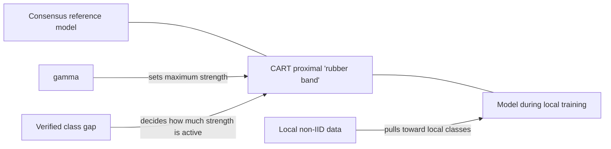
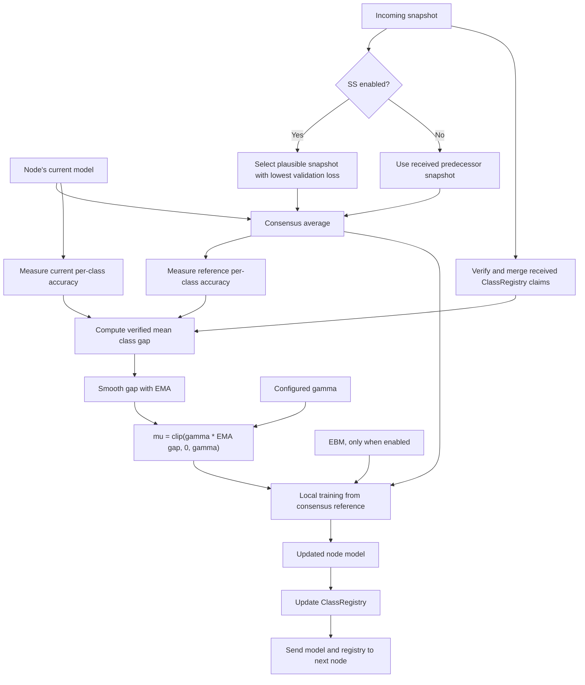
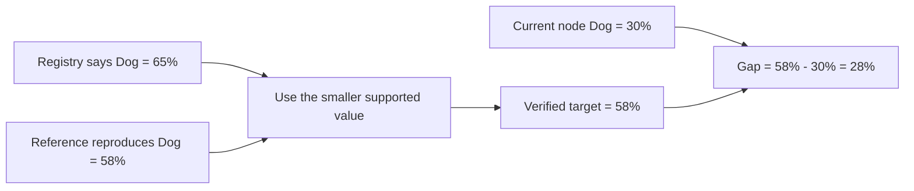
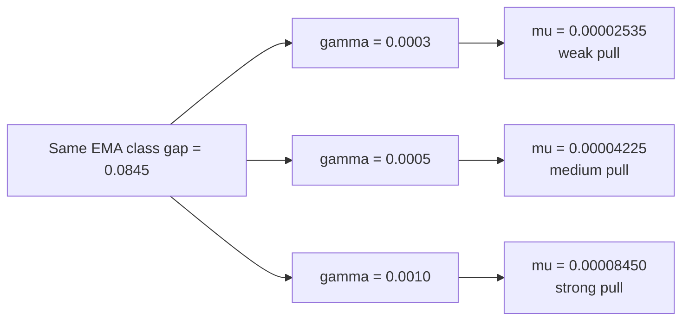
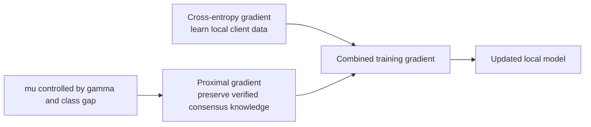
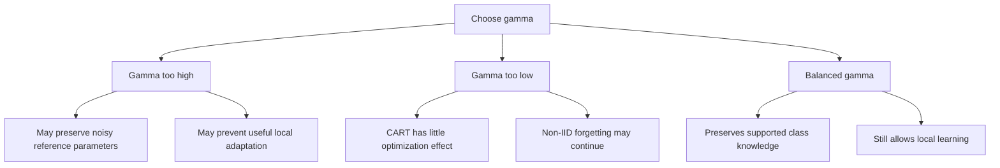
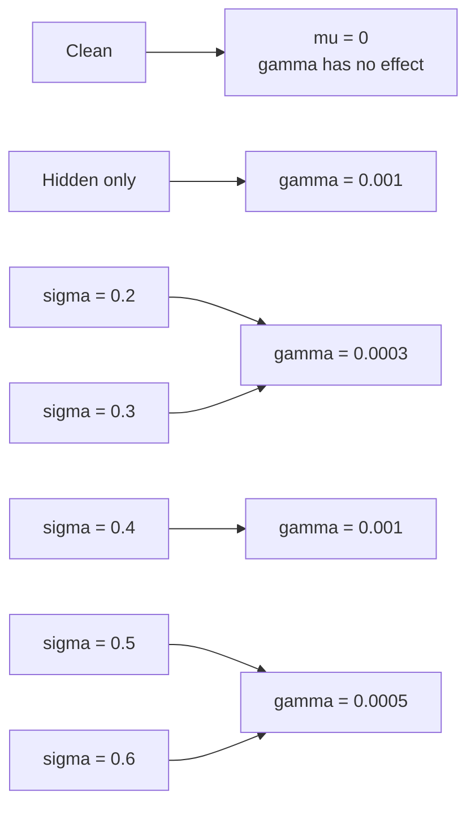
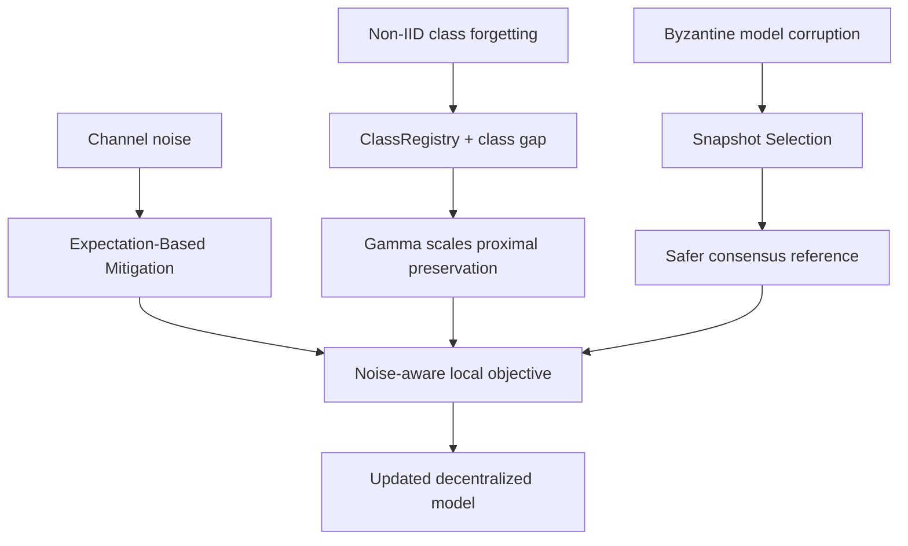

# Gamma in CART: Detailed Explanation

## Quick Answer

In CART, `gamma` controls how strongly a node is pulled back toward the
consensus model while it trains on its local non-IID data.

An easy way to understand it is as a **maximum rubber-band strength**:

- The consensus model is the anchor.
- Local training pulls the node toward its local data.
- The ClassRegistry measures how much useful class knowledge may be forgotten.
- `gamma` limits how strongly CART resists that forgetting.
- The actual strength used in a round is `mu`, not `gamma` itself.



## Terminology

| Term | Meaning |
|---|---|
| `gamma` | Maximum CART proximal strength configured for an experiment |
| Class gap | How far the node is behind verified ring knowledge on reliable classes |
| EMA gap | Smoothed class gap used to avoid unstable round-to-round changes |
| `mu` | Actual proximal strength used for a node in a particular round |
| Reference model | Consensus of the node's current model and the selected incoming snapshot |
| Proximal term | Penalty that discourages the node from moving too far from the reference model |

The GUI currently calls gamma **Distillation Strength**. That is a legacy label.
The R2 implementation does not exchange logits or perform standard knowledge
distillation. A more accurate name is:

> **CART proximal strength gamma**

## Where Gamma Fits in One CART Update



The important separation is:

1. SS chooses which incoming model is safe enough to use.
2. Consensus forms the reference model.
3. CART measures verified class gaps.
4. Gamma converts the smoothed gap into `mu`.
5. `mu` controls the proximal penalty during local training.
6. EBM separately modifies optimization when channel noise is active.

## Step 1: Create the Consensus Reference

For a non-clean Campaign 3 experiment, the reference model is:

```text
consensus reference = average(current node model, selected incoming model)
```

In parameter notation:

$$
w_{\mathrm{ref}} =
\frac{w_i + w_{\mathrm{selected}}}{2}.
$$

SS may determine `w_selected`, but SS does not replace consensus averaging.

The reference model is frozen while the node performs its local training. CART
uses it as the model that should not be forgotten too aggressively.

## Step 2: Calculate a Verified Class Gap

The ClassRegistry contains historical best verified per-class accuracies.
However, CART does not blindly trust a historical registry maximum.

For each reliable class, CART caps the registry value by what the current
reference model can reproduce:

$$
\text{verifiedTarget}_{i,c}
=
\min\left(
\text{registryBest}_{c},
\text{referenceAccuracy}_{i,c}
\right).
$$

The class gap is:

$$
g_{i,c}
=
\max\left(
0,
\text{verifiedTarget}_{i,c}
-
\text{currentAccuracy}_{i,c}
\right).
$$

Only classes with sufficient local support and finite measurements are used.
The mean gap is:

$$
g_i
=
\frac{1}{|\mathcal{C}_{\mathrm{reliable}}|}
\sum_{c \in \mathcal{C}_{\mathrm{reliable}}}
g_{i,c}.
$$

### Example Class Gaps

Suppose a node measures three reliable classes:

| Class | Registry best | Reference reproduces | Current node | Verified target | Gap |
|---|---:|---:|---:|---:|---:|
| Airplane | 80% | 75% | 78% | 75% | 0% |
| Dog | 65% | 58% | 30% | 58% | 28% |
| Truck | 55% | 50% | 45% | 50% | 5% |

The mean class gap is:

$$
g_i = \frac{0 + 0.28 + 0.05}{3} = 0.11.
$$

This means that the node is, on average, 11 percentage points behind class
knowledge that the actual reference model can reproduce.



This cap is important. A registry may contain a valid old claim even when the
current incoming model no longer contains that knowledge. CART should not
anchor local training to knowledge that the reference model cannot reproduce.

## Step 3: Smooth the Gap

Raw per-class measurements can vary between rounds. CART therefore uses an
exponential moving average:

$$
\bar{g}_i^t
=
0.85\bar{g}_i^{t-1}
+
0.15g_i^t.
$$

Using the example above:

- Previous EMA gap: `0.08`
- Current mean gap: `0.11`

$$
\bar{g}_i^t
=
0.85(0.08)
+
0.15(0.11)
=
0.0845.
$$

The EMA prevents one unusually good or bad probe batch from suddenly changing
the proximal strength.

## Step 4: Convert Gamma into the Actual Strength Mu

The current Campaign 3 R2 implementation uses:

$$
\boxed{
\mu_i^t
=
\operatorname{clip}
\left(
\gamma\bar{g}_i^t,
0,
\gamma
\right)
}
$$

Therefore:

- `gamma` is the configured maximum.
- The EMA class gap determines how much of gamma is activated.
- `mu` can vary by node and round.
- If the gap is zero, `mu` is zero.
- `mu` cannot exceed gamma.

### Same Gap, Different Gamma

Using the EMA gap `0.0845`:

| Gamma | Calculation | Actual `mu` | Relative strength |
|---:|---:|---:|---|
| `0.0003` | `0.0003 x 0.0845` | `0.00002535` | Weak |
| `0.0005` | `0.0005 x 0.0845` | `0.00004225` | Medium |
| `0.0010` | `0.0010 x 0.0845` | `0.00008450` | Strong |



With the same class gap, `gamma=0.001` creates approximately 3.33 times the
proximal pressure of `gamma=0.0003`.

The numerical values are small because the proximal gradient is applied to
every trainable parameter over many optimizer steps. Gamma should not be
interpreted as an accuracy percentage.

## Step 5: Apply the Proximal Term During Training

The local CART objective is:

$$
\mathcal{L}_{i}^{\mathrm{CART}}(w)
=
\mathcal{L}_{i}^{\mathrm{CE}}(w)
+
\frac{\mu_i^t}{2}
\left\|
w-w_{\mathrm{ref}}
\right\|_2^2.
$$

Its proximal gradient contribution is:

$$
\mu_i^t
\left(
w-w_{\mathrm{ref}}
\right).
$$

The complete update balances two forces:



When a node begins moving far from the reference model, the proximal gradient
becomes larger. When the node remains close to the reference, the proximal
gradient remains small.

## Why Not Use One Gamma Everywhere?

Gamma controls attachment to the reference model. Channel noise changes how
reliable that reference may be.

Two competing effects must be balanced:

### Reason to increase gamma

A stronger proximal term can:

- reduce non-IID client drift;
- reduce catastrophic forgetting;
- preserve classes learned by earlier nodes;
- keep local training closer to ring consensus.

### Reason to decrease gamma

A weaker proximal term can:

- allow the node to correct a noisy reference;
- avoid preserving channel corruption;
- allow adaptation to useful local data;
- avoid underfitting caused by excessive anchoring.



There is no theoretical rule that gamma must increase with sigma. Increasing
noise simultaneously creates a greater need for stability and a greater risk
of anchoring to a corrupted reference. The best balance can therefore be
non-monotonic.

## Current Frozen R2 Gamma Schedule

Campaign 3 calibrated representative noise levels `0.2`, `0.4`, and `0.6`.
Intermediate noise levels inherit a declared bucket.

| Experiment condition | Gamma used | Meaning |
|---|---:|---|
| Clean environment | Configured value is ignored; `mu=0` | CART proximal term is disabled |
| Hidden attack, no channel noise | `0.001` | Strongest configured CART anchoring |
| Channel noise `sigma=0.2` | `0.0003` | Weak anchoring |
| Channel noise `sigma=0.3` | `0.0003` | Uses the low-noise `0.2` bucket |
| Channel noise `sigma=0.4` | `0.001` | Strongest configured anchoring |
| Channel noise `sigma=0.5` | `0.0005` | Uses the high-noise `0.6` bucket |
| Channel noise `sigma=0.6` | `0.0005` | Medium anchoring |



The schedule is a lookup table selected through calibration. Gamma is not
calculated directly from sigma.

The original calibration candidates were:

```text
0, 0.00025, 0.0005, 0.001
```

The low-noise refinement additionally tested:

```text
0.00030, 0.00035, 0.00040
```

The schedule was frozen before the full confirmation campaign. Its purpose is
to avoid choosing gamma after looking at the final confirmation results.

## Behavior in Each Environment

### Clean environment

The clean arm uses full consensus. Every node starts local training from the
same consensus model. The engine explicitly sets:

$$
\mu=0.
$$

Gamma therefore has no effect in the clean experiment. CART and Merged should
be identical for the same seed in this arm.

This clean run is the upper reference because:

- there are no Byzantine nodes;
- there is no channel noise;
- transmitted and received values are correct;
- no mitigation is required.

### Hidden Byzantine attack without channel noise

Gamma is active in CART.

- Without SS, gamma cannot determine whether the incoming snapshot is
  malicious.
- With SS, the selected reference should be safer.
- Gamma then controls how strongly CART preserves verified class knowledge
  represented by that selected consensus model.

Gamma does not replace SS.

### Channel noise without Byzantine attack

Gamma is active in CART.

- The reference model may contain communication noise.
- A larger gamma preserves the reference more strongly.
- A smaller gamma gives local training more freedom to correct it.
- EBM, when enabled, separately addresses the noisy-communication objective.

Gamma does not replace EBM.

### Hidden attack and channel noise together

All responsibilities are layered:



The intended division of work is:

| Component | Problem it addresses |
|---|---|
| SS | Byzantine model snapshots |
| EBM | Stochastic channel noise |
| CART ClassRegistry | Class-level non-IID forgetting |
| Gamma | Strength of CART's class-aware proximal preservation |

## What Gamma Does Not Do

Gamma does **not**:

- detect Byzantine nodes;
- select snapshots;
- remove channel noise;
- control EBM;
- represent the noise sigma;
- store class-specific model parameters;
- create a separate model for every class;
- multiply the reported accuracy;
- guarantee CART will outperform Merged.

Gamma controls one global proximal coefficient after class-level information has
been reduced to a verified mean gap.

## How to Interpret the CART Telemetry Plot

The `cart_registry_telemetry` diagnostic contains `mu` history information.
Remember:

- Gamma is the configured ceiling.
- `mu_history` is the actual average strength activated during training.
- A small `mu_history` can occur even with a larger gamma when verified class
  gaps are small.
- A gamma comparison should examine accuracy, worst-node accuracy, AUC,
  registry behavior, and `mu_history`.

The relevant plot is generated as:

```text
plots3/r2/images/gui/nonIID/cifar10/hidden/comparison/
diagnostics/cart_registry_telemetry.png
```

## Important Correction for the Paper

The earlier paper draft states:

$$
\mu_i^t=\gamma(1+\bar{g}_i^t).
$$

That equation does **not** match the current Campaign 3 R2 implementation.

The implemented equation is:

$$
\boxed{
\mu_i^t
=
\operatorname{clip}
\left(
\gamma\bar{g}_i^t,
0,
\gamma
\right).
}
$$

These formulas are materially different:

| Situation | Earlier draft equation | Current R2 implementation |
|---|---:|---:|
| Gap is zero | `mu=gamma` | `mu=0` |
| Positive gap | `mu` is greater than gamma | `mu` is between zero and gamma |
| Maximum behavior | No gamma ceiling | Explicitly capped at gamma |

The earlier experimental table also reports `gamma=0.4`. That does not describe
the current R2 confirmation campaign. Any paper section using the R2 results
should report the frozen noise-dependent schedule shown above.

## Short Presentation Explanation

> Gamma is CART's proximal-strength hyperparameter. CART first checks which
> classes the current node is behind on using registry claims that the actual
> consensus model can reproduce. It smooths that class gap and multiplies it by
> gamma to obtain the actual proximal coefficient, mu. Mu then discourages local
> non-IID training from moving too far away from the consensus model. We use
> different gamma values because a stronger anchor can preserve class knowledge,
> but it can also preserve a noisy reference. The values were calibrated at
> representative noise levels and frozen before confirmation testing. Gamma
> handles non-IID drift; it does not replace Snapshot Selection or EBM.

## Implementation References

- Proximal gradient application:
  `basil_core/experiment_engine.py`, `SharedModelWorker.apply_step`
- Verified class-gap calculation:
  `basil_core/experiment_engine.py`, `_mean_reference_supported_gap`
- Gamma-to-mu calculation:
  `basil_core/experiment_engine.py`, `run_campaign_experiment`
- Gamma candidates and sigma buckets:
  `gui/baseline_study.py`
- Frozen selected schedule:
  `experiments/results3/r2/campaign_state.json`
