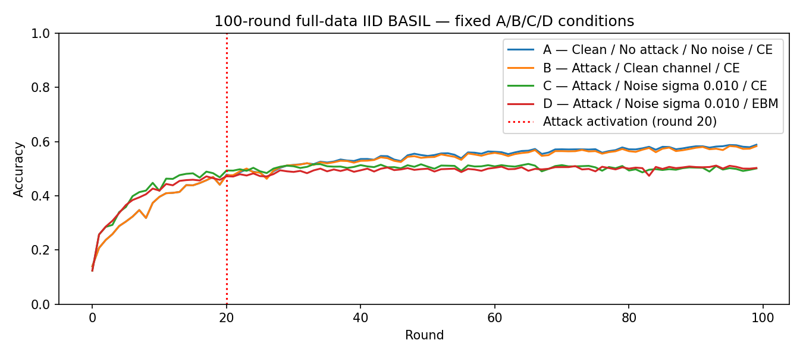
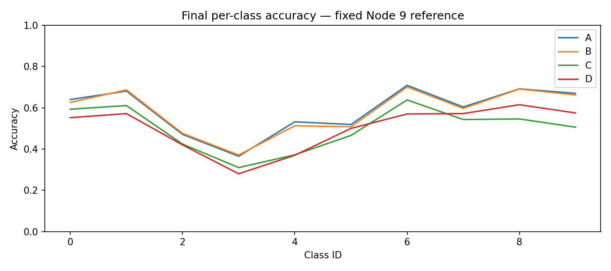

# Completed 100-round IID BASIL study: A/B/C/D

Audit date: 2026-10-07. Analysis of saved results only: **no research training, extension, retuning, queue execution, or new scientific condition was performed for this audit**. Round identifiers are zero-based R0–R99.

## Executive summary

| Condition | What was tested | Final Node-9 accuracy | Final worst-node accuracy |
|---|---|---:|---:|
| **A** | Clean BASIL; no attack; CE | **58.83%** | 57.00% |
| **B** | Hidden attack; clean channel; CE | **58.32%** | 56.91% |
| **C** | Hidden attack; absolute noise; CE | **50.09%** | 49.63% |
| **D** | Same as C; source-grounded EBM | **50.26%** | 47.00% |

> **Bottom line:** all four fresh GPU runs completed. Longer training helped A/B. Communication noise produced the larger observed degradation. EBM was mathematically active, but its accuracy/fairness benefit was mixed in this single seed.

A's 58.83% is **not a proven ceiling**: it was still improving slowly. IID class coverage and clean links do not guarantee 80–90% accuracy under this fixed small CNN, optimizer, learning-rate decay and BASIL selection setup.

The primary EBM contrast is **D−C**, not D−B. D−C is **+0.17 percentage points** in final Node-9 accuracy, but **−2.63 pp** in worst-node accuracy. A strong, consistent improvement is not established.

This report uses the latest **fresh all-GPU A rerun**, with fresh GPU B/C/D. Earlier mixed-device A and interrupted CPU runs remain separate archived evidence.

### Reading guide

| Your question | Where to look |
|---|---|
| Did the right experiments finish? | Table 1 |
| What are the results and scientific differences? | Tables 2–3 |
| Did 100 rounds help more than 50? | Table 4 |
| Did BASIL reject attack-corrupted snapshots? | Table 5 |
| Which classes and nodes struggled? | Tables 6–7 |
| Was noise/EBM actually applied? | Table 8 |
| Are pairing, device history and artifacts trustworthy? | Tables 9–10 |
| Why not 80–90% accuracy? | [Accuracy diagnosis](#why-not-8090-accuracy) |
| What code implements this? | [Code and mathematics report](../../../docs/IID_CODE_CHANGES_AND_TRAINING_MATHEMATICS.md) |

## Metric definitions and sources

| Term | Exact meaning | Not this |
|---|---|---|
| Full-test accuracy | Fixed end-of-ring **Node 9** honest trained model, before outbound corruption, on all 10,000 test images | Ensemble, averaged model or best-node model |
| Mean-node accuracy | Arithmetic mean of ten trained-node full-test accuracies | Node 9 alone |
| Worst-node accuracy | Minimum of the ten trained-node accuracies | Worst class |
| Full-test loss | Node-9 mean logits-based test cross-entropy | Local training loss or EBM objective |
| Per-class accuracy here | Node 9 on 1,000 test images of each class | Manifest `finalPerClassAccuracy`, which averages ten nodes |
| pp | **Percentage-point** difference between accuracies | Relative percentage change |

All round numbers are **zero-based**: R49 is the 50th completed round; R99 is the 100th. The test set remains **evaluation-only**.

Sources: saved configs/manifests, CSV/NPZ metrics, compressed activation telemetry, batch traces, confusions, execution logs, checkpoints and final weights. [Machine-readable audit](POST_RUN_VERIFICATION.json) retains statistics/hashes; [read-only verifier](../../../scripts/analyze_completed_iid.py) checks the saved evidence.

## Table 1 — Run completion and executed configuration

| Condition | Rounds / activations | Attack | Channel | Loss | Training device | Complete? |
|---|---|---|---|---|---|---|
| A | 100 / 1,000 | None | Off | CE | Fresh GPU R0–R99 | Yes |
| B | 100 / 1,000 | Hidden [0, 1, 5, 7]; R20 | Off | CE | Fresh GPU R0–R99 | Yes |
| C | 100 / 1,000 | Hidden [0, 1, 5, 7]; R20 | Absolute sigma=0.010 | CE | Fresh GPU R0–R99 | Yes |
| D | 100 / 1,000 | Hidden [0, 1, 5, 7]; R20 | Absolute sigma=0.010 | CE + 0.0001 squared-gradient norm | Fresh GPU R0–R99 | Yes |

### Shared protocol — no tuning after seeing results

| Setting | Executed value |
|---|---|
| Protocol / schema / seed | `sequential_basil_iid_v1` / 5 / 2025 |
| Training data | 50,000 images; ten random-disjoint IID sets of 5,000 |
| Evaluation data | Complete 10,000-image test set; 1,000 per class |
| CNN | Approved 117,706 trainable parameters |
| Local epochs / batch / remainder | Five full epochs / 512 / 392 |
| Optimizer | Reset SGD; momentum 0; no clipping or weight decay |
| Learning rate | ηᵣ = 0.05 / (1 + 0.05r) |
| BASIL | Assumed bound 4; S=5; receiver-local Snapshot Selection in all four |
| Handoff | Complete selected parameters replace the starting model |
| Excluded | Anchors, CART, class registry, Monte Carlo loss, legacy gradient scaling |

B/C/D use the existing Hidden transform (strength 1.4, blend 0.55), beginning R20. C/D use independently keyed **absolute** Gaussian corruption per outgoing link, after attack, starting R0.

| Noise / EBM quantity | Value | Interpretation |
|---|---:|---|
| Coordinate standard deviation σₑ | 0.010 | Not a percentage or model-relative value |
| Coordinate variance σₑ² | 0.0001 | EBM coefficient in D, with no lambda |
| Stored float32 coefficient | ≈0.00009999999747 | Expected finite-precision representation |

Sigma was declared from calibration **before** observing these results.

### Saved paths

| Condition | Result/config | Plots |
|---|---|---|
| A | [A_clean_no_attack_ce_100r_gpu](../A_clean_no_attack_ce_100r_gpu/run.json) · [config](../A_clean_no_attack_ce_100r_gpu/config.json) | [directory](../../../newPlots/IID/A_clean_no_attack_ce_100r_gpu/) |
| B | [B_attack_clean_ce_100r_gpu](../B_attack_clean_ce_100r_gpu/run.json) · [config](../B_attack_clean_ce_100r_gpu/config.json) | [directory](../../../newPlots/IID/B_attack_clean_ce_100r_gpu/) |
| C | [C_attack_noise_ce_100r_gpu](../C_attack_noise_ce_100r_gpu/run.json) · [config](../C_attack_noise_ce_100r_gpu/config.json) | [directory](../../../newPlots/IID/C_attack_noise_ce_100r_gpu/) |
| D | [D_attack_noise_ebm_100r_gpu](../D_attack_noise_ebm_100r_gpu/run.json) · [config](../D_attack_noise_ebm_100r_gpu/config.json) | [directory](../../../newPlots/IID/D_attack_noise_ebm_100r_gpu/) |

These are IID outputs only. All four began fresh; no weights-only continuation or stitching from historical trajectories.

## Table 2 — Primary accuracy/loss results

| Metric | A | B | C | D |
|---|---|---|---|---|
| Initial full-test accuracy | 9.01% | 9.01% | 9.01% | 9.01% |
| Final full-test accuracy | 58.83% | 58.32% | 50.09% | 50.26% |
| Best full-test accuracy | 58.83% | 58.36% | 51.76% | 51.14% |
| Best zero-based round | 99 | 95 | 65 | 93 |
| Final mean-node accuracy | 58.25% | 57.64% | 50.11% | 49.77% |
| Final worst-node accuracy | 57.00% | 56.91% | 49.63% | 47.00% |
| Final Node-9 test CE | 1.181190 | 1.199362 | 1.404584 | 1.394451 |
| Runtime (minutes) | 73.06 | 76.96 | 77.46 | 76.76 |

Individual runtimes sum to 5.07 hours, not the wall time between manual launches.

### Visual overview — accuracy trajectories



*The chart uses fractional accuracy: 0.6 means 60%. Lines are measured R0–R99 values; the attack marker applies to B/C/D, not A.*

## Table 3 — Prespecified scientific contrasts

| Contrast | Final Node-9 difference (pp) | What it measures |
|---|---:|---|
| **B−A** | **−0.51** | Attack environment while BASIL is active |
| **C−B** | **−8.23** | Absolute communication noise under CE |
| **D−C** | **+0.17** | EBM under the same noisy condition |
| **D−A** | **−8.57** | Combined attacker/noise/EBM gap |

### The same contrasts across other endpoints

| Contrast | Best (pp) | Mean R90–99 (pp) | Final node mean (pp) | Final worst (pp) |
|---|---:|---:|---:|---:|
| B−A | −0.47 | −0.63 | −0.61 | −0.09 |
| C−B | −6.60 | −7.75 | −7.53 | −7.28 |
| D−C | −0.62 | +0.58 | −0.34 | −2.63 |
| D−A | −7.69 | −7.80 | −8.48 | −10.00 |

A/B both use BASIL: B−A is **not the cost of BASIL**. Noise has the larger observed negative effect. D's small final advantage over C is not consistent across endpoints: better late-round Node-9 mean and slightly lower final CE, but lower best, node-mean, and worst-node accuracy. No universal/statistically significant EBM benefit is established.

## Table 4 — Longer training and convergence

### 50th round versus 100th round — the current GPU trajectory

| Condition | R49: 50th round | R99: 100th round | Change (pp) |
|---|---:|---:|---:|
| A | 55.04% | 58.83% | **+3.79** |
| B | 54.00% | 58.32% | **+4.32** |
| C | 51.62% | 50.09% | −1.53 |
| D | 49.83% | 50.26% | +0.43 |

### Prespecified accuracy windows

| Condition | Mean R0–19 | Mean R20–79 | Mean R80–89 | Mean R90–99 |
|---|---:|---:|---:|---:|
| A | 35.60% | 53.99% | 57.55% | 58.30% |
| B | 35.60% | 53.55% | 56.91% | 57.67% |
| C | 40.14% | 50.61% | 49.68% | 49.92% |
| D | 39.06% | 49.46% | 50.07% | 50.50% |

### Late-round trend

| Condition | Last-two-window change (pp) | R80–99 slope (pp/round) | Descriptive assessment |
|---|---:|---:|---|
| A | +0.75 | +0.0676 | Still improving slowly |
| B | +0.76 | +0.0691 | Still improving slowly |
| C | +0.24 | +0.0249 | Fluctuating near 50% |
| D | +0.43 | +0.0376 | Modest late improvement near 50% |

The window change is mean(R90–99) − mean(R80–89); it is not a significance test.

A/B: slowing but still improving (+0.75/+0.76 pp between the last two ten-round means). A's best point is R99: a strict plateau or universal 58% ceiling is **not demonstrated**. C fluctuates near 50% and ends below R49 and its best R65 point. D improves modestly late but remains near 50%. These are descriptive trends, without an arbitrary significance threshold or automatic extension.

Mean-node changes from R49→R99: A+3.602 pp, B+3.638, C−0.472, D+0.295. Worst-node changes: +3.500,+3.660,−0.020,−1.410 pp. D's weakest final node must not be hidden by the Node-9 result.

### Historical 50-round CPU reference — separate experiments

| Historical run | Rounds | Final Node 9 | Best / round | Final node mean | Final worst | Runtime |
|---|---|---|---|---|---|---|
| Clean BASIL + attackers + CE |50|54.35%|54.73% / R48|54.146%|53.24%|98.61 min|
| Noisy BASIL + attackers + EBM |50|50.57%|51.89% / R43|50.667%|49.34%|166.14 min|

Stored under `../test_01_basil_iid_no_noise_ce/` and `../test_02_basil_iid_noise_ebm/`. They are not R49 of the current GPU runs. Their comparison changed both noise and objective; current C/D supplies the previously missing matched EBM control.

## Table 5 — Attack onset and Snapshot Selection

| Condition | R19 | R20 | R21 | R20−R19(pp) | Mean R20–99 |
|---|---|---|---|---|---|
| B | 44.09% | 47.53% | 47.62% | 3.44 | 54.49% |
| C | 46.80% | 49.33% | 49.29% | 2.53 | 50.41% |
| D | 45.88% | 47.21% | 47.10% | 1.33 | 49.67% |

R20 increases do not mean attacks improve learning: training continues, and no actually corrupted snapshot was selected. No post-onset Node-9 measurement fell below its respective R19 accuracy. Later round-to-round decreases do occur; this is not a monotonicity or universal robustness claim.

| Condition | Decisions | Designated-attacker selections: all | Designated: R20–99 | Actually corrupted selections |
|---|---:|---:|---:|---:|
| A | 1,000 | 0 | 0 | **0** |
| B | 1,000 | 73 | 0 | **0** |
| C | 1,000 | 74 | 1 | **0** |
| D | 1,000 | 70 | 1 | **0** |

Actually corrupted selection rate is **0%**, both overall and after onset. B/C/D each have **320 attack-active activations**; A has zero.

Actual corruption requires an attacker-designated **source** with snapshot round≥20, not merely receiver round≥20. C/D each selected one still-honest R19 snapshot from an attacker-designated sender during transition; B had no designated post-onset selections. There are **no corrupted-selection rounds or receivers**. Each B/C/D generated 1,600 attacked transmissions (320 activations×5 links). This demonstrates filtering of this particular attack realization, not every Byzantine attack.

| Sender | A | B | C | D |
|---|---|---|---|---|
| 0 | 104 | 14 | 20 | 25 |
| 1 | 78 | 17 | 17 | 11 |
| 2 | 118 | 159 | 162 | 155 |
| 3 | 117 | 154 | 177 | 157 |
| 4 | 117 | 154 | 140 | 139 |
| 5 | 91 | 22 | 15 | 17 |
| 6 | 77 | 104 | 123 | 135 |
| 7 | 78 | 20 | 22 | 17 |
| 8 | 85 | 145 | 136 | 149 |
| 9 | 135 | 211 | 188 | 195 |

Mean snapshot ages, excluding initial W0: A 0.2893, B 0.3624, C 0.3581, D 0.3691 rounds; all ages 0 or 1. Tie decisions: A/B 1 each, C/D 3 each. All 4,000 selections obey receiver-local minimum loss and nearest-counterclockwise tie-breaking.

Actual R11 memories match in all runs:

```text
Before Node0: 5:R10, 6:R10, 7:R10, 8:R10, 9:R10
Before Node1: 6:R10, 7:R10, 8:R10, 9:R10, 0:R11
Node0 refreshes Nodes1–5; only Node1 is the next trainer.
```

Received selected hashes match first-training-batch hashes; final-batch hashes match trained output, at every activation. Candidates share one receiver-local training batch; sender-reported/global-test metrics do not select models. Global evaluation of every unselected candidate was not recorded (`audit/candidate_evaluation.json` is empty); candidate-local-loss versus candidate-global-quality correlation cannot be reconstructed from these outputs.

## Table 6 — Final per-class Node-9 accuracy

| Class | A | B | C | D | B−A(pp) | C−B(pp) | D−C(pp) |
|---|---|---|---|---|---|---|---|
| airplane | 64.00% | 62.60% | 59.30% | 55.20% | -1.40 | -3.30 | -4.10 |
| automobile | 68.10% | 68.70% | 61.10% | 57.20% | 0.60 | -7.60 | -3.90 |
| bird | 47.10% | 47.60% | 42.40% | 42.00% | 0.50 | -5.20 | -0.40 |
| cat | 36.50% | 37.10% | 31.00% | 28.00% | 0.60 | -6.10 | -3.00 |
| deer | 53.20% | 51.30% | 37.20% | 37.00% | -1.90 | -14.10 | -0.20 |
| dog | 51.90% | 50.80% | 46.60% | 50.00% | -1.10 | -4.20 | 3.40 |
| frog | 70.90% | 70.10% | 63.80% | 57.00% | -0.80 | -6.30 | -6.80 |
| horse | 60.40% | 59.70% | 54.30% | 57.20% | -0.70 | -5.40 | 2.90 |
| ship | 69.20% | 69.10% | 54.60% | 61.50% | -0.10 | -14.50 | 6.90 |
| truck | 67.00% | 66.20% | 50.60% | 57.50% | -0.80 | -15.60 | 6.90 |

Frog is strongest in A/B/C; ship is strongest in D. Cat is weakest in every condition: 36.5%, 37.1%, 31.0%, 28.0%. Largest A→B decline: deer−1.90 pp; B→C decline: truck−15.60 pp. Largest C→D improvements: ship/truck+6.90 pp; decline: frog−6.80 pp. Describe these patterns without inventing class-specific causal explanations.

Final confusions show structured mistakes, **not constant-class collapse**. A predicts all ten classes (825–1,137 predictions/class of 10,000). Largest off-diagonal cells include cat→dog198/1,000, dog→cat 155, airplane→ship 152, automobile→truck 149. D has cat→dog 283. The earlier one-class 10%/own-class-only finding belongs to another experiment, not these IID runs.

### Visual overview — class-level differences



*This is a categorical class comparison, not a time trajectory. Exact percentages and changes are in Table 6.*

## Table 7 — Node consistency

| Condition | Node 9 | Mean | Worst | Best node | Spread(pp) | Population SD(pp) |
|---|---|---|---|---|---|---|
| A | 58.83% | 58.25% | 57.00% | 58.83% | 1.83 | 0.55 |
| B | 58.32% | 57.64% | 56.91% | 58.32% | 1.41 | 0.47 |
| C | 50.09% | 50.11% | 49.63% | 50.69% | 1.06 | 0.37 |
| D | 50.26% | 49.77% | 47.00% | 51.15% | 4.15 | 1.11 |

| Node | A | B | C | D |
|---|---|---|---|---|
| 0 | 57.00% | 56.91% | 49.63% | 50.69% |
| 1 | 57.67% | 57.11% | 50.46% | 49.67% |
| 2 | 58.64% | 57.45% | 50.69% | 49.51% |
| 3 | 58.56% | 58.21% | 50.37% | 51.15% |
| 4 | 58.14% | 57.86% | 49.67% | 49.38% |
| 5 | 58.19% | 57.35% | 50.06% | 50.52% |
| 6 | 58.80% | 57.67% | 49.79% | 49.09% |
| 7 | 58.05% | 57.30% | 49.76% | 47.00% |
| 8 | 58.63% | 58.20% | 50.55% | 50.43% |
| 9 | 58.83% | 58.32% | 50.09% | 50.26% |

A/B/C spreads are tight; D has a 4.15 pp spread, including Node 7 at 47.00%. Metrics use honest locally trained states, including those owned by attacker-designated nodes, before outbound attack.

## Table 8 — Noise and EBM diagnostics

| Channel statistic (5,000 links/run) | C | D |
|---|---|---|
| Coordinate sigma / variance | 0.010 / 0.0001 | 0.010 / 0.0001 |
| Noise L2 mean | 3.430778 | 3.430778 |
| Noise L2 min–max | 3.405944–3.455492 | 3.405944–3.455492 |
| Mean post-attack outbound model L2 | 35.553803 | 35.235407 |
| Mean noise/model ratio | 12.65% | 12.81% |
| Mean ratio, non-attacked messages | 8.51% | 8.64% |
| Mean ratio, attacked messages | 21.47% | 21.65% |
| Maximum ratio | 29.62% | 30.82% |

Expected noise L2 is σₑ√d = 0.010 × √117706 ≈ **3.4308**; observations agree. All 5,000 noise hashes are distinct within each noisy run and every corresponding C/D noise hash matches. The **additive draws** match, not transmitted weights: objectives change model trajectories.

The R20 jump in noise/model ratio has a mechanical explanation: the existing Hidden transform approximately sends −0.32w plus small noise, shrinking the outbound norm. An unchanged σ divided by that smaller norm produces a larger ratio. It is not an increase in coordinate noise. Even absolute noise satisfies E‖w+ξ‖²=‖w‖²+dσₑ² before training/selection; model norms can grow without model-relative channel scaling. No non-finite runaway occurred here.

| D step statistic | Mean of 50,000 | Maximum | Mean R90–99 |
|---|---|---|---|
| Ordinary CE | 1.516180 | 2.314280 | 1.457587 |
| EBM penalty | 0.000589 | 0.007936 | 0.000826 |
| Ordinary gradient L2 | 2.270363 | 8.908262 | Not separately tabulated |
| Second-order correction L2 | 0.046757 | 0.419621 | Not separately tabulated |
| Applied gradient L2 | 2.312014 | 9.316879 | Not separately tabulated |
| Correction/base ratio | 1.84% | 5.65% | 2.94% |

R_EBM=‖2σₑ²Hg‖/(‖g‖+ε) averages **1.8385%**, maximum **5.6458%**, late mean **2.9389%**. The correction is measurable but modest, never dominant in the saved steps. Maximum ratio: R96, Node 6, epoch 1, batch 2; CE 1.461235, penalty 0.00261648, base norm 5.115152, correction 0.288791, applied norm 5.392100. Maxima of different metrics need not occur at the same step.

Mean penalty 0.00058879 is about 0.0388% of mean CE 1.51618. A small term can alter nonlinear trajectories but does not promise a large gain. No lambda is read. C has zero EBM penalty/correction in every recorded step.

**Per-link pre/post-noise accuracy/loss was not measured**; manifests explicitly say so. Do not invent immediate noise-induced accuracy-drop estimates. These results measure trajectories after training, not an immediate corrupted-link accuracy ablation.

## Table 9 — Device, pairing, and provenance

| Property | Verified evidence |
|---|---|
| Partition | All four: `db79edd6b35d709b0a40fcc9ca5b5253e1da52a414cfba30a87de6aff4339b29` |
| Canonical W0 | All four: `7c717dbbd9bd1f2f230b1ff3d288bd8fec33dcd3ec730eb43e8a14e496cdc2df` |
| Data/shuffle/augmentation |50,000 matching batch records/run; digest `ccda0799bc77e7753e56679a3a7566162c200bf203e6798461121fbc157dc3b0`|
| Seeds | Explicit 2025 with separate keyed streams for initialization/partition/order/augmentation/attackers/attack/channel |
| B/C/D attacks |[0, 1, 5, 7], onset 20, strength 1.4/blend 0.55|
| C/D noise |0.010 coordinate sigma; 5,000 matching directed-link noise hashes|
| A/B scientific diff | Actual attackers/activation only; same S=5 |
| B/C scientific diff | Channel enable/sigma only; CE unchanged |
| C/D scientific diff | `localObjective`/`ebmMode` only, plus run-name/path metadata |
| A/B warm-up | R0–19 full-test arrays exactly equal |
| Backend | RTX 4070 Ti; TF 2.18.0; CUDA 12.5.1/cuDNN 9; TF32 off; float32; one intra/inter-op thread |
| Execution | Serial single process; multiprocessingUsed=false |
| Memory |4,096 MiB logical cap;≥5,120 MiB free before launch; single-worker lock |

All manifest Git commits: `09132877c69473785bbd9f6eb8b69538e663db32`, with `gitWorktreeDirty=true`. Commit alone is insufficient provenance: eight recorded scientific/runner source fingerprints match current files, as does GPU worker SHA-256 `6fdf21ca164bb7c79bbe05fa42325e2592d2a128b42aa34995c03f10d90f0f0f`. Python version recorded: 3.12.3. Same numerical policy `iid_serial_float32_v1`.

| Condition | CPU-trained prefix | GPU training | Exact CPU→GPU transfer | Bit-identical CPU continuation |
|---|---|---|---|---|
| A | None | R0–R99 | N/A; fresh start, flag absent | N/A; not claimed |
| B | None | R0–R99 | N/A; fresh start, flag absent | N/A; not claimed |
| C | None | R0–R99 | N/A; fresh start, flag absent | N/A; not claimed |
| D | None | R0–R99 | N/A; fresh start, flag absent | N/A; not claimed |

The earlier mixed-device caveat no longer applies to this **fresh all-GPU** comparison. CPU creation of canonical W0 and CPU keyed preprocessing are intentional, not CPU-trained prefixes. Old mixed/recovery evidence remains in `../reference_archive/` and `../recovery_archive/`.

Existing `docs/GPU_EXECUTION_VERIFICATION.json` records analytic-gradient errors<5×10⁻⁸, same-device repeatability, identical synthetic predictions, and CPU/GPU gradient relative-L2 difference≈0.002994. This verifies a representative scope, **not bitwise CPU/GPU equivalence or identical long-run trajectories**. No new GPU benchmark was run in this audit; historical multiprocessing discrepancies were bypassed, not declared fixed.

## Table 10 — Numerical and artifact integrity

| Check | A | B | C | D |
|---|---|---|---|---|
| Measured rounds |100 consecutive|100 consecutive|100 consecutive|100 consecutive|
| Activations / batches |1,000 /50,000|1,000 /50,000|1,000 /50,000|1,000 /50,000|
| Full epochs / remainder |5,000; 392 retained|5,000; 392 retained|5,000; 392 retained|5,000; 392 retained|
| Unchanged SGD updates |0|0|0|0|
| NaN/Inf parameter/gradient traces |0|0|0|0|
| Recorded failure/OOM artifacts |None|None|None|None|
| Current recovery/transition |None recorded|None recorded|None recorded|None recorded|
| Checkpoint cursor / evaluated rounds |1,000 /100|1,000 /100|1,000 /100|1,000 /100|
| Saved parameters |Finite, hash-verified|Finite, hash-verified|Finite, hash-verified|Finite, hash-verified|
| Existing per-run PNGs |26|26|28|32|

Every full-checkpoint packed parameter hash and ten final-node hashes were checked; all checkpoint memories retain five senders. Each execution log has 100 round-completion entries and no numerical error. Earlier interruptions/reconstruction attempts belong to archived outputs, not these fresh completed runs. Current GUI worker logs independently show one GPU device-ready event and a zero-progress startup record per condition (recoveryTotal=0), with no failure/stop/non-finite/OOM event.

### IID partition audit

| Node | Samples | airplane | auto | bird | cat | deer | dog | frog | horse | ship | truck |
|---|---|---|---|---|---|---|---|---|---|---|---|
| 0 | 5000 | 515 | 493 | 490 | 461 | 477 | 494 | 522 | 527 | 527 | 494 |
| 1 | 5000 | 521 | 485 | 450 | 494 | 505 | 507 | 497 | 512 | 532 | 497 |
| 2 | 5000 | 484 | 480 | 511 | 496 | 484 | 523 | 493 | 514 | 500 | 515 |
| 3 | 5000 | 488 | 511 | 487 | 541 | 501 | 503 | 518 | 466 | 497 | 488 |
| 4 | 5000 | 477 | 497 | 532 | 508 | 523 | 489 | 477 | 495 | 470 | 532 |
| 5 | 5000 | 525 | 512 | 503 | 470 | 473 | 500 | 511 | 494 | 530 | 482 |
| 6 | 5000 | 501 | 489 | 499 | 500 | 545 | 477 | 495 | 489 | 514 | 491 |
| 7 | 5000 | 484 | 517 | 519 | 530 | 478 | 489 | 503 | 487 | 469 | 524 |
| 8 | 5000 | 514 | 499 | 510 | 489 | 537 | 497 | 496 | 508 | 459 | 491 |
| 9 | 5000 | 491 | 517 | 499 | 511 | 477 | 521 | 488 | 508 | 502 | 486 |

All 50,000 unique training indices cover 0–49,999 with no duplication/omission. All nodes contain all classes, counts 450–545: correct for a random equal-size IID split. **IID does not require exactly 500 of each class per node.** Global training counts are 5,000/class; the distinct evaluation set is 10,000, 1,000/class. SGD/SS use training indices only.


### Plot correctness

All expected plots exist. A read-only capture of plot-generation inputs (no image writes) verified 100 points for every round trajectory, current 100-round full-data titles and appropriate R20 markers. A has no attack marker; B/C/D and the joint comparison mark R20. CSV/NPZ agree to 10⁻⁷; Node 9/mean/min definitions agree with the node arrays. Primary PNG modification times are after final CSV completion.

The four comparison PNGs were visually inspected; accuracy scales are 0–1. The final class figure joins ten categorical class positions, not 100 rounds. Appearance alone cannot prove every numerical value: verification uses saved arrays and plotting inputs. No raw results or existing plots were regenerated.

Primary figures:

- [Full-test comparison](../../../newPlots/IID/ABCD_100r_comparison_gpu/ABCD_full_test_accuracy_comparison.png)
- [Mean-node comparison](../../../newPlots/IID/ABCD_100r_comparison_gpu/ABCD_mean_node_accuracy_comparison.png)
- [Worst-node comparison](../../../newPlots/IID/ABCD_100r_comparison_gpu/ABCD_worst_node_accuracy_comparison.png)
- [Final class comparison](../../../newPlots/IID/ABCD_100r_comparison_gpu/ABCD_final_per_class_comparison.png)
- [A per-class trajectories](../../../newPlots/IID/A_clean_no_attack_ce_100r_gpu/per_class_accuracy_vs_round.png)
- [A full-test CE](../../../newPlots/IID/A_clean_no_attack_ce_100r_gpu/full_test_loss_vs_round.png)
- [D correction ratio](../../../newPlots/IID/D_attack_noise_ebm_100r_gpu/ebm_correction_ratio_vs_round.png)
- [C noise/model ratio](../../../newPlots/IID/C_attack_noise_ce_100r_gpu/noise_to_model_norm_ratio_vs_round.png)

### Verification commands and actual outcomes

~~~bash
python scripts/analyze_completed_iid.py
python -m compileall -q gui basil_core reporting scripts tests
DISPLAY= PYTEST_DISABLE_PLUGIN_AUTOLOAD=1 CUDA_VISIBLE_DEVICES=-1 TF_ENABLE_ONEDNN_OPTS=0 TF_NUM_INTRAOP_THREADS=1 TF_NUM_INTEROP_THREADS=1 environment/basil-noise-env/bin/python -m pytest -q tests/test_completed_iid_analysis.py tests/test_iid_study.py tests/test_iid_campaign.py tests/test_iid_gpu.py tests/test_iid_fresh_queue.py tests/test_iid_plot_pipeline.py tests/test_protocol_recovery.py tests/test_research_protocol.py tests/test_research_audit.py tests/test_gui_architecture.py tests/test_gui_live_updates.py
~~~

- Read-only audit completed: 200,000 batch records, 4,000 selection/handoff checks, 20,000 directed transmissions, 5,000 matched C/D noise vectors. Tiny mathematical contract fixtures are not new scientific conditions.
- Compile: exit 0, no introduced syntax errors.
- Focused suite: **158 passed, 2 skipped, 2 deprecation warnings**, 13.71 s. Skips require a usable GUI display; not a full-repository-suite claim.
- Initial pytest auto-loading failed before collection because an unrelated ROS plugin requires missing lark. Disabling auto-loaded external plugins resolved that environment issue.
- Inherited DISPLAY=:0 produced 158 passed/2 GUI-connection failures; explicitly headless execution produced the passing outcome above.
- A separate xvfb-run -a attempt on just the two GUI tests also failed to connect to :109. Current GUI integration was not verified here; these display errors are not research failures.


### Historical SHA-256 preservation

Documentation-only follow-up: the reports were reformatted, not the experiments. All 38 code excerpts match current source, 115 local file/image links were checked, 28 inspected source files remain unchanged, and the five analysis-only tests passed in 0.15 s. A fresh SHA-256 comparison of `experiments/results4/` (2,153 files) and `plots4/` (737 files) matched with zero changes. The broader counts below describe the completed scientific audit, not a newly executed research run.

| Protected historical root | Files before | Files after | All hashes match? | Changed |
|---|---|---|---|---|
| experiments/results4 | 2153 | 2153 | Yes | 0 |
| plots4 | 737 | 737 | Yes | 0 |
| experiments/professor_protocol_results | 842 | 842 | Yes | 0 |
| experiments/professor_validation_results | 845 | 845 | Yes | 0 |
| plots/professor_protocol | 726 | 726 | Yes | 0 |
| plots/professor_validation | 60 | 60 | Yes | 0 |

**5,363 historical files matched; changed=0.** The two originally protected roots total 2,890 files (2,153 results +737 plots), all matched. Their digests also match the saved pre-run snapshot in docs/IID_FRESH_A_GPU_PREPARATION.json, not just this audit's own initial scan.

Expanded read-only preservation scan: 33 roots, **5,813 files before and after**, all root manifest digests identical; changed=0. This additionally covers current A/B/C/D raw results/plots, CPU references and recovery/reference archives. The current comparison directory is intentionally excluded because it receives these new analysis reports, not research training outputs.

Root manifest method: SHA-256 every file's bytes; concatenate sorted relative path, NUL separator and binary file digest; SHA-256 that manifest. Relative-path/count changes are therefore detected as well as byte changes. All root digests are retained in POST_RUN_VERIFICATION.json. No protected file was renamed, normalized or regenerated. Legacy-named protected trees are retained only as historical provenance.


## Why not 80–90% accuracy?

### Confirmed facts versus unsupported expectations

| Confirmed observation | Consequence |
|---|---|
| Correct IID coverage; every final model predicts all ten labels | This is not the previous one-class collapse |
| Full epochs, partial batches, finite updates and intended objectives/device verified | No missing-training or wrong-config defect found |
| A: 55.04% → 58.83%; late-window gain +0.75 pp | A had not demonstrated a hard ceiling |
| Clean links but small CNN, reset SGD and fixed decay | Clean communication is not sufficient for high classification accuracy |
| A: cat 36.5% versus frog 70.9%; vehicle mean 67.08%, animal mean 53.33% | Errors are structured, not random constant-class prediction |

**IID describes the data assignment, not a guaranteed accuracy.** It does not promise 80–90% for this architecture and training protocol.

### Plausible explanations, not proven isolated causes

| Explanation | Current evidence | What remains unproven |
|---|---|---|
| Small/aggressively pooled representation |117,706 parameters; second convolution 7×7×64 becomes 1×1×64 before dense layers|Parameter count alone cannot prove the CNN cannot exceed 58%; architecture is source-matched|
| Slowing optimization |Reset SGD, no momentum; learning rate 0.05→0.008403 by R99; positive late A slope|No alternative schedule/optimizer control; changing them changes the protocol|
| BASIL branch selection discards latest updates |A selects nearest predecessor242/1,000 times, others758/1,000; mean age 0.2893 rounds|Not every non-nearest choice is harmful; no no-SS/plain-ring causal control|
| Fixed local SS subset |Current code repeatedly uses the first 512 local training indices, unaugmented|Possible selection-overfitting bias is unmeasured; this is not test leakage|
| Five-epoch local adaptation on finite IID samples |Different local sets, complete snapshot replacement, node states differ|Not the extreme one-class forgetting mechanism; contribution is not isolated|
| Augmented optimization |Late A pre-update augmented batch accuracy 56.79%, mean CE 1.2298, not near 100%|Not clean training-set accuracy; cannot establish/exclude ordinary overfitting|

The defensible diagnosis is **limited/slowing learning under this fixed representation and BASIL optimization/selection setup**, not a discovered software cap. Evidence does not separate representation, optimization and selection effects sufficiently to name one as the sole cause.

Each condition executes 50,000 optimizer batches and 25 million training-image visits. That is a large computation budget, but not one continuous model trajectory equivalent to centralized training: selecting an earlier/different predecessor can discard an immediate predecessor's updates. More executed steps do not automatically mean more retained progress.

### Why the source paper does not promise 80–90% here

The [BASIL PDF](<../../../papers/001-Basil A Fast and Byzantine-Resilient Approach for Decentralized Training.pdf>) Appendix H-A/Table II confirms this architecture. Its experimental discussion explains that performance-based selection can reject the newest model and lose update steps relative to a plain ring. Reported settings include S=10, decay 0.03/(1+0.03k), a different round/update convention, and worst-benign-node reporting.

Our ten-node S=5, five-full-epoch, batch 512, 0.05-decay, fixed-Node 9 protocol is an adaptation, not an exact benchmark reproduction. Matching architecture does not justify importing another experiment's accuracy target, or a modern network's CIFAR score, as a correctness criterion.

### Why EBM did not clearly close the noise gap

D optimizes CE+0.0001‖∇CE‖², update direction g + 0.0002Hg. It regularizes a sensitivity surrogate, not accuracy directly, and cannot guarantee retention or undo every transmission. Its recorded correction is modest; small differences can still alter nonlinear BASIL choices. Evidence is mixed, not a broad EBM success or universal failure.

The [noisy-communication PDF](<../../../papers/002-Robust Federated Learning with Noisy Communication.pdf>) Eq 14 approximates a **squared-loss quantity**. The regularization concept is adapted here to multiclass CE and a decentralized ring. A Taylor expansion of expected noisy CE itself generally involves a Hessian-trace correction, not squared-gradient norm as an identity. This is a source-motivated surrogate, not exact expected noisy classification loss. Source Eq 23's scalar-gradient simplification is not a general CNN identity; nested differentiation retains 2σ²Hg. [Source equations](../../../docs/SOURCE_EQUATIONS.md) documents the distinction.

## Genuine anomalies versus expected variation

| Classification | Finding |
|---|---|
| NO ISSUE FOUND |IID coverage, full epochs, strict loading, rolling S=5, local selection, attack timing, fixed sigma, pairing, no-lambda coefficient, finite updates, complete 100-point curves|
| POSSIBLE CONCERN |Reused 512-example SS subset and branched/discarded updates could limit clean performance; no causal ablation|
| OBSERVED LIMITATION |D worst node 47.00% below C 49.63%; Node 9 alone conceals this|
| EVIDENCE GAP |No per-link pre/post accuracy or global evaluation of every unselected candidate|
| EXPECTED VARIATION |Class/round oscillation, different best/final rankings, norm ratios changing under fixed sigma|
| ENGINEERING LIMITATION |GPU queue ETA can remain“Estimating…” because pending GPU estimates are unavailable; not a stall signal. Historical multiprocessing discrepancy remains|
| ENVIRONMENT LIMITATION |ROS plugin and Tk display access failures, separate from headless protocol passes|

No confirmed research-protocol defect was found by these checks. This is bounded evidence, not proof that all design choices are optimal.

## KEY FINDINGS

1. All four completed 100 measured rounds with fresh GPU training and paired initialization/data.
2. A/B gained +3.79/+4.32 pp from their own R49 points; A 58.83% is still slowly improving, not a proven ceiling.
3. BASIL selected zero actually corrupted snapshots; B−A = −0.51 pp.
4. Noise has the larger final degradation: C−B = −8.23 pp.
5. EBM is active without lambda, but mixed: final D−C = +0.17 pp, late mean +0.578 pp, best −0.62 pp, worst −2.63 pp.
6. Final IID models predict all ten classes; cats are hardest. Not the one-class collapse.

## LIMITATIONS

| Limitation | Bound on the conclusion |
|---|---|
| One seed | No statistical-significance or universal-resilience claim |
| Small source-matched CNN and fixed approved protocol | Results are not a modern high-capacity CIFAR-10 benchmark |
| Fixed local SS batch and branch selection | Potential clean-learning limitations not causally isolated |
| No clean-training generalization decomposition | Cannot attribute the outcome uniquely to underfitting or overfitting |
| Missing per-link accuracy / unselected-candidate global evaluations | No immediate noise-drop or global-quality correlation claim |
| Historical multiprocessing discrepancy unresolved | Primary scientific runs used serial execution |
| Representative GPU verification only | No bit-identical CPU/GPU continuation claim |
| Earlier mixed-device histories archived | They are not merged into this fresh GPU comparison |
| Source theory is not a CNN accuracy guarantee | CE/ring implementation is a documented adaptation |

## VERDICT

This study demonstrates finite, paired IID BASIL execution and filtering of this specific delayed Hidden attack. Clean A reaches 58.83% while still learning slowly; noisy communication is the larger observed degradation. Source-grounded EBM produces its second-order correction but not a clear improvement across all accuracy/fairness endpoints in this one-seed setting. The ~58% result is a property of this fixed learning setup, not an IID correctness threshold or universal ceiling. Further causal diagnosis requires separately authorized validation/ablations, not retuning completed evidence.

[File-by-file code and mathematics report](../../../docs/IID_CODE_CHANGES_AND_TRAINING_MATHEMATICS.md).
